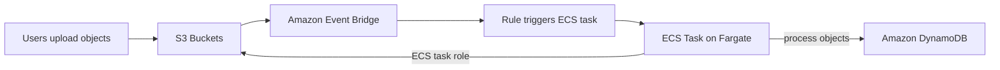
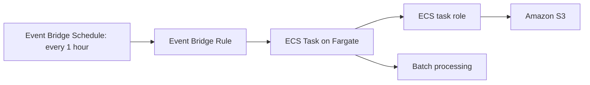
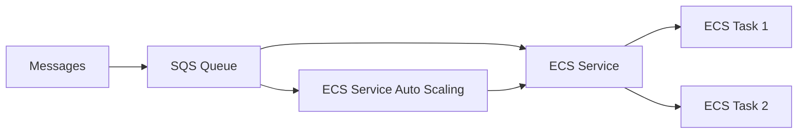
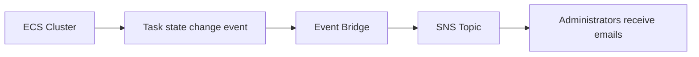

# 171. Amazon ECS - Solutions Architectures

## 🎯 Giới thiệu
- Bài này nói về một số **solution architectures** thường gặp với **Amazon ECS**.
- Trọng tâm là cách ECS kết hợp với **Event Bridge**, **S3**, **DynamoDB**, **SQS**, **SNS**, và **ECS Service Auto Scaling**.
- Mục tiêu chính: hiểu các mô hình triển khai và luồng sự kiện để ôn thi AWS.

## 1. ECS tasks được kích hoạt bởi Event Bridge từ S3
- Người dùng upload object lên **S3 buckets**.
- **S3** được tích hợp với **Amazon Event Bridge** để gửi event.
- **Event Bridge rule** sẽ chạy **ECS tasks** trên **Fargate**.
- Mỗi task có **ECS task role**.
- Task có thể:
  - lấy object từ **S3**
  - xử lý dữ liệu / image
  - ghi kết quả vào **Amazon DynamoDB**
- Đây là một kiến trúc **serverless** dùng Docker container để xử lý object từ S3.

## 2. ECS tasks chạy theo lịch bằng Event Bridge Schedule
- Một cách khác dùng **Event Bridge schedule**.
- **Event Bridge rule** được cấu hình chạy mỗi **1 hour**.
- Mỗi lần trigger sẽ tạo một **ECS task** mới trên **Fargate**.
- Task có thể làm bất kỳ công việc nào được chỉ định.
- Ví dụ trong transcript:
  - dùng **ECS task role** có quyền truy cập **Amazon S3**
  - thực hiện **batch processing** mỗi 1 giờ với các file trong S3
- Kiến trúc này cũng được mô tả là **fully serverless**.

## 3. ECS service xử lý message từ SQS và tự mở rộng
- Có thể dùng **ECS** kết hợp với **SQS queue**.
- Một **service on ECS** chạy với **two ECS tasks**.
- Message được gửi vào **SQS queue**.
- Service sẽ **pull messages** từ queue và xử lý.
- Có thể bật **ECS Service Auto Scaling**.
- Khi số message trong SQS tăng, số task trong ECS service cũng tăng theo.

## 4. Event Bridge theo dõi lifecycle của ECS task
- **Event Bridge** có thể intercept event từ bên trong **ECS cluster**.
- Ví dụ: phản ứng khi task **starting** hoặc **exited / stopped**.
- Event có thể là:
  - **ECS task state change**
  - trạng thái `"stopped"`
  - kèm **stopped reason**
- Từ đó có thể gửi cảnh báo đến **SNS topic**.
- SNS có thể gửi email cho administrator.
- Ý chính: **Event Bridge** giúp hiểu lifecycle của container trong ECS cluster.

## 📊 Bảng tóm tắt
| Tiêu chí | Mô tả |
|----------|------|
| Event-driven ECS | **Event Bridge** trigger **ECS tasks** từ event của **S3** |
| Scheduled ECS | **Event Bridge schedule** chạy task theo thời gian, ví dụ mỗi **1 hour** |
| Queue-based processing | **ECS Service** pull message từ **SQS queue** và xử lý |
| Scaling | **ECS Service Auto Scaling** tăng task khi queue nhiều message |
| Observability / lifecycle | **Event Bridge** theo dõi **task state change** của ECS |
| Notification | Có thể gửi alert tới **SNS topic** và email cho admin |
| Security / access | **ECS task role** cho phép task truy cập **S3** và **DynamoDB** |
| Kiến trúc | Các mô hình trong bài đều được mô tả là **serverless** |

## 💡 Mẹo ghi nhớ cho kỳ thi AWS
- Nhớ theo cặp:
  - **S3 -> Event Bridge -> ECS task -> DynamoDB**
  - **Schedule -> Event Bridge -> Fargate task**
  - **SQS -> ECS Service -> Auto Scaling**
  - **ECS state change -> Event Bridge -> SNS**
- Khi thấy **Event Bridge**, hãy nghĩ ngay đến:
  - trigger theo event
  - trigger theo schedule
  - theo dõi lifecycle event
- Khi thấy **ECS task role**, hãy nhớ task có thể truy cập tài nguyên như **S3** hoặc **DynamoDB**.
- Khi thấy **SQS queue tăng**, liên tưởng đến **ECS Service Auto Scaling**.

## ✅ Kết luận
- **Amazon ECS** có nhiều kiến trúc thực tế xoay quanh **Event Bridge**, **SQS**, **SNS**, **S3**, và **DynamoDB**.
- Điểm cần nhớ nhất là:
  - **Event-driven processing**
  - **Scheduled task execution**
  - **Queue-based scaling**
  - **Lifecycle monitoring**
- Đây là các pattern quan trọng để nhận diện trong bài thi AWS.
