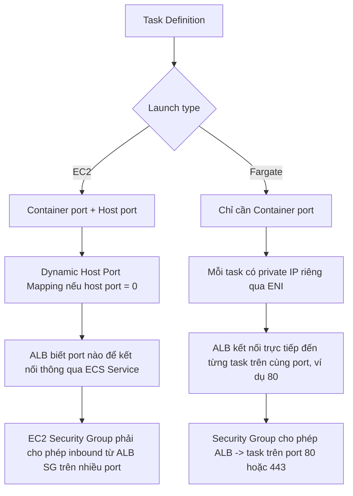

# 172. Amazon ECS Task Definitions - Deep Dive

## 🎯 Giới thiệu
- `Amazon ECS Task Definition` là bản khai báo ở dạng `JSON` để ECS biết cách chạy một hoặc nhiều Docker containers.
- Trong `console`, AWS cung cấp UI để hỗ trợ tạo `JSON` này.
- Đây là phần rất quan trọng vì exam hay hỏi về:
  - `Image Name`
  - `Port Binding`
  - `CPU` và `Memory`
  - `Environment Variables`
  - `Networking information`
  - `IAM role`
  - `Logging configuration` như `CloudWatch`

## 1. 📦 Thành phần chính của Task Definition
- `Task Definition` có thể chứa:
  - `Image Name`
  - `Container Port` và `Host Port` nếu chạy trên `EC2`
  - `CPU` và `Memory`
  - `Environment Variables`
  - `Networking`
  - `IAM role` gắn với task
  - `Logging configuration`
- Một `task definition` có thể có nhiều container:
  - Tối đa `10 containers` mỗi task definition
- Thực tế thường có:
  - `application container`
  - `sidecar containers` cho `logging`, `metrics`, `tracing`

## 2. 🔌 Port Mapping: EC2 vs Fargate

- Với `EC2 launch type`:
  - `Container port` và `Host port` đều quan trọng
  - Có thể map `container port 80` sang `host port 8080`
  - `Host port` và `Container port` không cần giống nhau
- Với `Dynamic Host Port Mapping`:
  - Nếu chỉ khai báo `container port` và `host port = 0`
  - ECS sẽ gán `host port` ngẫu nhiên, động
  - `ALB` vẫn kết nối được vì ECS service hỗ trợ tìm đúng port
- Lưu ý:
  - Cơ chế này **không dùng với `Classic Load Balancer`**
  - Chỉ áp dụng với `ALB`
- Về `Security Group`:
  - `EC2 instance SG` phải cho phép inbound từ `ALB SG` trên các port động vì chưa biết trước `host port`

- Với `Fargate`:
  - Không có `host`
  - Mỗi task có một `private IP` riêng qua `ENI`
  - Chỉ cần khai báo `container port`
  - `ALB` kết nối tới từng task trên cùng một port, ví dụ `80`
  - `Task ENI Security Group` phải cho phép `ALB SG` truy cập vào port đó
  - `ALB SG` cho phép `80` hoặc `443` từ internet nếu bật SSL

## 3. 🔐 IAM Role trong ECS
- `IAM role` được gán ở mức `task definition`, không phải ở mức `service`
- Khi tạo `ECS service` từ task definition:
  - Mỗi `ECS task` sẽ tự động `assume` và kế thừa `task role`
- Ví dụ trong transcript:
  - Một task definition có role để truy cập `Amazon S3`
  - Task definition khác có role để truy cập `DynamoDB`
- Ý quan trọng cho exam:
  - Nếu hỏi “Where do you define an IAM role for ECS task?”
  - Đáp án là: **trong `task definition`**

## 4. 🧩 Environment Variables
- `Task definition` có thể khai báo `environment variables` từ nhiều nguồn:
  - `Hardcode` trực tiếp trong task definition
  - `SSM Parameter Store`
  - `Secrets Manager`
  - `Amazon S3` file để load hàng loạt (`bulk environment variables loading`)
- Cách dùng:
  - Giá trị nhạy cảm như `API keys`, `shared configs`, `database passwords`
  - Được lấy ra và resolve tại `runtime`
  - Sau đó inject vào ECS task dưới dạng environment variables
- Gợi ý từ transcript:
  - `Hardcode` phù hợp cho giá trị cố định, không nhạy cảm
  - `SSM Parameter Store` hoặc `Secrets Manager` phù hợp cho dữ liệu nhạy cảm

## 5. 🗂️ Chia sẻ dữ liệu giữa các containers
- Một task có thể chứa nhiều containers, nên đôi khi cần chia sẻ file giữa:
  - `application container`
  - `sidecar container` như logging hoặc metrics
- Cách làm:
  - Dùng `bind mount` để mount `data volume` vào nhiều container
  - Các container cùng đọc/ghi vào storage chung, ví dụ `/var/logs`
- Với `EC2 tasks`:
  - `bind mount` chính là storage trên EC2 instance
  - Dữ liệu gắn với lifecycle của EC2 instance
- Với `Fargate tasks`:
  - Dùng `ephemeral storage`
  - Dữ liệu gắn với lifecycle của task/container
  - Khi task biến mất thì storage cũng mất
  - Transcript nói Fargate có khoảng `20 GB đến 200 GB` shared storage
- Use case điển hình:
  - Chia sẻ file cho `sidecar` đọc để gửi `metrics` hoặc `logs`

## 📊 Bảng tóm tắt
| Tiêu chí | Mô tả |
|----------|------|
| Mục đích của Task Definition | Khai báo cách ECS chạy một hoặc nhiều Docker containers |
| Số container tối đa | Tối đa `10 containers` mỗi task definition |
| Port trên EC2 | Có cả `Container port` và `Host port` |
| Port trên Fargate | Chỉ cần `Container port`, không có host |
| Dynamic Host Port Mapping | Dùng với `EC2` + `ALB`, host port được gán động khi `host port = 0` |
| Load balancer hỗ trợ | Cơ chế này chỉ hoạt động với `ALB`, không phải `Classic Load Balancer` |
| IAM role | Gán ở mức `task definition` |
| Environment variables | Có thể hardcode, lấy từ `SSM Parameter Store`, `Secrets Manager`, hoặc `S3` |
| Chia sẻ dữ liệu | Dùng `bind mount` giữa nhiều containers trong cùng task |
| Storage trên EC2 | Gắn với lifecycle của EC2 instance |
| Storage trên Fargate | `Ephemeral storage`, gắn với lifecycle của task |
| Dung lượng Fargate | Transcript nêu từ `20 GB` đến `200 GB` |

## 💡 Mẹo ghi nhớ cho kỳ thi AWS
- `Task Definition` là nơi định nghĩa cấu hình chạy task, không phải `service`.
- `IAM role` cho ECS task luôn gắn ở mức `task definition`.
- Nếu thấy `EC2 + ALB + port thay đổi`, nghĩ ngay đến `Dynamic Host Port Mapping`.
- Nếu thấy `Fargate`, nhớ:
  - không có `host`
  - mỗi task có `private IP` riêng qua `ENI`
  - chỉ khai báo `container port`
- Nếu có câu hỏi về chia sẻ file giữa containers:
  - nghĩ đến `bind mount`
  - `sidecar container` là pattern rất hay gặp
- Nếu dữ liệu nhạy cảm:
  - ưu tiên `SSM Parameter Store` hoặc `Secrets Manager`
- Nếu cần nạp nhiều biến môi trường:
  - nhớ `S3` file loading

## ✅ Kết luận
- `Amazon ECS Task Definition` là trung tâm để ECS biết cách chạy containers, gắn role, cấu hình port, biến môi trường và storage chia sẻ.
- Điểm cần nhớ nhất cho exam:
  - `IAM role` ở mức `task definition`
  - `EC2` dùng `host port`
  - `Fargate` không có `host`
  - `ALB` hỗ trợ `Dynamic Host Port Mapping`
  - `bind mount` dùng để chia sẻ dữ liệu giữa nhiều containers trong cùng task
