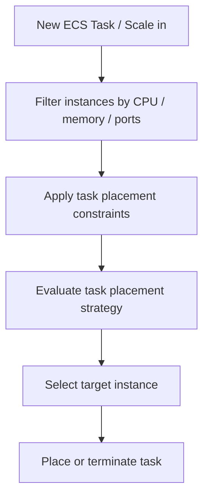

# 174. Amazon ECS - Task Placements

## 🎯 Giới thiệu
- `ECS Task Placement` là khái niệm quan trọng khi chạy ECS task kiểu `EC2`.
- Khi tạo mới hoặc scale in một ECS service, ECS phải quyết định:
  - đặt task mới ở đâu,
  - hoặc task nào sẽ bị terminate.
- Việc này dựa trên:
  - `CPU`
  - `memory`
  - `ports`
  - `task placement strategy`
  - `task placement constraints`
- Chỉ áp dụng cho `ECS on EC2`, không áp dụng cho `Fargate`.

## 1. Quy trình Task Placement
- ECS sẽ chọn nơi đặt task theo thứ tự:
  1. Tìm các EC2 instances đáp ứng yêu cầu `CPU`, `memory`, `port` trong `task definition`.
  2. Áp dụng `task placement constraints`.
  3. Chọn instance phù hợp nhất với `task placement strategy`.
  4. Đặt task lên instance đó.

- Lưu ý: `task placement strategies` là `best effort`.

## 2. Task Placement Strategies
### a. `binpack`
- Đặt task dựa trên nơi còn ít `CPU` hoặc `memory` nhất.
- Mục tiêu:
  - nhồi nhiều task nhất có thể vào ít instance nhất,
  - giảm số lượng EC2 instances đang dùng,
  - tiết kiệm chi phí.
- Ví dụ:
  - `binpack` trên `memory` sẽ cố gắng lấp đầy một EC2 instance trước khi chuyển sang instance khác.

### b. `random`
- Đặt task ngẫu nhiên.
- Không có logic tối ưu đặc biệt.
- Đơn giản, nhưng không phải chiến lược tối ưu nhất.

### c. `spread`
- Phân tán task theo một giá trị xác định.
- Giá trị có thể là:
  - `instance ID`
  - `availability zone`
  - các giá trị khác tương tự
- Ví dụ phổ biến:
  - `spread` theo `ECS availability zones`
  - task được phân bố đều qua các AZ
- Mục tiêu:
  - tăng `high availability`

### Kết hợp strategies
- Có thể mix nhiều strategy, ví dụ:
  - `spread` theo `availability zone` rồi `spread` theo `instance ID`
  - `spread` theo `availability zone` rồi `binpack` theo `memory`

## 3. Task Placement Constraints
### a. `distinctInstance`
- Mỗi task phải nằm trên một container instance khác nhau.
- Không bao giờ có 2 task trên cùng một instance.

### b. `memberOf`
- Chỉ đặt task lên các instance thỏa mãn một expression.
- Expression được viết bằng `cluster query language`.
- Ví dụ trong transcript:
  - chỉ đặt task lên instance có loại `t2`
- Ý nghĩa:
  - dùng `memberOf` để giới hạn task chạy trên nhóm EC2 instances cụ thể.

## 📊 Bảng tóm tắt
| Tiêu chí | Mô tả |
|----------|------|
| Phạm vi áp dụng | Chỉ dùng cho `ECS on EC2`, không áp dụng cho `Fargate` |
| Mục tiêu | Xác định task sẽ được đặt hoặc bị terminate ở đâu |
| Quy trình | Filter theo `CPU`/`memory`/`ports` -> áp dụng `constraints` -> chọn theo `strategy` |
| `binpack` | Nhét task vào ít instance nhất, ưu tiên tiết kiệm chi phí |
| `random` | Đặt task ngẫu nhiên |
| `spread` | Phân tán task đều theo `instance ID`, `AZ`, hoặc giá trị khác |
| `distinctInstance` | Mỗi task trên một instance khác nhau |
| `memberOf` | Chỉ đặt task trên instance thỏa expression trong `cluster query language` |

## 💡 Mẹo ghi nhớ cho kỳ thi AWS
- `binpack` = “nhồi đầy” để **giảm số EC2 instances**.
- `spread` = “chia đều” để **tăng high availability**.
- `random` = đơn giản, ngẫu nhiên, ít tối ưu hơn.
- `distinctInstance` = không cho 2 task chung một instance.
- `memberOf` = lọc instance theo điều kiện, ví dụ chỉ `t2`.
- Nhớ kỹ: `Task Placement` chỉ xuất hiện khi dùng `ECS on EC2`, không phải `Fargate`.

## ✅ Kết luận
- `ECS Task Placement` là cơ chế ECS dùng để quyết định task sẽ chạy ở đâu hoặc task nào sẽ bị dừng.
- Hai phần cần nhớ nhất cho kỳ thi:
  - `task placement strategies`: `binpack`, `random`, `spread`
  - `task placement constraints`: `distinctInstance`, `memberOf`
- Hiểu được luồng chọn instance và mục tiêu của từng strategy sẽ giúp làm tốt các câu hỏi về ECS trên AWS exam.
