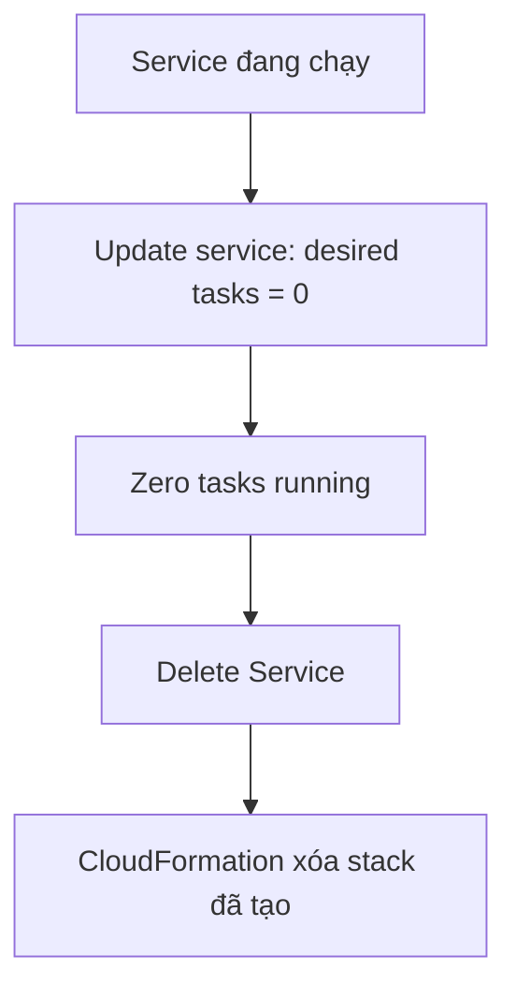

# 175. Amazon ECS - Clean Up - Hands On

## 🎯 Giới thiệu
Bài này hướng dẫn cách **dọn dẹp toàn bộ tài nguyên ECS** sau khi lab kết thúc để tránh còn sót lại infrastructure không cần thiết. Trọng tâm là:
- **Stop service** trước khi xóa
- **Delete service** và chờ **CloudFormation** xóa các tài nguyên liên quan
- **Delete cluster** sau khi service đã bị xóa
- Có thể **deregister task definition** nếu muốn, dù nó không tốn chi phí

## 1. Dừng ECS Service trước khi xóa
- Cần নিশ্চিত đảm bảo **zero tasks running** trước khi xóa service.
- Nếu còn task đang chạy:
  - Update service
  - Set **desired task = 0**
- Sau đó:
  - Click **Delete Service**
  - Gõ **Delete** để xác nhận

### Mermaid flow

## 2. CloudFormation sẽ xóa toàn bộ tài nguyên liên quan
Khi xóa service, thao tác này thực tế sẽ đi qua **CloudFormation** để xóa cả stack đã tạo ra.

CloudFormation sẽ xóa:
- **ECS service**
- **LoadBalancer Listener**
- **LoadBalancer**
- **Security group**
- **Target groups**

Lưu ý:
- Quá trình này có thể mất thời gian
- Cần **wait** cho đến khi mọi thứ được xóa xong

## 3. Xóa ECS Cluster và tùy chọn deregister Task Definition
Sau khi service đã bị xóa hoàn toàn:
- Click **Delete Cluster** để xóa demo cluster

Việc này cũng kích hoạt **CloudFormation** để xóa hạ tầng của ECS cluster, gồm:
- **Capacity provider**
- **Auto Scaling group**
- **Cluster**
- **Launch templates**

Về **task definition**:
- Có thể **giữ nguyên**
- Vì chúng **không tốn tiền**, chỉ là definitions
- Nếu muốn, có thể vào một task definition và **deregister** bằng **Do Action -> deregister**

## 📊 Bảng tóm tắt
| Tiêu chí | Mô tả |
|----------|------|
| Bước đầu tiên | Đảm bảo **zero tasks running** |
| Nếu còn task | Update service và set **desired task = 0** |
| Xóa service | Dùng **Delete Service** và xác nhận |
| Cơ chế xóa | **CloudFormation** xử lý xóa stack |
| Tài nguyên bị xóa khi delete service | ECS service, LoadBalancer Listener, LoadBalancer, security group, target groups |
| Xóa cluster | Chỉ làm sau khi service đã bị xóa xong |
| Tài nguyên bị xóa khi delete cluster | capacity provider, Auto Scaling group, cluster, launch templates |
| Task definition | Có thể giữ lại vì không tốn chi phí |
| Tùy chọn thêm | Có thể **deregister** task definition |

## 💡 Mẹo ghi nhớ cho kỳ thi AWS
- Nhớ trình tự: **stop service -> desired task = 0 -> delete service -> chờ CloudFormation -> delete cluster**
- Khi **delete ECS service/cluster**, đừng quên đây là quá trình xóa tài nguyên qua **CloudFormation**
- **Task definitions** chỉ là definitions, nên có thể để lại nếu không cần dọn sạch hoàn toàn
- Nếu đề bài hỏi về cleanup sau lab ECS, hãy nghĩ ngay đến:
  - **service**
  - **cluster**
  - **CloudFormation**
  - **deregister task definition**

## ✅ Kết luận
Quy trình cleanup ECS trong lab này là:
1. Đưa service về **0 tasks**
2. **Delete Service** và chờ **CloudFormation** xóa các tài nguyên liên quan
3. **Delete Cluster**
4. Tùy chọn **deregister task definition** nếu muốn dọn sạch hơn

Trình tự này giúp xóa đúng thứ tự và tránh để sót lại tài nguyên ECS không cần thiết.
