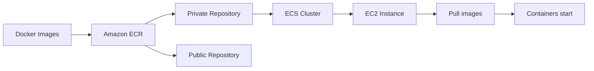

# 176. Amazon ECR

## 🎯 Giới thiệu
Amazon ECR là viết tắt của **Elastic Container Registry**. Dịch vụ này dùng để **lưu trữ và quản lý Docker images trên AWS**.

Trước đây có thể dùng repository bên ngoài như **Docker Hub**, nhưng với ECR bạn có thể lưu images của riêng mình ngay trên AWS.

## 1. Mục đích sử dụng của Amazon ECR
- Dùng để **store** và **manage** Docker images.
- Là lựa chọn khi bạn muốn lưu images trên AWS thay vì dùng repository bên ngoài.
- Khi thấy yêu cầu liên quan đến **storing Docker images**, hãy nghĩ ngay đến **ECR**.

## 2. Các loại repository trong ECR
- **Private repository**:
  - Chỉ dành cho account của bạn hoặc các account bạn cho phép.
- **Public repository**:
  - Có thể publish lên **Amazon ECR public gallery**.

## 3. ECR, ECS, EC2 và IAM hoạt động cùng nhau
- **ECR** được **integrated** chặt chẽ với **Amazon ECS**.
- Images được lưu phía sau bởi **Amazon S3**.
- Một **EC2 instance** trong ECS cluster có thể cần **pull images** từ ECR.
- Để làm được điều đó:
  - Gán **IAM role** cho EC2 instance.
  - IAM role này cho phép instance **pull Docker images**.
- Toàn bộ access vào ECR được bảo vệ bởi **IAM**.
- Nếu gặp **permission error** trên ECR, cần kiểm tra **policies**.
- Sau khi images được pull, containers sẽ được start trên EC2 instance.

## 📊 Bảng tóm tắt
| Tiêu chí | Mô tả |
|----------|------|
| Tên dịch vụ | Amazon ECR = Elastic Container Registry |
| Chức năng chính | Lưu trữ và quản lý Docker images |
| Loại repository | Private repository, Public repository |
| Tích hợp | Amazon ECS |
| Lưu trữ nền | Amazon S3 |
| Quyền truy cập | IAM bảo vệ toàn bộ access |
| Luồng sử dụng | EC2 instance dùng IAM role để pull images rồi start containers |
| Tính năng nổi bật | image vulnerability scanning, versioning, image tags, image lifecycle |

## 💡 Mẹo ghi nhớ cho kỳ thi AWS
- Thấy **Docker images** trên AWS thì nghĩ ngay đến **ECR**.
- Thấy **ECS pull images** từ repository thì nhớ:
  - **EC2 instance**
  - **IAM role**
  - **IAM policies**
- Nhớ các điểm hay được hỏi:
  - **Private vs Public repository**
  - **image vulnerability scanning**
  - **versioning**
  - **image tags**
  - **image lifecycle**

## ✅ Kết luận
Amazon ECR là dịch vụ để lưu và quản lý **Docker images** trên AWS. Nó hỗ trợ cả **private** và **public repository**, tích hợp tốt với **ECS**, và dùng **IAM** để kiểm soát quyền truy cập. Đây là dịch vụ cần nhớ khi ôn thi về container trên AWS.
