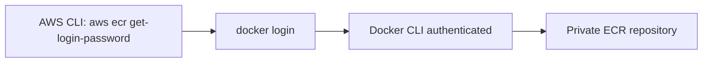

# 177. Amazon ECR - Hands On

## 🎯 Giới thiệu
Bài này tập trung vào cách dùng CLI để **pull** và **push Docker images** với **Amazon ECR**.

Ý chính:
- Muốn làm việc với **private ECR repository** thì cần đăng nhập bằng **AWS CLI**.
- Lệnh `aws ecr get-login-password` sẽ tạo **password** cho `docker login`.
- Sau khi đăng nhập, có thể dùng `docker pull`, `docker tag`, `docker push` để làm việc với image.
- Nếu không push/pull được thì thường là do **IAM permissions** không đúng.

## 1. Quy trình đăng nhập vào ECR 🔐
- Chạy `aws ecr get-login-password`.
- Dùng output của lệnh này đưa vào `docker login`.
- Username khi login là `AWS`.
- Mục tiêu là để Docker CLI trên máy có thể kết nối với **private repository** trong AWS.

## 2. Push image lên Amazon ECR 📦
- Trước đây image ví dụ được pull từ **Docker Hub** như `nginxdemos/hello`.
- Nếu muốn host image đó trên ECR:
  - Tạo **private repository** trong Amazon ECR.
  - Có thể đặt tên repository, ví dụ `demostephane`.
- Các tuỳ chọn khi tạo repo:
  - **Tag immutability**: không cho push cùng một tag hai lần.
  - **Image scan on push**: quét image khi push để tìm vấn đề bảo mật.
  - Tính năng scan này được nói là đã bị deprecated, thay vào đó nên dùng **registry level scan filters** với **Amazon Inspector**.
  - Có thể mã hoá repository bằng **KMS**.
- Sau khi tạo repo, có thể xem các lệnh push dành cho **Mac/Linux** hoặc **Windows**.
- Cần đảm bảo:
  - Docker đã được cài và đang chạy.
  - AWS CLI đã được cấu hình.
- Quy trình push:
  - `docker pull` image gốc từ Docker Hub.
  - `docker tag` image sang tên ECR repository + image name + tag.
  - `docker push` image đã tag lên ECR.

## 3. Public vs Private Repository và kết quả sau khi push 🧭
- **Public repository**:
  - Ai cũng có thể pull image.
- **Private repository**:
  - Chỉ người có đúng **IAM permissions** mới pull được image.
- Khi push thành công:
  - Image xuất hiện trong repository ECR.
  - Có thể click vào image để xem thông tin.
  - Image này có thể dùng trong **task definition** để ECS pull trực tiếp từ ECR thay vì từ Docker Hub.

## 📊 Bảng tóm tắt
| Tiêu chí | Mô tả |
|----------|------|
| Mục tiêu | Dùng CLI để pull/push Docker images với Amazon ECR |
| Đăng nhập | `aws ecr get-login-password` -> `docker login` |
| Push image | `docker pull` -> `docker tag` -> `docker push` |
| Private repo | Chỉ user có đúng IAM permissions mới truy cập |
| Public repo | Bất kỳ ai cũng có thể pull image |
| Tuỳ chọn repo | Tag immutability, image scan, KMS encryption |
| Lưu ý bảo mật | Image scan on push được nhắc là deprecated, dùng Amazon Inspector registry level scan filters |
| Điều kiện cần | Docker cài đặt và đang chạy, AWS CLI cấu hình đúng |

## 💡 Mẹo ghi nhớ cho kỳ thi AWS
- Nhớ chuỗi thao tác: **login -> tag -> push**.
- `aws ecr get-login-password` không push image trực tiếp, nó chỉ tạo password cho `docker login`.
- **Private ECR** luôn gắn với **IAM permissions**.
- Muốn đổi image từ Docker Hub sang ECR thì phải dùng `docker tag` trước khi `docker push`.
- **Public repo** = ai cũng pull được, **private repo** = cần quyền.
- Nếu đề cập bảo mật repository, nhớ các ý: **tag immutability**, **scan**, **KMS**.

## ✅ Kết luận
Amazon ECR cho phép lưu và phân phối Docker images trong AWS. Trong hands-on này, luồng chính là đăng nhập bằng `aws ecr get-login-password`, sau đó dùng Docker để **tag** và **push** image lên **private repository**. Nếu cấu hình và quyền đúng, ECS có thể pull image trực tiếp từ ECR thay vì Docker Hub.
