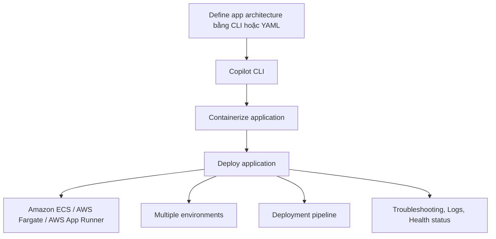

# 178. AWS CoPilot - Overview

## 🎯 Giới thiệu
- **AWS Copilot** không phải là một service, mà là một **CLI tool**.
- Mục đích chính: giúp **build, release, and operate** các **production-ready containerized applications**.
- Copilot giúp giảm độ phức tạp khi chạy ứng dụng trên:
  - **Amazon ECS**
  - **AWS Fargate**
  - **AWS App Runner**
- Thay vì tự cấu hình nhiều thành phần hạ tầng, Copilot sẽ hỗ trợ xử lý phần lớn độ phức tạp như **ECS, VPC, ELB, ECR**.

## 1. Vai trò của AWS Copilot 🛠️
- Dùng để triển khai ứng dụng container theo cách đơn giản hơn qua **CLI**.
- Giúp bạn tập trung vào **build application** thay vì lo nhiều về hạ tầng.
- Có thể hỗ trợ triển khai theo mô hình **Microservice** bằng:
  - **CLI**
  - **YAML file**

## 2. Luồng triển khai với Copilot 🚀
- Dùng Copilot CLI để **containerize** ứng dụng và **deploy**.
- Có thể triển khai đến **multiple environments**.
- Nếu tích hợp với **CodePipeline**, bạn có thể có **automated container deployments** chỉ với **one command**.

## 3. Lợi ích chính 📈
- Tạo ra một **well-architected infrastructure setup**.
- Hệ thống được **right-sized** và **scale automatically**.
- Hỗ trợ:
  - **Deployment pipeline**
  - **Effective operations**
  - **Troubleshooting**
  - **Logs**
  - **Health status** của application

## 📊 Bảng tóm tắt
| Tiêu chí | Mô tả |
|----------|------|
| Bản chất | **CLI tool**, không phải service |
| Mục tiêu | Build, release, operate **production-ready containerized applications** |
| Nền tảng triển khai | **ECS**, **Fargate**, **App Runner** |
| Hạ tầng được Copilot hỗ trợ | **ECS, VPC, ELB, ECR** |
| Cách mô tả kiến trúc | **CLI** hoặc **YAML file** theo hướng **Microservice** |
| Tính năng vận hành | **Logs**, **troubleshooting**, **health status** |
| Tích hợp CI/CD | Có thể tích hợp với **CodePipeline** |
| Kết quả | Infrastructure được thiết kế sẵn, **scale automatically** |

## 💡 Mẹo ghi nhớ cho kỳ thi AWS
- Nhớ rằng **Copilot = CLI tool**, không phải AWS service.
- Gắn Copilot với 3 từ khóa: **containerized applications**, **ECS/Fargate/App Runner**, **production-ready**.
- Khi thấy câu hỏi về việc giảm công sức cấu hình hạ tầng container, nghĩ ngay đến **AWS Copilot**.
- Copilot hỗ trợ **multiple environments**, **logs**, **health status**, và có thể kết hợp **CodePipeline**.
- Copilot giúp bạn tập trung vào **application**, còn phần hạ tầng sẽ được tự động hóa nhiều hơn.

## ✅ Kết luận
- **AWS Copilot** là công cụ CLI giúp triển khai và vận hành ứng dụng container một cách đơn giản hơn.
- Nó giảm đáng kể độ phức tạp của hạ tầng và hỗ trợ triển khai production-ready trên **ECS**, **Fargate**, và **App Runner**.
- Đây là chủ đề quan trọng khi ôn thi vì nó liên quan trực tiếp đến **container deployment workflow** và **operational simplicity**.
