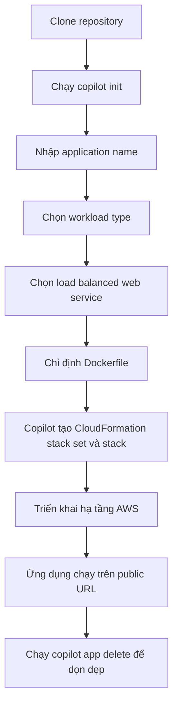

# 179. AWS CoPilot - Hands On

## 🎯 Giới thiệu
- Bài học này thực hành với **AWS Copilot CLI** để triển khai một ứng dụng Docker lên AWS.
- Quy trình bắt đầu từ một repository mẫu, sau đó dùng `copilot init` để tạo application, environment và service.
- Mục tiêu chính là hiểu Copilot tạo ra hạ tầng AWS như thế nào, và cách dọn dẹp để tránh phát sinh chi phí.

## 1. Cài đặt và chuẩn bị môi trường
- Cài **Copilot CLI** theo đúng nền tảng:
  - Mac
  - Linux
  - Windows
- Kiểm tra cài đặt bằng lệnh `copilot --help`.
- Đảm bảo đã có:
  - **AWS CLI**
  - **Docker Desktop**
- Clone repository mẫu tương thích với Copilot, sau đó chuyển vào thư mục làm việc của ví dụ.

## 2. Khởi tạo ứng dụng với Copilot
- Chạy `copilot init` để khởi tạo cấu hình Copilot.
- Nhập tên application, ví dụ: `example-app`.
- Chọn loại workload phù hợp.
- Các lựa chọn được nhắc đến trong bài:
  - request-driven web service trên **App Runner**
  - load balanced web service dùng public **ALB** và **ECS on Fargate**
  - backend service
  - worker service với **SQS to ECS on Fargate**
  - static site
  - scheduled job
- Trong bài này chọn **load balanced web service** cho front-end service.
- Chỉ định **Dockerfile** để Copilot dùng khi build và deploy.

## 3. Quá trình deploy và tài nguyên được tạo
- Copilot hiển thị các thay đổi dự kiến trước khi deploy.
- Khi xác nhận, Copilot tạo **CloudFormation stack set** và dùng **CloudFormation** để deploy.
- Khi tạo environment `test` lần đầu, Copilot sẽ tự tạo environment đó.
- Các tài nguyên được quan sát trong CloudFormation gồm:
  - **KMS key**
  - **S3 bucket**
  - **ECR repository**
  - **IAM roles**
  - **ECS services**
  - **target groups**
  - **listeners**
  - **ECS cluster**
  - **load balancer**
  - **VPC**
  - **security groups**
  - **log groups**
- Copilot giúp tạo một kiến trúc deploy hoàn chỉnh từ Dockerfile và cấu hình Copilot.
- Sau khi deploy xong, ứng dụng được truy cập qua **public URL** và hiển thị logo Copilot.

## 4. Kiểm tra cấu trúc tạo ra và dọn dẹp
- Nên vào **CloudFormation** để xem chi tiết những gì đã được tạo.
- Nên kiểm tra thêm trong **ECS**:
  - cluster `example-app-test-Cluster`
  - services
- Cũng nên xem **load balancer** để hiểu luồng triển khai.
- Copilot tạo thư mục `copilot/` với các phần chính:
  - `environments/`
  - `front-end/`
- Trong `copilot/environments/test/manifest.yml`:
  - chứa tên environment
  - type là `environment`
  - có thể thêm các setting bổ sung
- Trong `copilot/front-end/manifest.yml`:
  - chứa các setting của service front-end
  - đây là nơi tùy biến cấu hình theo kiểu **configuration as code**
- Khi không còn dùng nữa, chạy `copilot app delete` để xóa toàn bộ và tránh chi phí đang chạy.

## 📊 Bảng tóm tắt
| Tiêu chí | Mô tả |
|----------|------|
| Công cụ chính | **AWS Copilot CLI** |
| Mục đích | Triển khai app Docker lên AWS theo cách có sẵn best practices |
| Bước khởi đầu | `copilot init` |
| Loại service dùng trong bài | **load balanced web service** |
| Hạ tầng được tạo | **CloudFormation**, **ECS**, **ALB**, **VPC**, **IAM roles**, **ECR**, **S3**, **KMS** |
| File cấu hình | `copilot/environments/.../manifest.yml`, `copilot/front-end/manifest.yml` |
| Kiểm tra triển khai | CloudFormation, ECS, load balancer |
| Dọn dẹp | `copilot app delete` |

## 💡 Mẹo ghi nhớ cho kỳ thi AWS
- Nhớ rằng **Copilot** là **CLI** dùng để đơn giản hóa việc deploy containerized application.
- `copilot init` là bước mở đầu để tạo application, environment và service.
- Với **load balanced web service**, Copilot sẽ gắn với **ALB** và **ECS on Fargate**.
- Khi thấy Copilot, hãy liên tưởng ngay đến việc nó tạo ra nhiều tài nguyên AWS tự động qua **CloudFormation**.
- Luôn kiểm tra `manifest.yml` vì đây là nơi điều chỉnh cấu hình theo kiểu **configuration as code**.
- Sau khi thực hành xong, cần nhớ `copilot app delete` để tránh tài nguyên còn chạy gây chi phí.

## ✅ Kết luận
- Bài học cho thấy **AWS Copilot** giúp triển khai ứng dụng Docker nhanh chóng bằng CLI.
- Copilot tự tạo và quản lý nhiều thành phần AWS quan trọng như **ECS**, **ALB**, **IAM**, **ECR**, **S3**, **KMS** và **CloudFormation**.
- Điểm cần nhớ cho ôn thi là quy trình deploy, các tài nguyên sinh ra, cấu trúc file `manifest.yml`, và bước cleanup bằng `copilot app delete`.
