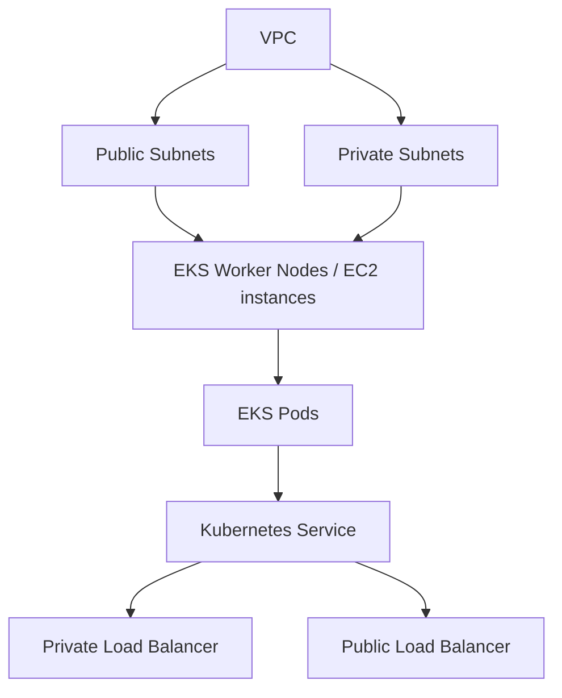

# 180. Amazon EKS

## 🎯 Giới thiệu
- **Amazon EKS** là viết tắt của **Amazon Elastic Kubernetes Service**.
- Đây là dịch vụ để **launch và manage Kubernetes cluster trên AWS**.
- **Kubernetes** là hệ thống **open-source** dùng để **automatic deployments, scaling, and management** cho containerized applications, thường là **Docker**.
- Về mục tiêu, EKS tương tự **ECS**, nhưng:
  - **ECS** không open-source
  - **Kubernetes** open-source và được nhiều cloud provider dùng, nên mang tính **standardization** cao hơn
- Từ góc nhìn thi AWS, **Kubernetes là cloud agnostic**, có thể dùng trên nhiều cloud như Azure, Google Cloud, v.v.

## 1. 🚀 Khi nào nên dùng Amazon EKS
- Dùng EKS khi công ty:
  - đã dùng **Kubernetes on-premises**
  - đã dùng **Kubernetes trên cloud khác**
  - muốn tiếp tục dùng **Kubernetes API**
  - muốn AWS quản lý Kubernetes cluster
- EKS đặc biệt phù hợp khi cần **migrate giữa các clouds** vì container workload dựa trên Kubernetes sẽ đơn giản hơn.

## 2. 🧱 Kiến trúc và các loại node trong EKS
- Mô hình điển hình:
  - có **VPC**
  - chia thành **3 AZ**
  - tách **public subnets** và **private subnets**
  - tạo **EKS Worker Nodes** để chạy **EKS Pods**
- **Pods** là thuật ngữ gắn với Kubernetes, khác với cách gọi **tasks** trong ECS.
- EKS Worker Nodes có thể được quản lý bởi **Auto Scaling group**.
- Có thể expose **EKS Service / Kubernetes Service** ra ngoài bằng:
  - **private load balancer**
  - **public load balancer**

### Các kiểu node support bởi EKS
- **Managed Node Groups**
  - AWS tự tạo và quản lý **Nodes**
  - Nodes là **EC2 instances**
  - nằm trong **Auto Scaling group**
  - được quản lý bởi **EKS service**
  - hỗ trợ **On-Demand** và **Spot Instances**
- **Self-managed nodes**
  - tự tạo nodes
  - tự register vào EKS cluster
  - tự quản lý nodes trong **ASG**
  - có thể dùng **Amazon EKS Optimized AMI**
  - hoặc tự build **AMI** riêng
  - cũng hỗ trợ **On-Demand** và **Spot Instances**
- **Fargate mode**
  - không cần quản lý nodes
  - không có maintenance cho nodes
  - chỉ chạy containers trên Amazon EKS

## 3. 💾 Storage trong Amazon EKS
- Có thể attach data volumes vào EKS cluster.
- Cần khai báo **StorageClass manifest** trên EKS cluster.
- Giải pháp này sử dụng **Container Storage Interface (CSI) compliant driver**.
- Các loại storage được nhắc đến:
  - **Amazon EBS**
  - **Amazon EFS**
  - **Amazon FSx for Lustre**
  - **Amazon FSx for NetApp ONTAP**
- Lưu ý quan trọng:
  - **Amazon EFS** là **the only type of storage class that works with Fargate**

## 📊 Bảng tóm tắt
| Tiêu chí | Mô tả |
|----------|------|
| Tên dịch vụ | **Amazon EKS = Amazon Elastic Kubernetes Service** |
| Mục đích | Launch và manage **Kubernetes cluster** trên AWS |
| Điểm mạnh | Dùng **Kubernetes API**, cloud agnostic, dễ migration giữa các cloud |
| So sánh với ECS | Cùng mục tiêu chạy containers, nhưng API khác; **Kubernetes open-source**, **ECS không open-source** |
| Launch modes | **EC2 mode** và **Fargate mode** |
| Node options | **Managed Node Groups**, **Self-managed nodes**, **Fargate** |
| Storage | Dùng **StorageClass manifest** và **CSI driver** |
| Storage hỗ trợ | **EBS**, **EFS**, **FSx for Lustre**, **FSx for NetApp ONTAP** |
| Lưu ý Fargate | **EFS** là storage class được nhắc là hoạt động với **Fargate** |

## 💡 Mẹo ghi nhớ cho kỳ thi AWS
- **EKS = Kubernetes trên AWS**
- Khi thấy **Pods**, hãy nghĩ đến **Kubernetes**, không phải ECS
- Khi thấy yêu cầu:
  - dùng **Kubernetes API**
  - đã có Kubernetes on-prem / multi-cloud
  - muốn AWS quản lý cluster
  => nghĩ ngay đến **EKS**
- Ghi nhớ 3 kiểu vận hành:
  - **Managed Node Groups**
  - **Self-managed nodes**
  - **Fargate**
- Ghi nhớ từ khóa storage:
  - **StorageClass**
  - **CSI**
  - **EBS / EFS / FSx**
- Nếu đề bài nói **không muốn quản lý nodes**, đáp án có xu hướng là **Fargate**

## ✅ Kết luận
- **Amazon EKS** là dịch vụ của AWS để chạy và quản lý **Kubernetes cluster**.
- Dịch vụ này phù hợp khi cần tính **standardization**, **cloud agnostic**, hoặc đang dùng Kubernetes sẵn.
- EKS hỗ trợ nhiều mô hình triển khai node và có khả năng gắn storage qua **StorageClass** và **CSI driver**.
