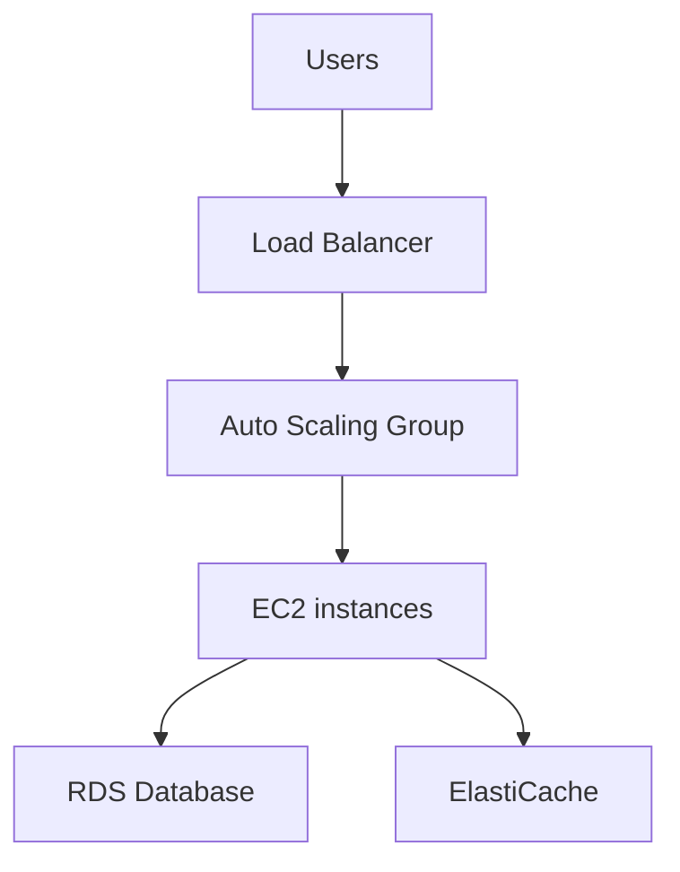
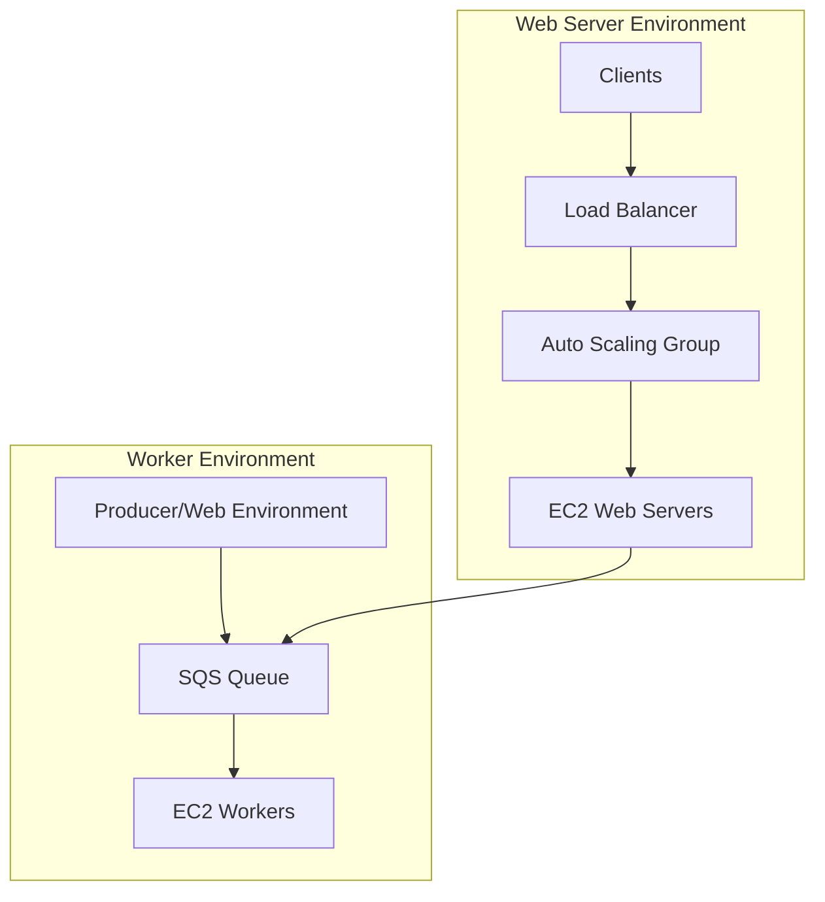

# 182. Elastic Beanstalk Overview (High level)

## 🎯 Giới thiệu
Elastic Beanstalk là một **managed service** giúp developer triển khai application trên AWS theo kiểu **developer centric**.

- Thay vì tự cấu hình từng thành phần như `Load Balancer`, `Auto Scaling Group`, `EC2`, `RDS`, `ElastiCache`...
- Beanstalk sẽ **reuse** các service đó và tự xử lý phần lớn việc triển khai.
- Developer chủ yếu tập trung vào **code**.
- Beanstalk lo các việc như:
  - `capacity provisioning`
  - cấu hình `load balancer`
  - `scaling`
  - `application health monitoring`
  - `instance configuration`

## 1. Kiến trúc và vai trò của Beanstalk
Beanstalk được dùng khi nhiều application có kiến trúc triển khai tương tự nhau.

- Mô hình phổ biến:
  - `Load Balancer`
  - `Auto Scaling Group`
  - nhiều `EC2 instances` ở nhiều `AZ`
  - backend có thể có `RDS`
  - caching layer có thể dùng `ElastiCache`
- Với Beanstalk, mục tiêu là:
  - không phải dựng lại kiến trúc này mỗi lần
  - có một cách triển khai thống nhất cho nhiều ngôn ngữ và nhiều môi trường
- Beanstalk vẫn cho phép bạn giữ quyền kiểm soát cấu hình từng component, nhưng dưới một giao diện duy nhất.

## 2. Thành phần chính của Elastic Beanstalk
Beanstalk gồm các khái niệm chính sau:

- `Application`
  - tập hợp các Beanstalk components
  - gồm `environments`, `versions`, `configurations`
- `Application Version`
  - là một iteration của code
  - ví dụ: version 1, version 2, version 3
- `Environment`
  - tập hợp các resources đang chạy một application version cụ thể
  - trong một environment chỉ có **một application version tại một thời điểm**
  - có thể update từ version cũ sang version mới
- `Tier`
  - `web server environment tier`
  - `worker environment tier`
- Có thể tạo nhiều environment như `dev`, `test`, `prod`

### Flow triển khai
1. Tạo `Application`
2. Upload `Version`
3. Launch `Environment`
4. Manage `Environment lifecycle`
5. Upload version mới và deploy lại để update application stack

## 3. Web tier, Worker tier và deployment mode
Beanstalk có 2 kiểu môi trường chính.

### Web Server Environment Tier
- Kiến trúc giống mô hình web app truyền thống:
  - `Load Balancer`
  - `Auto Scaling Group`
  - nhiều `EC2 instances` làm web server

### Worker Environment Tier
- Không có client truy cập trực tiếp vào `EC2`
- Dùng `SQS queue`
- Message được đẩy vào `SQS`
- `EC2 instances` đóng vai trò `workers`
- Workers pull message từ `SQS` để xử lý
- Scale dựa trên số lượng `SQS messages`

### Deployment modes
- `Single instance`
  - phù hợp cho `development`
  - chỉ có 1 `EC2 instance`
  - có thể có `Elastic IP`
  - có thể launch thêm `RDS`
- `High available`
  - phù hợp cho `production`
  - có `Load Balancer`
  - nhiều `EC2 instances` trong `Auto Scaling Group`
  - nhiều `AZ`
  - `RDS` có thể `Multi-AZ` với `master` và `standby`

## 📊 Bảng tóm tắt
| Tiêu chí | Mô tả |
|----------|------|
| Mục tiêu | Giúp developer triển khai application trên AWS mà không phải tự quản lý toàn bộ infrastructure |
| Service chính | `Elastic Beanstalk` là managed service, dùng lại `EC2`, `ASG`, `ELB`, `RDS` |
| Trách nhiệm của developer | Chủ yếu tập trung vào `code` |
| Thành phần | `Application`, `Version`, `Environment`, `Tier` |
| Tier | `web server environment tier` và `worker environment tier` |
| Deployment mode | `single instance` cho development, `high available` cho production |
| Scalability | Tự động theo `ASG`, và worker tier scale theo số lượng `SQS messages` |
| Chi phí | Beanstalk service itself free, chỉ trả cho underlying resources |

## 💡 Mẹo ghi nhớ cho kỳ thi AWS
- Nhớ rằng `Elastic Beanstalk` là **platform managed** cho deployment, không phải để bạn tự build từng thành phần từ đầu.
- `Application` không phải là code riêng lẻ, mà là một nhóm gồm `versions`, `environments`, `configurations`.
- `Environment` chỉ chạy **một version tại một thời điểm**.
- `Web tier` = `Load Balancer` + `Auto Scaling Group` + `EC2`.
- `Worker tier` = `SQS queue` + `EC2 workers`.
- `Single instance` phù hợp cho `development`.
- `High available` phù hợp cho `production`.

## ✅ Kết luận
`Elastic Beanstalk` cung cấp một cách triển khai application đơn giản hơn cho developer trên AWS bằng cách đóng gói các service quen thuộc như `EC2`, `ASG`, `ELB`, và `RDS` vào một interface quản lý chung.

- Bạn tập trung vào `application code`
- AWS lo phần hạ tầng và scaling
- Có thể dùng cho nhiều ngôn ngữ và nhiều loại môi trường khác nhau
