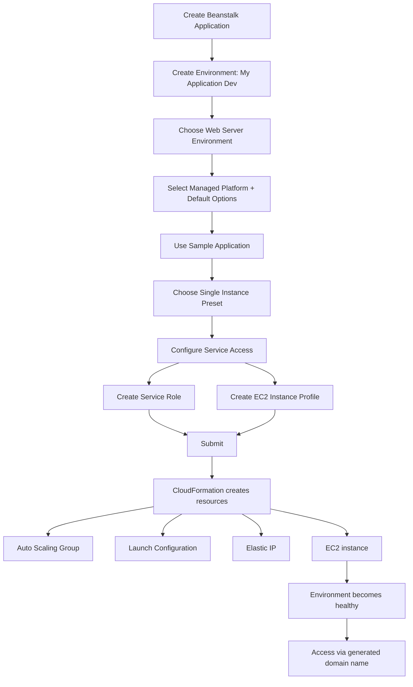

# 183. Beanstalk First Environment

## 🎯 Giới thiệu
- Bài học này thực hành tạo **Elastic Beanstalk first environment** từ console.
- Mục tiêu là chạy một **website** nên chọn **web server environment**.
- Nếu muốn xử lý task từ **queue**, thì sẽ chọn **worker environment**.
- Beanstalk được dùng để triển khai ứng dụng dựa trên **code** và **environment**.

## 1. Tạo application và environment 🛠️
- Tạo application với tên **My Application**.
- Tạo environment riêng là **My Application Dev** để đại diện cho môi trường development.
- **Domain name** được Beanstalk tự động tạo để truy cập web server.
- Chọn **platform managed**, dùng **No JS**, rồi giữ **default options**.
- Chọn **sample application** vì chưa có code riêng.

## 2. Cấu hình service access và triển khai hạ tầng ⚙️
- Ở phần preset, chọn **single instance** để đơn giản và phù hợp **free tier eligible**.
- Trong **service access**, cần có:
  - **service role** cho Beanstalk environment
  - **EC2 instance profile** cho Beanstalk Compute
- Nếu chưa có role thì tạo mới:
  - **AWS Elastic Beanstalk service role**
  - role cho **Beanstalk Compute**
- Sau khi submit, Beanstalk tạo môi trường và sinh ra hạ tầng phía sau.

- Các event trong Beanstalk thực tế đến từ **CloudFormation**.
- Trong **CloudFormation stack**, có thể thấy:
  - **auto scaling group**
  - **launch configuration**
  - **Elastic IP**
  - các resource khác
- Có thể xem template trong **Application Composer** để hình dung những gì Beanstalk tạo ra.

## 3. Quan sát kết quả và quản lý môi trường 📦
- Trong **Events**, thấy tiến trình tạo tài nguyên như:
  - security group
  - Elastic IP
  - EC2 instance
- Trong **EC2 console**:
  - một **EC2 instance** đang chạy
  - instance dùng loại **t3.micro**
  - có **public IP address**
- Trong **Elastic IPs**:
  - Elastic IP đã được tạo và gán cho EC2 instance
- Trong **Auto Scaling Groups**:
  - Beanstalk tạo **auto scaling group**
  - group này quản lý instance đơn lẻ, nên đây là **single EC2 instance**
- Khi hoàn tất:
  - trạng thái có thể là **Successfully launched**
  - **health** là **OK**
  - truy cập bằng **domain name** sẽ thấy trang chào mừng chạy trên EC2 instance
- Một số tùy chọn quản lý:
  - **Upload new version** để deploy phiên bản mới
  - **Health** để xem tình trạng instance
  - **Logs** để xem log ứng dụng
  - **Monitoring** để xem metrics
  - **Alarms**
  - **Configuration** để xem và chỉnh cấu hình environment
- Có thể tạo nhiều environment như:
  - **My Application Dev**
  - **My Application Prod**

## 📊 Bảng tóm tắt
| Tiêu chí | Mô tả |
|----------|------|
| Loại environment | Chọn **web server environment** để chạy website |
| Mục đích preset | Dùng **single instance** để đơn giản |
| Service access | Cần **service role** và **EC2 instance profile** |
| Nền tảng triển khai | Chọn **managed platform** và **default options** |
| Nguồn code | Dùng **sample application** |
| Hạ tầng được tạo | **CloudFormation**, **Auto Scaling Group**, **launch configuration**, **Elastic IP**, **EC2 instance** |
| Truy cập ứng dụng | Qua **domain name** được Beanstalk tự động tạo |
| Quản trị môi trường | **Health**, **Logs**, **Monitoring**, **Alarms**, **Configuration** |

## 💡 Mẹo ghi nhớ cho kỳ thi AWS
- **Beanstalk = code + environment**: trọng tâm là triển khai ứng dụng theo môi trường.
- **Web server** dùng để chạy website, còn **worker** dùng để xử lý task từ queue.
- Khi tạo Beanstalk environment, nhớ rằng nhiều resource được sinh ra tự động qua **CloudFormation**.
- Với **single instance**, Beanstalk vẫn có thể tạo **ASG**, **EC2**, **Elastic IP**, và các resource liên quan.
- Nếu gặp câu hỏi về quyền truy cập môi trường, hãy nhớ 2 phần chính:
  - **service role**
  - **EC2 instance profile**
- Để kiểm tra kết quả sau deploy, nhìn vào:
  - **Events**
  - **health**
  - **domain name**
  - **EC2 console**

## ✅ Kết luận
- Bài học cho thấy Elastic Beanstalk có thể tạo nhanh một môi trường web từ sample code.
- Beanstalk tự lo phần lớn hạ tầng phía sau, trong khi người dùng tập trung vào application và environment.
- Đây là cách tốt để hiểu luồng triển khai cơ bản của **Elastic Beanstalk** trước khi đi sâu hơn.
