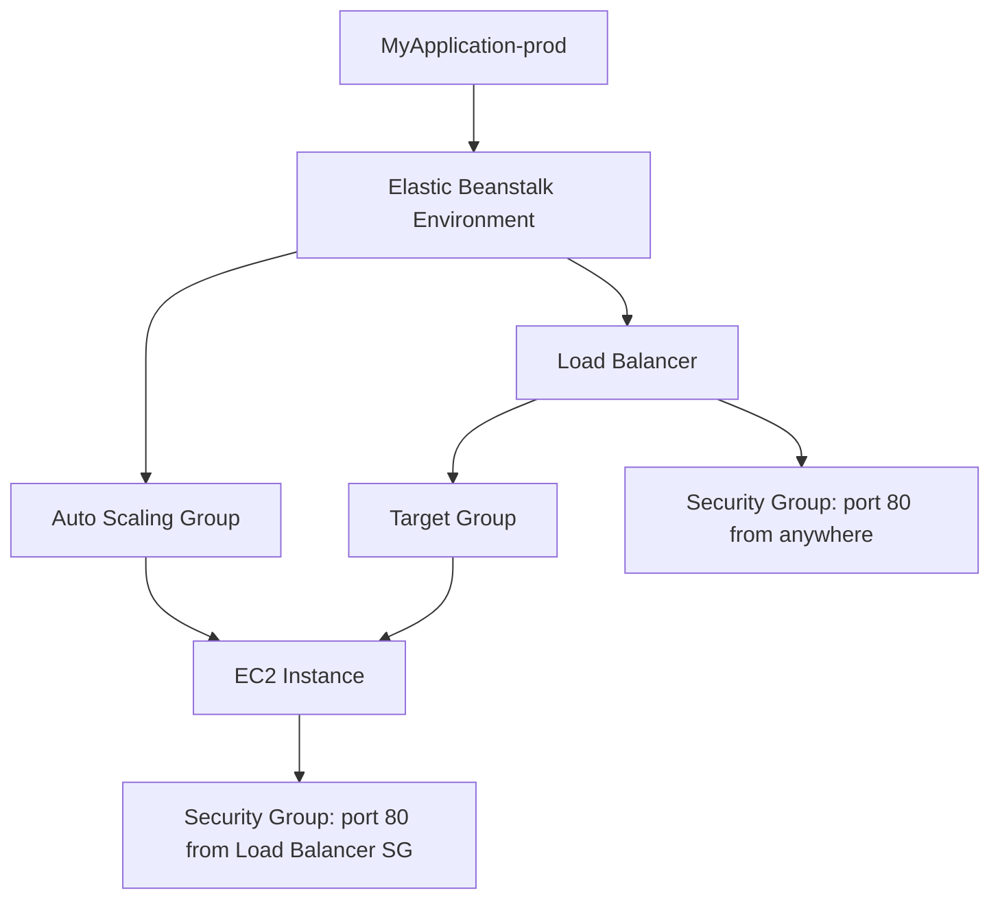

# 184. Beanstalk Second Environment

## 🎯 Giới thiệu
Trong bài này, Elastic Beanstalk được dùng để tạo **môi trường thứ hai** cho cùng một application, lần này là **production environment** (`prod`).

- Môi trường đầu tiên là **development**
- Môi trường mới là **production**
- Vẫn dùng:
  - **Managed platform**: `Node.js`
  - **Sample application** giống nhau
- Điểm khác biệt chính: chọn preset **High Availability** thay vì **Single Instance**

## 1. Cấu hình môi trường Beanstalk
Khi tạo environment mới, có nhiều cấu hình có thể chỉnh trực tiếp trong Beanstalk:

- Chọn **existing service role**
- Có thể cấu hình:
  - **Networking**
  - **Database**
  - **Tags**
- Chọn **VPC**
- Chọn **subnets** để triển khai instance
  - Ở đây chọn **tất cả subnets có sẵn** để đạt **high availability**
- Vì dùng **load balancer**, nên **không cần public IP** cho EC2 instances
- Có thể gắn **database** vào Beanstalk environment
  - Nhưng database này **gắn với lifecycle của environment**
  - Xóa environment thì database cũng bị xóa
  - Có thể snapshot và restore sau, nhưng transcript chỉ nhấn mạnh rủi ro lifecycle này

## 2. Instance, Auto Scaling và Load Balancer
Beanstalk cho phép cấu hình khá nhiều phần hạ tầng phía sau:

### Instance settings
- Có thể chọn:
  - **root volume**
  - **security groups**
  - cấu hình instance khác
- Trong bài, để Beanstalk tự cấu hình

### Auto Scaling Group
- Do là **Load Balanced environment**, ASG sẽ có:
  - **minimum capacity**
  - **maximum capacity**
- Ví dụ trong bài: `min 1`, `max 4`
- Có thể chọn:
  - **On-Demand**
  - **Spot**
- Có thể chọn loại instance như `t3.micro`, `t3.small`
- Có thể cấu hình:
  - **AMI ID**
  - **scale out / scale in thresholds**
  - các policy tự động

### Load Balancer
- Chọn:
  - **Application Load Balancer (ALB)**
  - hoặc **Network Load Balancer (NLB)**
- Có thể dùng:
  - **dedicated load balancer**
  - hoặc **shared load balancer** để tiết kiệm chi phí
- Cấu hình được:
  - **visibility**
  - **subnets**
  - **listeners**
  - **processes**
  - **rules**

### Health Reporting và Platform Software
- Có các tuỳ chọn:
  - **CloudWatch custom metrics**
  - **Enhanced health reporting**
  - **email notifications**
  - **rolling updates**
  - **Amazon X-Ray**
  - **stream logs to CloudWatch Logs**
- Transcript nhấn mạnh: Beanstalk tự quản lý khá nhiều thứ, nên đây là dịch vụ **powerful** nhưng cũng khá **complex**

## 3. Kết quả sau khi deploy
Sau khi submit và chờ khoảng **10 minutes**, environment mới đã sẵn sàng.

### Kiến trúc thực tế sau deploy
- App vẫn là **cùng một application**
- Nhưng được chạy theo kiểu **High Availability**
- Có:
  - **load balancer**
  - **target group**
  - **EC2 instance**
  - **security groups**
  - **Auto Scaling Group**

### Quan sát hạ tầng
- **Load balancer**
  - được tạo trong **3 Availability Zones**
- **Target group**
  - có **1 healthy instance**
- **EC2 instance**
  - thuộc environment `MyApplication-prod`
- **Security group**
  - instance security group:
    - chỉ cho phép **port 80** từ **load balancer security group**
  - load balancer security group:
    - cho phép **port 80 from anywhere**
    - outbound **port 80** đến anywhere

### Auto Scaling Groups
- Có **2 ASG**
  - một cho environment đầu
  - một cho **prod**
- ASG của prod có:
  - `min 1`
  - `max 4`
- Trong **Instance Management**, có **1 instance in service**
- Elastic Beanstalk tự tạo luôn **dynamic scaling policies**

### Mermaid

## 📊 Bảng tóm tắt
| Tiêu chí | Mô tả |
|----------|------|
| Mục tiêu | Tạo Beanstalk environment thứ hai cho production |
| Platform | `Node.js` |
| Preset | `High Availability` |
| Môi trường | `prod`, bên cạnh `development` |
| Networking | Chọn VPC và tất cả subnets để tăng HA |
| Public IP | Không cần vì có load balancer |
| Database | Nếu gắn vào environment thì phụ thuộc lifecycle của environment |
| ASG | Có min/max capacity, ví dụ `1-4` |
| Load Balancer | Có thể là `ALB` hoặc `NLB`, hỗ trợ shared LB |
| Health | Hỗ trợ `Enhanced health reporting`, CloudWatch metrics |
| Kết quả | Tạo load balancer, target group, EC2 instance, security groups, scaling policies |

## 💡 Mẹo ghi nhớ cho kỳ thi AWS
- **Beanstalk + High Availability** thường đi kèm:
  - **Load Balancer**
  - **Auto Scaling Group**
  - **multiple subnets / AZs**
- Nếu Beanstalk environment có **database embedded**, hãy nhớ:
  - **xóa environment => database cũng mất**
- **ALB** có thể **dedicated** hoặc **shared** giữa nhiều environment để tiết kiệm chi phí
- Khi cần HA, đừng quên:
  - **không gán public IP** cho EC2 instances nếu chỉ cần truy cập qua load balancer
- Beanstalk có thể tự tạo:
  - **scaling policies**
  - **security groups**
  - **health checks**
  - giúp giảm rất nhiều công việc thủ công

## ✅ Kết luận
Elastic Beanstalk có thể triển khai cùng một application thành nhiều environment, ví dụ **dev** và **prod**, với cấu hình khác nhau. Trong bài này, môi trường `prod` được tạo theo kiểu **High Availability**, tự sinh ra **Load Balancer**, **Auto Scaling Group**, **target group**, và các cấu hình liên quan, cho thấy Beanstalk có thể quản lý gần như toàn bộ hạ tầng phía sau chỉ từ vài lựa chọn triển khai.
