# 185. Beanstalk Deployment Modes

## 🎯 Giới thiệu
Elastic Beanstalk có nhiều **deployment modes** khi cập nhật ứng dụng. Mỗi mode khác nhau về:
- **Downtime**
- **Deployment speed**
- **Chi phí**
- **Rollback**
- **Mức độ tự động hóa**

```mermaid
flowchart TD
    A[Elastic Beanstalk Deployment Modes] --> B[All at once]
    A --> C[Rolling]
    A --> D[Rolling with additional batch]
    A --> E[Immutable]
    A --> F[Blue/Green]
    A --> G[Traffic splitting]

    B --> B1[Nhanh nhất]
    B --> B2[Có downtime]

    C --> C1[Update theo từng bucket]
    C --> C2[Không thêm chi phí]
    C --> C3[Có thể chạy 2 version cùng lúc]

    D --> D1[Giữ at capacity]
    D --> D2[Có thêm chi phí nhỏ]
    D --> D3[Đổi mới bằng batch bổ sung]

    E --> E1[Deploy lên new instances]
    E --> E2[Zero downtime]
    E --> E3[Cost cao, rollback nhanh]

    F --> F1[Tạo môi trường mới]
    F --> F2[Swap URL khi sẵn sàng]
    F --> F3[Manual, không phải feature trực tiếp của EB]

    G --> G1[Canary testing]
    G --> G2[Send một phần traffic]
    G --> G3[Automated rollback]
```

## 1. Các kiểu deployment cơ bản
### All at once
- Deploy toàn bộ cùng lúc lên tất cả EC2 instances.
- **Nhanh nhất**.
- Có **downtime** vì instances tạm thời không phục vụ traffic.
- Phù hợp cho:
  - môi trường development
  - khi cần deploy nhanh
  - không quá quan tâm downtime
- **Không có additional cost**.

### Rolling
- Update từng nhóm instances theo **bucket**.
- Chỉ một phần instances được update trước, rồi mới sang bucket tiếp theo.
- Trong quá trình deploy, ứng dụng có thể chạy **cả v1 và v2 cùng lúc**.
- **Không thêm chi phí**.
- Nếu bucket size nhỏ và số lượng instance lớn, deployment sẽ **rất lâu**.

## 2. Các kiểu deployment giữ capacity tốt hơn
### Rolling with additional batch
- Tương tự rolling, nhưng Elastic Beanstalk tạo thêm **new instances** trước.
- Giúp ứng dụng vẫn chạy **at capacity** trong khi update.
- Có **chi phí bổ sung nhỏ**.
- Sau khi deploy xong, additional batch sẽ bị terminate.
- Vẫn có thể chạy **v1 và v2 cùng lúc** trong quá trình triển khai.

### Immutable
- Deploy version mới lên **new instances** trong một **temporary Auto Scaling group**.
- Chỉ khi health checks ổn thì mới chuyển sang.
- **Zero downtime**.
- **Cost cao hơn** vì gần như **double capacity**.
- Có lợi thế lớn là **rollback rất nhanh**: chỉ cần terminate temporary ASG nếu có lỗi.
- Đây là lựa chọn tốt cho **prod** nếu chấp nhận chi phí cao hơn.

## 3. Blue/Green và Traffic Splitting
### Blue/Green
- Tạo **một Elastic Beanstalk environment mới** hoàn toàn.
- Deploy version mới vào environment **green**.
- Environment cũ là **blue**.
- Có thể test environment mới độc lập trước khi chuyển traffic.
- Dùng **Route 53 weighted policies** để chia một phần traffic sang green.
- Khi sẵn sàng, có thể **swap URLs**.
- Transcript nhấn mạnh đây là cách **rất manual** và không phải feature trực tiếp, rõ ràng của Elastic Beanstalk.

### Traffic splitting
- Dùng cho **canary testing**.
- Deploy version mới vào **temporary Auto Scaling group** có cùng capacity.
- Một phần nhỏ traffic được gửi sang temporary ASG trong một khoảng thời gian cấu hình được.
- Ví dụ: **90%** traffic vào main ASG, **10%** vào temporary ASG.
- Việc này được **automated**.
- Health của temporary ASG được monitor.
- Nếu deployment fail hoặc metric có vấn đề, hệ thống sẽ **automated rollback** rất nhanh.
- Không có downtime.
- Khi ổn định, new instances sẽ được migrate về main ASG, rồi old version bị terminate.

## 📊 Bảng tóm tắt
| Tiêu chí | Mô tả |
|----------|------|
| All at once | Nhanh nhất, nhưng có downtime, không thêm chi phí |
| Rolling | Update theo bucket, không thêm chi phí, có thể lâu nếu nhiều instances |
| Rolling with additional batch | Giữ at capacity, có thêm chi phí nhỏ |
| Immutable | Deploy lên new instances, zero downtime, cost cao, rollback nhanh |
| Blue/Green | Tạo environment mới, có thể test độc lập, swap URL khi xong |
| Traffic splitting | Canary testing, chia traffic có kiểm soát, rollback tự động rất nhanh |

## 💡 Mẹo ghi nhớ cho kỳ thi AWS
- **All at once** = nhanh nhất, nhưng **downtime**.
- **Rolling** = update theo **bucket**, không thêm chi phí.
- **Rolling with additional batch** = rolling nhưng có **extra capacity** để giữ tải, nên có **small additional cost**.
- **Immutable** = **new instances**, **zero downtime**, **high cost**, **quick rollback**.
- **Blue/Green** = **new environment**, thường liên quan **Route 53 weighted policy** và **swap URLs**.
- **Traffic splitting** = nhớ ngay đến **canary testing** và **automated rollback**.
- Nếu đề bài nói:
  - cần **zero downtime** → nghĩ đến **Immutable**, **Blue/Green**, hoặc **Traffic splitting**
  - cần **test một phần traffic** → nghĩ đến **Traffic splitting**
  - cần **deployment nhanh nhất** → nghĩ đến **All at once**

## ✅ Kết luận
Elastic Beanstalk có nhiều deployment modes với trade-off khác nhau giữa **speed**, **downtime**, **cost**, và **rollback**.  
Trong ôn thi AWS, hãy đặc biệt nhớ:
- **All at once**: nhanh nhưng downtime
- **Rolling**: theo bucket
- **Rolling with additional batch**: giữ capacity tốt hơn
- **Immutable**: zero downtime, rollback nhanh
- **Blue/Green**: environment mới + swap URL
- **Traffic splitting**: canary testing + automated rollback
