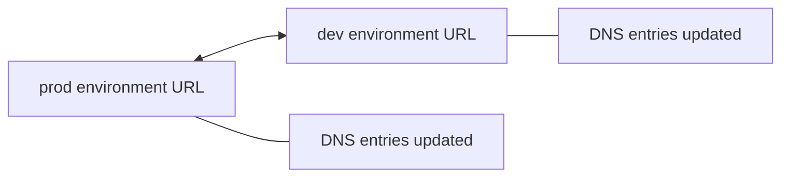

# 186. Beanstalk Deployment Modes Hands On

## 🎯 Giới thiệu
Bài giảng này tập trung vào **application deployments** trong Elastic Beanstalk, đặc biệt là các **deployment policies** và cách chúng tác động đến môi trường khi deploy version mới. Transcript cũng minh họa thêm **environment swapping** để đổi URL giữa 2 môi trường.

## 1. Deployment Modes trong Elastic Beanstalk
- Khi vào **Configuration > Updates, monitoring, and logging > Edit**, phần **application deployments** cho phép chọn cách triển khai version mới.
- Các mode được nhắc đến:
  - **All at once**
    - Đẩy code update lên toàn bộ instances cùng lúc.
    - Nhanh nhất nhưng có thời gian **downtime**.
    - Các tùy chọn **fixed** và **percentage** hiển thị nhưng không có tác dụng trong mode này.
  - **Rolling**
    - Cập nhật theo từng batch.
    - Có thể chọn batch size theo:
      - **percentage**: ví dụ 30% instances mỗi lần
      - **fixed**: ví dụ 1 instance mỗi lần
  - **Rolling with additional batch**
    - Tạo thêm EC2 instances tạm thời để giữ nguyên capacity trong lúc deploy.
    - Có thêm chi phí vì tạo instance bổ sung.
  - **Immutable**
    - Tạo một bộ instances mới hoàn toàn để deploy vào đó.
    - Sau khi ổn định thì xóa bộ cũ.
    - Đây là mode được demo trong bài.
  - **Traffic splitting**
    - Chia một phần traffic sang version mới trong một khoảng thời gian trước khi chuyển toàn bộ.

### Mermaid: Immutable deployment flow
```mermaid
flowchart TD
    A[Upload new application version] --> B[Elastic Beanstalk updates environment]
    B --> C[Launch temporary Auto Scaling Group]
    C --> D[Create new instance(s)]
    D --> E[Add new instance to Load Balancer]
    E --> F[Wait for health check pass]
    F --> G[Detach new instances from temporary group]
    G --> H[Attach to permanent Auto Scaling Group]
    H --> I[Post-deployment configuration]
    I --> J[Terminate old instances and temporary ASG]
    J --> K[Deployment complete]
```

## 2. Immutable Deployment Flow và Kết quả
- Bản app Node.js được dùng để test deploy.
- File ứng dụng có các thành phần được nhắc đến:
  - `index.html`: trang welcome
  - `app.js`: phần Node.js tạo server
  - `cron.yaml`: lên lịch task định kỳ
  - `.ebextensions`: custom cấu hình Elastic Beanstalk
- Transcript cho thấy thay đổi nội dung ứng dụng từ **green** sang **blue**.
- Khi upload version mới với **deployment preference = immutable**:
  - Hệ thống tạo **temporary Auto Scaling Group**
  - Launch instance mới và chờ **health check**
  - Chuyển instance mới sang **permanent Auto Scaling Group**
  - Thực hiện **post-deployment configuration**
  - Xóa instance cũ và temporary group
- Kết quả cuối:
  - **prod** hiển thị màu **blue**
  - **dev** vẫn hiển thị màu **green**

## 3. Environment Swapping
- Bài giảng cũng demo **swap environment domains** giữa 2 môi trường.
- Mục đích:
  - Clone một môi trường như **prod**
  - Deploy và test ở môi trường mới
  - Khi sẵn sàng, swap domain để đổi vai trò giữa 2 môi trường
- Việc swap này liên quan đến **DNS entries**:
  - Domain của môi trường này trỏ sang môi trường kia và ngược lại
- Do DNS có thể cập nhật chậm, kết quả có thể mất một lúc mới phản ánh.
- Sau swap:
  - Môi trường **prod** hiển thị nội dung trước đó của **dev**
  - Môi trường **dev** hiển thị nội dung trước đó của **prod**

### Mermaid: Environment swapping


## 📊 Bảng tóm tắt
| Tiêu chí | Mô tả |
|----------|------|
| All at once | Deploy lên toàn bộ instances cùng lúc, nhanh nhất nhưng có downtime |
| Rolling | Deploy theo batch, có thể dùng percentage hoặc fixed |
| Rolling with additional batch | Tạo thêm EC2 instances tạm thời để giữ capacity |
| Immutable | Tạo bộ instances mới, kiểm tra health rồi thay thế bộ cũ |
| Traffic splitting | Chia traffic sang version mới trong một thời gian |
| Environment swapping | Đổi DNS/domain giữa 2 environment sau khi clone và test |

## 💡 Mẹo ghi nhớ cho kỳ thi AWS
- **All at once = nhanh nhất, rủi ro downtime cao**
- **Rolling = thay từng phần**
- **Rolling with additional batch = thêm capacity tạm thời**
- **Immutable = new ASG, new instances, old ones bị xóa sau cùng**
- **Traffic splitting = chia traffic cho version mới trước khi chuyển hẳn**
- **Swap environment domains = đổi URL/DNS giữa 2 môi trường**

## ✅ Kết luận
Elastic Beanstalk cung cấp nhiều **deployment modes** để cân bằng giữa tốc độ deploy, downtime và chi phí. Trong transcript, trọng tâm là **immutable deployment** và **environment swapping**, đặc biệt hữu ích khi cần test version mới rồi chuyển môi trường một cách an toàn.
