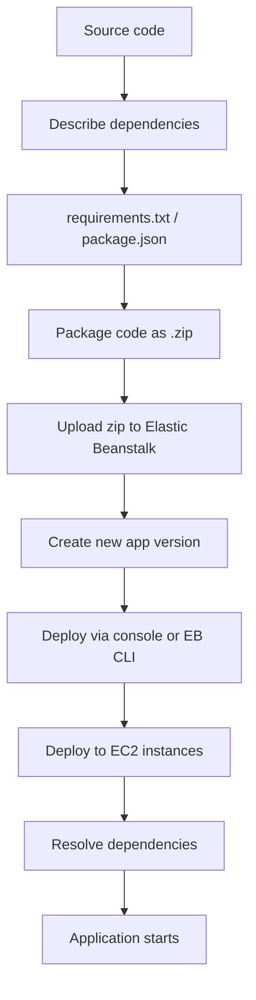

# 187. Beanstalk CLI and Deployment Process

## 🎯 Giới thiệu
- **Elastic Beanstalk CLI (EB CLI)** là công cụ dòng lệnh giúp làm việc với **Elastic Beanstalk** dễ hơn so với thao tác trên console.
- Nó có thể thay thế nhiều thao tác quen thuộc trên console như:
  - `eb create`
  - `eb status`
  - `eb health`
  - `eb events`
  - `eb logs`
  - `eb open`
  - `eb deploy`
  - `eb config`
  - `eb terminate`
- EB CLI đặc biệt hữu ích khi cần **automate development pipelines**.
- Theo transcript:
  - Không cần nắm quá sâu EB CLI cho **developer exam**
  - Quan trọng hơn cho **DevOps exam**

## 1. Quy trình triển khai ứng dụng Beanstalk 🚀
- Để deploy ứng dụng lên Beanstalk, cần **mô tả dependencies** trước.
- Ví dụ:
  - Python: tạo `requirements.txt`
  - Node.js: tạo `package.json`
- Sau đó:
  - Đóng gói toàn bộ code thành file **`.zip`**
  - Upload file zip lên **Beanstalk**
- Khi upload xong:
  - Beanstalk tạo ra **new app version**
  - App version này có thể được deploy bằng **console** hoặc **CLI**
- EB CLI cũng có thể thực hiện cùng quy trình:
  - tạo zip
  - upload zip
  - deploy application

## 2. Backend process bên trong Beanstalk 🔧
- Sau khi zip được upload, Beanstalk sẽ:
  - deploy các file zip đó lên từng **EC2 instances**
  - resolve dependencies từ file `requirements.txt` hoặc `package.json`
  - khởi động ứng dụng
- Đây là phần **backend process** giúp hiểu cách Beanstalk hoạt động phía sau.

## 3. Ý nghĩa khi ôn thi AWS 🎓
- Cần nhớ:
  - EB CLI **tồn tại**
  - EB CLI giúp thao tác với Elastic Beanstalk nhanh và thuận tiện hơn
  - Nó hỗ trợ **deployment workflow** của Beanstalk
- Tuy nhiên, theo transcript:
  - Đây không phải phần trọng tâm của **developer exam**
  - Chủ yếu phù hợp để biết về mặt khái niệm và cho **DevOps exam**

## 📊 Bảng tóm tắt
| Tiêu chí | Mô tả |
|----------|------|
| Công cụ | **EB CLI** |
| Mục đích | Làm việc với **Elastic Beanstalk** qua command line |
| Lệnh ví dụ | `eb create`, `eb status`, `eb health`, `eb events`, `eb logs`, `eb open`, `eb deploy`, `eb config`, `eb terminate` |
| Chuẩn bị deploy | Khai báo dependencies bằng `requirements.txt` hoặc `package.json` |
| Gói triển khai | Đóng gói code thành file **zip** |
| Kết quả upload | Tạo **new app version** |
| Triển khai cuối | Beanstalk deploy lên **EC2 instances** và resolve dependencies |
| Ý nghĩa thi cử | Biết khái niệm, quan trọng hơn cho **DevOps exam** |

## 💡 Mẹo ghi nhớ cho kỳ thi AWS
- **Beanstalk = zip + dependencies + app version + deploy**
- Nhớ chuỗi xử lý:
  - **Code**
  - **Dependencies**
  - **Zip**
  - **Upload**
  - **App version**
  - **Deploy**
  - **EC2 instances**
- EB CLI là cách làm việc **nhanh hơn từ CLI**, nhưng trọng tâm thi chủ yếu là hiểu **quy trình deploy** hơn là thuộc từng lệnh.

## ✅ Kết luận
- EB CLI là công cụ dòng lệnh giúp thao tác với **Elastic Beanstalk** thuận tiện hơn.
- Khi deploy, cần khai báo dependencies, đóng gói thành zip, upload lên Beanstalk, tạo app version và deploy xuống các **EC2 instances**.
- Với mục tiêu ôn thi AWS, trọng tâm là hiểu **deployment process** và biết EB CLI tồn tại, không cần đi sâu vào chi tiết lệnh.
