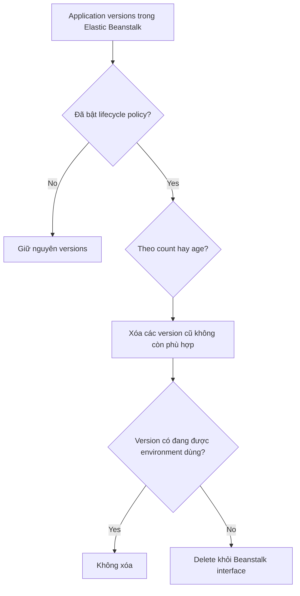

# 188. Beanstalk Lifecycle Policy Overview + Hands On

## 🎯 Giới thiệu
- Elastic Beanstalk có thể lưu tối đa **1000 application versions** trong account.
- Nếu không dọn các version cũ, bạn sẽ **không thể deploy** ứng dụng Beanstalk nữa.
- Giải pháp là dùng **Beanstalk lifecycle policy** để:
  - loại bỏ các version cũ theo **time**
  - hoặc theo **space / count** khi có quá nhiều version

## 1. ⚙️ Cách hoạt động của Lifecycle Policy
- Lifecycle policy chỉ áp dụng để **phase out** các version cũ.
- Bạn có thể cấu hình theo:
  - **count**: giới hạn số lượng application versions
  - **age**: giữ version trong một khoảng thời gian nhất định
- Ví dụ trong transcript:
  - giữ tối đa **200 application versions**
  - hoặc chỉ giữ **180 days** version đã được dùng
- **Version đang được môi trường sử dụng sẽ không bị xóa**, dù đã cũ hoặc chiếm nhiều dung lượng.

## 2. 🪣 Vai trò của Amazon S3 trong Beanstalk versions
- Khi upload application version, **source bundle** được lưu trong **Amazon S3**.
- Elastic Beanstalk có một **bucket** để giữ các application versions.
- Trong hands-on:
  - vào **application versions** của `MyApplication`
  - thấy version `MyApplication-blue`
  - kiểm tra trong **Amazon S3** sẽ thấy file đã được upload
- Nghĩa là:
  - version vẫn được **registrar** trong Beanstalk
  - và file nguồn vẫn nằm trong **S3**

## 3. 🧹 Xóa version và tùy chọn giữ source bundle
- Khi lifecycle policy áp dụng, version có thể bị **xóa khỏi Beanstalk** nếu không còn phù hợp.
- Với **Amazon S3**, có 2 lựa chọn:
  - **Retain the source bundle in Amazon S3**
    - hữu ích nếu muốn recovery hoặc restore sau này
  - **Delete the source bundle from S3**
- Role được dùng để thực hiện việc xóa này là:
  - **AWS Elastic Beanstalk service role**

## 📊 Bảng tóm tắt
| Tiêu chí | Mô tả |
|----------|------|
| Giới hạn | Beanstalk lưu tối đa **1000 application versions** |
| Mục đích lifecycle policy | Dọn version cũ để tránh không deploy được nữa |
| Điều kiện áp dụng | Theo **count** hoặc **age** |
| Version đang dùng | **Không bị xóa** |
| Source bundle | Có thể **giữ lại trong S3** hoặc **xóa khỏi S3** |
| Thành phần liên quan | **Elastic Beanstalk service role** |

## 💡 Mẹo ghi nhớ cho kỳ thi AWS
- Nhớ 3 ý chính:
  - **1000 application versions** là giới hạn quan trọng
  - lifecycle policy có thể dựa trên **count** hoặc **age**
  - version đang được environment dùng thì **không bị xóa**
- Nếu đề bài hỏi về nơi lưu source bundle của Beanstalk, hãy nghĩ đến **Amazon S3**.
- Nếu hỏi ai thực hiện việc xóa, đáp án trong transcript là **AWS Elastic Beanstalk service role**.
- Khi ôn thi, phân biệt rõ:
  - **xóa khỏi Beanstalk interface**
  - và **xử lý source bundle trong S3**

## ✅ Kết luận
- Elastic Beanstalk cần lifecycle policy để quản lý application versions và tránh vượt giới hạn lưu trữ.
- Policy có thể dựa trên **count** hoặc **age**, nhưng **version đang active** sẽ không bị xóa.
- Source bundle được lưu trong **Amazon S3**, và bạn có thể chọn giữ lại để phục vụ recovery hoặc xóa đi khi không cần nữa.
