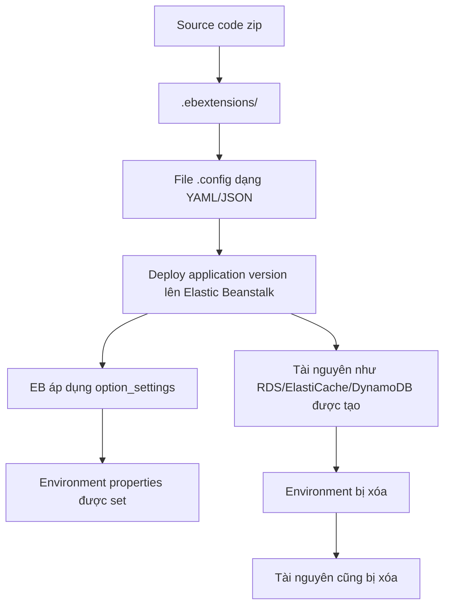

# 189. Beanstalk Extensions

## 🎯 Giới thiệu
Elastic Beanstalk Extensions (EB extensions) cho phép bạn đưa cấu hình hạ tầng và ứng dụng vào trong source code, thay vì chỉ cấu hình thủ công trên Elastic Beanstalk console.  
Chúng được đóng gói cùng zip deployment và được áp dụng khi triển khai application version lên environment.

## 1. EB extensions là gì? 🧩
- EB extensions là các file cấu hình đi kèm source code để thiết lập những thứ vốn có thể chỉnh trong UI.
- Dùng để:
  - thay đổi một số default settings
  - khai báo environment variables
  - thêm một số resources mà console không tiện set trực tiếp
- Các resource có thể được tạo qua EB extensions trong transcript gồm:
  - RDS
  - ElastiCache
  - DynamoDB
  - và các tài nguyên khác tương tự

## 2. Quy tắc đặt file EB extensions 📁
- File phải nằm trong thư mục `.ebextensions/` ở root của source code.
- File phải có định dạng YAML hoặc JSON.
- Dù nội dung là YAML/JSON, extension của file vẫn phải kết thúc bằng `.config`
  - ví dụ: `logging.config`
- Nếu không đúng cả 2 điều kiện này:
  - không đặt trong `.ebextensions/`
  - không có đuôi `.config`
  thì EB extension sẽ không hoạt động.

## 3. `option_settings` và workflow deploy 🚀
- Trong file EB extension, có thể dùng `option_settings` để cấu hình.
- Ví dụ trong transcript:
  - set application environment variables
  - `DB_URL`
  - `DB_USER`
- Mục đích là inject giá trị cấu hình vào ứng dụng khi deploy, ví dụ để connect tới external RDS database như Postgres.
- Sau khi zip source code và deploy version mới:
  - Elastic Beanstalk sẽ áp dụng file EB extension
  - các environment properties sẽ xuất hiện trong Configuration của environment
- Điểm quan trọng:
  - tài nguyên được tạo bởi EB extensions sẽ bị xóa khi environment bị xóa

## 📊 Bảng tóm tắt
| Tiêu chí | Mô tả |
|----------|------|
| Mục đích | Đưa cấu hình EB vào code thay vì làm thủ công trên console |
| Vị trí file | `.ebextensions/` ở root source code |
| Định dạng | YAML hoặc JSON |
| Đuôi file | Bắt buộc `.config` |
| Cấu hình nổi bật | `option_settings`, environment variables |
| Tài nguyên hỗ trợ | RDS, ElastiCache, DynamoDB, và các resource khác |
| Lifecycle | Tài nguyên do EB extensions tạo ra sẽ bị xóa khi environment bị xóa |

## 💡 Mẹo ghi nhớ cho kỳ thi AWS
- Nhớ 3 điểm cốt lõi: `.ebextensions/` + `.config` + YAML/JSON.
- `option_settings` dùng để set cấu hình, đặc biệt là environment variables.
- EB extensions có thể tạo resource kèm theo environment, nhưng resource đó gắn với lifecycle của environment.
- Nếu environment bị delete, resource do EB extensions tạo cũng bị delete theo.

## ✅ Kết luận
EB extensions là cách đưa cấu hình Elastic Beanstalk vào source code để deploy nhất quán và tự động hơn.  
Chỉ cần nhớ đúng vị trí `.ebextensions/`, đúng đuôi `.config`, và khả năng dùng `option_settings` để set environment variables hoặc tạo resource đi kèm environment.
