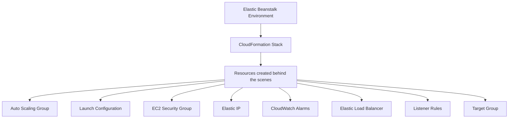

# 190. Beanstalk & CloudFormation

## 🎯 Giới thiệu
- Bài này giải thích “under the hood” của **Elastic Beanstalk**.
- Điểm chính: **Beanstalk relies on CloudFormation** để thực hiện nhiều hoạt động bên trong.
- **CloudFormation** được dùng để provision các AWS services theo kiểu **infrastructure as code**.
- Nhờ đó, dù UI của Beanstalk chỉ cho cấu hình một số thứ, bạn vẫn có thể mở rộng bằng **.ebextensions** và **CloudFormation**.

## 1. Elastic Beanstalk hoạt động qua CloudFormation
- **Elastic Beanstalk** dùng **CloudFormation** làm nền tảng cho nhiều thao tác.
- Trong **.ebextensions** folder, bạn có thể dùng CloudFormation resources để provision thêm tài nguyên.
- Transcript nhấn mạnh rằng bạn có thể provision:
  - **ElastiCache**
  - **S3 bucket**
  - **DynamoDB table**
  - và “whatever you want”
- Ý nghĩa ôn thi:
  - Beanstalk không chỉ bị giới hạn ở vài tùy chọn UI.
  - Kết hợp **EB extensions** + **CloudFormation** có thể cấu hình rất linh hoạt.

## 2. Những gì CloudFormation tạo ra cho Beanstalk
- Khi xem trong **CloudFormation**, mỗi environment của Beanstalk tương ứng với một **stack**.
- Transcript nêu ví dụ có 2 stack khác nhau:
  - một stack cho **-en**
  - một stack cho **-prod**
- Khi mở stack và xem **resources**, có thể thấy toàn bộ tài nguyên được tạo ra.

### Với stack `-en`
- **Auto Scaling Group**
- **Auto Scaling Group Launch Configuration**
- **Elastic IP (EIP)**
- **EC2 Security Group**
- **Wait conditions**  
  - transcript nói có thể bỏ qua phần này

### Với stack `-prod`
- **Auto Scaling Group**
- **Launch Configuration**
- **Scaling Policy**
- **CloudWatch Alarm**
- **EC2 Security Group**
- **Elastic Load Balancer**
- **Listener rules**
- **Target group**

## 3. Luồng triển khai

- Mỗi **Beanstalk environment** được gắn với một **CloudFormation stack**.
- CloudFormation sẽ tạo ra các resource cần thiết phía sau.
- Transcript nhấn mạnh: bạn không cần trực tiếp thao tác CloudFormation trong bài này, nhưng cần biết Beanstalk dùng nó để provision.

## 📊 Bảng tóm tắt
| Tiêu chí | Mô tả |
|----------|------|
| Thành phần chính | **Elastic Beanstalk** dùng **CloudFormation** ở phía sau |
| Mô hình | **Infrastructure as code** |
| Tính mở rộng | Có thể dùng **.ebextensions** để provision thêm resource |
| Ví dụ resource | **ElastiCache**, **S3 bucket**, **DynamoDB table** |
| Quan sát trong AWS | Mỗi environment tương ứng với một **CloudFormation stack** |
| Resource tạo ra | **Auto Scaling Group**, **Launch Configuration**, **EIP**, **Security Group**, **CloudWatch Alarm**, **ELB**, **Listener rules**, **Target group** |

## 💡 Mẹo ghi nhớ cho kỳ thi AWS
- **Beanstalk = UI đơn giản, nhưng backend mạnh nhờ CloudFormation**.
- Nhớ cụm: **.ebextensions + CloudFormation = mở rộng cấu hình**.
- Khi thấy Beanstalk environment, hãy nghĩ ngay đến:
  - **CloudFormation stack**
  - **Auto Scaling**
  - **Security Group**
  - **Load Balancer**
- Nếu đề bài hỏi “Beanstalk tạo gì phía sau?”, câu trả lời trong transcript là:
  - **Auto Scaling Group**
  - **Launch Configuration**
  - **Security Group**
  - **CloudWatch Alarm**
  - **ELB / Target group**
- Nếu cần thêm resource ngoài Beanstalk mặc định, transcript cho biết có thể dùng **CloudFormation resources** trong **.ebextensions**.

## ✅ Kết luận
- **Elastic Beanstalk** hoạt động dựa trên **CloudFormation** để provision tài nguyên phía sau.
- Qua **.ebextensions**, bạn có thể mở rộng ứng dụng Beanstalk để tạo thêm nhiều AWS resources khác nhau.
- Trong thực tế minh họa của transcript, một environment Beanstalk được triển khai thành một **CloudFormation stack** với nhiều resource như **Auto Scaling Group**, **Security Group**, **CloudWatch Alarm**, và **Load Balancer**.
