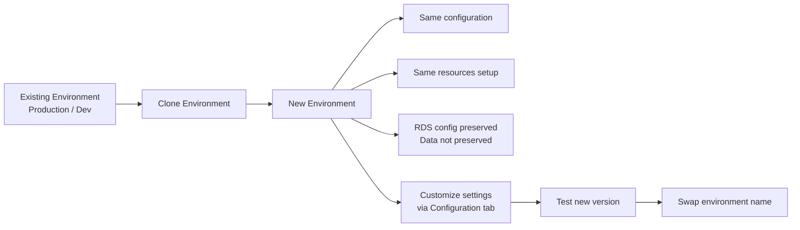

# 191. Beanstalk Cloning

## 🎯 Giới thiệu
- **Elastic Beanstalk cloning** cho phép tạo một **new environment** từ một environment hiện có với **exact same configuration**.
- Cách này rất hữu ích khi bạn đã có **production environment** và muốn tạo một **test environment** với cùng settings để kiểm thử.

## 1. Mục đích của Cloning
- Dùng để sao chép một environment sang environment mới.
- Phù hợp khi muốn:
  - Tạo môi trường test từ production
  - Giữ nguyên cấu hình để kiểm tra hành vi giống thật
  - Chuẩn bị cho việc **swap environment** sau khi test xong

## 2. Những gì được giữ nguyên
- **All resources and configuration** của environment gốc được bảo toàn.
- Bao gồm:
  - **Load balancer type** và configuration
  - **RDS database type**
  - **Environment variables**
  - Các cấu hình khác tương tự
- Lưu ý:
  - Nếu có **RDS database**, thì **data không được preserve**
  - Chỉ **configuration** của RDS được giữ lại

## 3. Cách thao tác và kết quả
- Trong console:
  - Chọn application
  - Vào **Action**
  - Chọn **Clone Environment**
- Có thể clone sang environment mới như `dev two`, `test`, hoặc tên khác.
- Các tùy chọn khá hạn chế:
  - Có thể chọn **new platform version** hoặc không
  - Chọn **service role**
- Sau khi clone:
  - Có thể chỉnh lại settings ở tab **Configuration**
  - Mục tiêu thường là deploy version mới, test, rồi thực hiện **swap of the environment name**

## 📊 Bảng tóm tắt
| Tiêu chí | Mô tả |
|----------|------|
| Mục đích | Tạo environment mới từ environment hiện có |
| Điểm mạnh | Giữ nguyên exact same configuration |
| Phù hợp cho | Tạo test environment từ production |
| Được giữ lại | Load balancer type, RDS configuration, environment variables, các settings khác |
| Không được giữ lại | RDS data |
| Sau khi clone | Có thể chỉnh settings trong Configuration tab |
| Kịch bản sử dụng | Test version mới rồi swap environment name |

## 💡 Mẹo ghi nhớ cho kỳ thi AWS
- Nhớ cụm: **clone = same configuration, not same data**.
- Nếu đề bài nói:
  - cần tạo môi trường test giống production
  - cần giữ nguyên cấu hình
  - không cần giữ dữ liệu RDS
  => nghĩ ngay đến **Elastic Beanstalk Cloning**.
- Từ khóa dễ xuất hiện: **Configuration**, **Environment variables**, **RDS data not preserved**, **swap environment**.

## ✅ Kết luận
- **Beanstalk Cloning** là cách sao chép một Elastic Beanstalk environment sang environment mới với cấu hình gần như giống hệt.
- Nó giữ lại cấu hình và resource setup, nhưng **không giữ dữ liệu RDS**.
- Đây là tính năng hữu ích để tạo môi trường test từ production và chuẩn bị cho quá trình triển khai hoặc swap môi trường.
