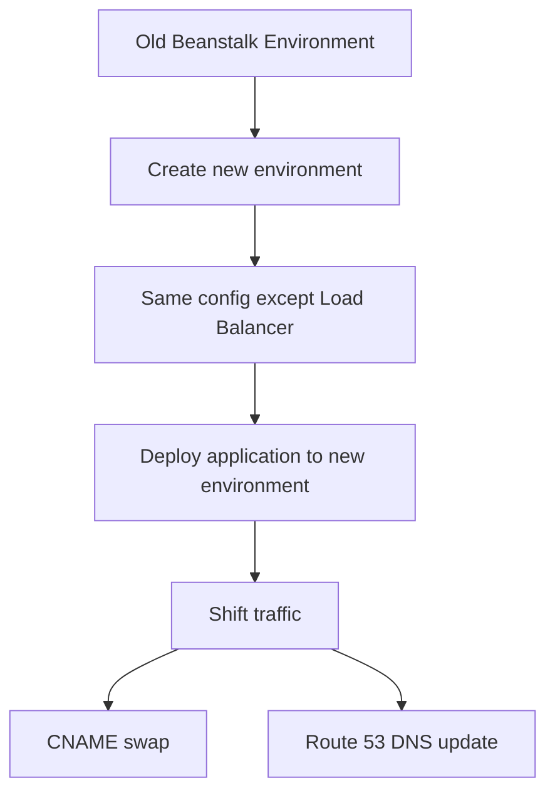
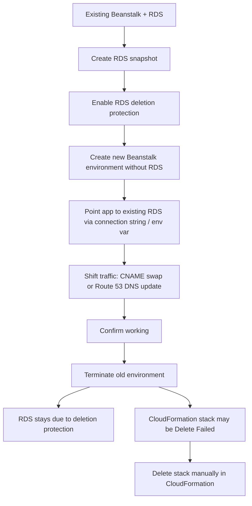

# 192. Beanstalk Migrations

## 🎯 Giới thiệu
Bài này nói về các tình huống **Elastic Beanstalk migration** thường gặp trong exam AWS, tập trung vào 2 luồng chính:
- **Migration Load Balancer** trong Beanstalk environment
- **Decouple RDS** ra khỏi Beanstalk environment để phù hợp với production

## 1. Migrate Load Balancer trong Elastic Beanstalk
- Sau khi tạo **Beanstalk environment**, bạn **không thể đổi loại Elastic Load Balancer**.
- Bạn chỉ có thể thay đổi **configuration** của Load Balancer hiện tại.
- Ví dụ:
  - **Classic Load Balancer** chỉ chỉnh được setting của nó
  - Không thể nâng trực tiếp từ **Classic Load Balancer** lên **Application Load Balancer**
  - Tương tự, không thể đổi trực tiếp từ **Application Load Balancer** sang **Network Load Balancer**
- Cách làm đúng là **migration**:
  - Tạo **new environment** với cùng configuration, **trừ Load Balancer**
  - Không dùng **clone feature** vì clone sẽ copy y hệt Load Balancer type và configuration
  - Recreate thủ công môi trường mới
  - Deploy application lên environment mới
  - Shift traffic từ môi trường cũ sang môi trường mới bằng:
    - **CNAME swap**
    - hoặc **Route 53 DNS update**

## 2. Decouple RDS khỏi Beanstalk
- **RDS** có thể được provision cùng với Beanstalk application.
- Cách này phù hợp cho **development** và **test**.
- Nhưng trong **production**, đây không phải lựa chọn tốt vì:
  - lifecycle của database bị gắn với lifecycle của Beanstalk environment
- Cách tốt hơn trong production:
  - Tách **RDS Database** ra khỏi Beanstalk environment
  - Kết nối bằng **connection string**
  - Có thể lưu connection string qua **environment variable**

### Các bước decouple RDS
- Tạo **snapshot** của RDS Database để làm safeguard
- Vào **RDS console** và bật **deletion protection**
- Tạo **new Elastic Beanstalk environment** mà **không có RDS**
- Point application tới **existing RDS Database**
- Có thể dùng **environment variable** để cấu hình kết nối
- Shift traffic từ môi trường cũ sang môi trường mới bằng:
  - **CNAME swap**
  - hoặc **Route 53 DNS updates**
- Xác nhận hệ thống hoạt động
- Terminate old environment
- Vì đã bật **RDS deletion protection**, RDS sẽ vẫn còn
- **CloudFormation stack** phía sau Beanstalk có thể ở trạng thái **Delete Failed**
- Cần vào **CloudFormation** và xóa stack đó **manually**

## 3. Ý chính cần nhớ cho exam
- **Không đổi trực tiếp loại Load Balancer** trong Beanstalk environment sau khi tạo.
- Muốn đổi loại Load Balancer thì phải:
  - tạo **environment mới**
  - deploy lại
  - **shift traffic**
- **Clone** không giải quyết được vì nó copy nguyên trạng Load Balancer.
- Với **RDS**, production nên **tách database ra khỏi Beanstalk**.
- Trước khi tách RDS nên:
  - tạo **snapshot**
  - bật **deletion protection**
- Sau khi terminate environment cũ:
  - RDS vẫn tồn tại
  - có thể cần xóa **CloudFormation stack** thủ công nếu bị **Delete Failed**

## 📊 Bảng tóm tắt
| Tiêu chí | Mô tả |
|----------|------|
| Mục tiêu migration | Đổi Load Balancer hoặc tách RDS khỏi Beanstalk |
| Giới hạn của Beanstalk | Không thể đổi loại Load Balancer sau khi tạo environment |
| Cách xử lý Load Balancer | Tạo environment mới, deploy lại, shift traffic |
| Clone feature | Không dùng được cho việc đổi loại Load Balancer |
| Cách shift traffic | **CNAME swap** hoặc **Route 53 DNS update** |
| RDS trong Beanstalk | Phù hợp cho dev/test, không phù hợp production |
| Cách decouple RDS | Snapshot, bật deletion protection, tạo env mới không có RDS |
| Sau khi tách RDS | Terminate env cũ, xóa CloudFormation stack nếu cần |

## 💡 Mẹo ghi nhớ cho kỳ thi AWS
- Nhớ câu: **“Đổi Load Balancer = tạo environment mới”**
- Nhớ câu: **“Clone không đổi được LB type”**
- Với production, **RDS không nên đi chung lifecycle với Beanstalk**
- Khi tách RDS:
  - **Snapshot trước**
  - **Deletion protection sau**
  - **Traffic cutover sau cùng**
- Nếu thấy đáp án nói **upgrade trực tiếp Classic LB sang ALB** trong Beanstalk thì đó là **sai**

## ✅ Kết luận
Elastic Beanstalk migration trong bài này xoay quanh 2 ý chính: **không thể đổi trực tiếp Load Balancer type** và **nên decouple RDS khỏi Beanstalk trong production**. Quy trình chuẩn là tạo môi trường mới, deploy lại ứng dụng, chuyển traffic bằng **CNAME swap** hoặc **Route 53**, rồi dọn dẹp môi trường cũ và stack liên quan.
