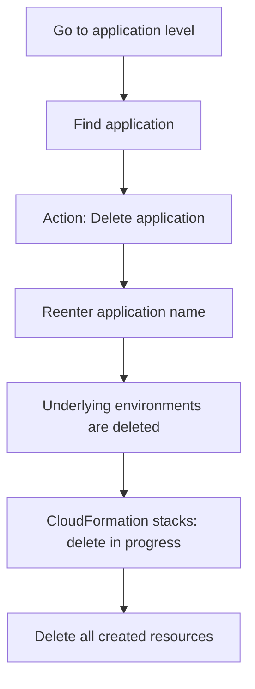

# 193. Beanstalk Cleanup

## 🎯 Giới thiệu
Trong bài này, mục tiêu là **cleanup toàn bộ AWS Elastic Beanstalk resources** sau khi chạy xong demo.

- Có **2 instances** đang chạy cùng lúc.
- Có **load balancers** đang hoạt động.
- Nếu để nguyên, các tài nguyên này sẽ **tốn chi phí**.
- Cách xử lý là **delete everything** từ cấp **application**.

## 1. Xóa ở cấp Application
- Vào **application level**.
- Tìm đúng **application** cần xóa.
- Chọn **Action > Delete application**.
- Hệ thống sẽ yêu cầu **nhập lại tên application** để xác nhận.

## 2. Xóa toàn bộ môi trường bên dưới
- Khi xóa application, toàn bộ **underlying environments** cũng bị xóa.
- Đây là cách dọn dẹp triệt để, không chỉ xóa phần hiển thị bên ngoài.
- Mục tiêu là đảm bảo không còn tài nguyên chạy nền gây phát sinh chi phí.

## 3. CloudFormation dọn resource phía sau
- Các **CloudFormation stacks** đã được deploy sẽ chuyển sang trạng thái **delete in progress**.
- Những gì CloudFormation tạo ra cũng sẽ bị xóa, bao gồm:
  - **load balancers**
  - **auto scaling groups**
  - **security groups**
  - và các tài nguyên khác
- Điểm quan trọng là Beanstalk dùng **CloudFormation under the hood**, nên việc cleanup trở nên rất gọn.

## 📊 Bảng tóm tắt
| Tiêu chí | Mô tả |
|----------|------|
| Mục tiêu | Dọn sạch Beanstalk resources sau khi demo |
| Vấn đề nếu không xóa | Tốn tiền do còn **instances** và **load balancers** chạy |
| Cách thực hiện | Vào application level và chọn **Delete application** |
| Xác nhận | Nhập lại tên application |
| Tác động | Xóa luôn **underlying environments** |
| Cơ chế phía sau | **CloudFormation stacks** chuyển sang **delete in progress** |
| Resource bị xóa | **load balancers**, **auto scaling groups**, **security groups**, v.v. |

## 💡 Mẹo ghi nhớ cho kỳ thi AWS
- Nhớ rằng xóa **Elastic Beanstalk application** có thể kéo theo xóa luôn các tài nguyên phía dưới.
- Keyword cần nhớ: **CloudFormation under the hood**.
- Nếu đề bài nói về cleanup Beanstalk, hãy nghĩ ngay đến:
  - **Delete application**
  - **Delete underlying environments**
  - **CloudFormation stack deletion**
- Khi thấy **load balancers** và **multiple instances** còn chạy, hãy liên hệ ngay với **cost**.

## ✅ Kết luận
Bài học này nhấn mạnh cách **cleanup Elastic Beanstalk đúng cách** bằng cách xóa từ cấp **application**. Việc này sẽ làm các **environments** và các tài nguyên do **CloudFormation** tạo ra bị xóa theo, giúp tránh phát sinh chi phí không cần thiết.
