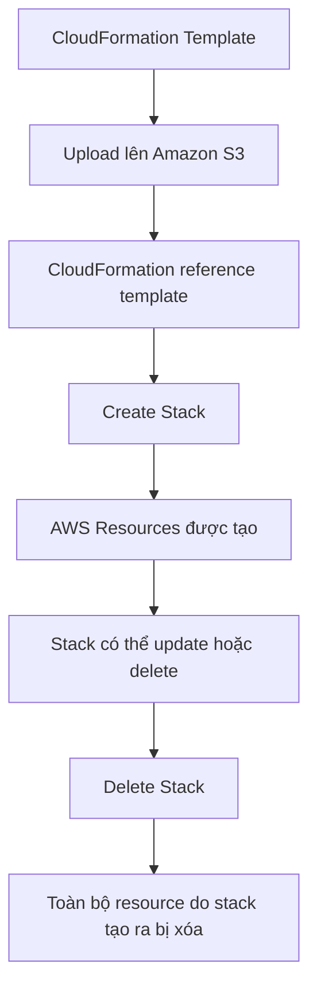

# 194. CloudFormation - Overview

## 🎯 Giới thiệu
AWS CloudFormation là dịch vụ giúp bạn mô tả và triển khai AWS infrastructure bằng **code** theo kiểu **declarative**.

- Bạn chỉ cần khai báo **muốn có gì**:
  - `Security Group`
  - `EC2 instances`
  - `Elastic IP`
  - `S3 bucket`
  - `Load Balancer`
- CloudFormation sẽ tự:
  - tạo các resource theo đúng **thứ tự**
  - gắn kết chúng với nhau
  - áp dụng đúng cấu hình bạn đã khai báo
- Mục tiêu chính:
  - giảm thao tác thủ công
  - tăng khả năng kiểm soát
  - dễ quản lý và tái tạo hạ tầng

## 1. Lợi ích chính của CloudFormation
CloudFormation rất hữu ích vì đây là **Infrastructure as Code**.

- Không tạo resource thủ công
- Dễ kiểm soát thay đổi qua code
- Hỗ trợ **version control** như `Git`
- Mọi thay đổi hạ tầng có thể được review như code
- Có thể **ước tính chi phí** từ template
- Các resource trong stack được gắn identifier để dễ theo dõi cost
- Có thể tự động hóa chiến lược tiết kiệm chi phí:
  - xóa môi trường dev lúc `5:00 PM`
  - tạo lại lúc `8:00 AM`
- Tăng năng suất vì có thể:
  - destroy
  - recreate
  - deploy nhanh trên cloud
- Có thể tự động sinh **diagrams**
- Hỗ trợ **separation of concern**:
  - stack cho network/VPC
  - stack cho application
  - stack cho từng layer khác nhau
- Không phải “reinvent the wheel” vì có thể tận dụng template sẵn có và documentation

## 2. CloudFormation hoạt động như thế nào
Luồng làm việc của CloudFormation trong transcript:

- Template phải được **upload lên Amazon S3**
- CloudFormation sẽ **reference** template đó
- Từ template, CloudFormation tạo ra một **stack**
- `Stack` là tập hợp các AWS resources được tạo ra từ template
- Khi muốn cập nhật template:
  - không sửa trực tiếp bản cũ
  - phải **upload version mới**
  - sau đó **update stack**
- `Stack` được xác định theo **name trong region**
- Khi **delete stack**:
  - tất cả artifact và resource được tạo bởi CloudFormation cũng bị xóa

## 3. Cách triển khai và các building blocks
Có 2 cách deploy template được nhắc đến:

- **Manual way**
  - tạo template bằng `Infrastructure Composer` hoặc code editor
  - nhập parameters qua console
  - thường dùng cho mục đích học tập trong course
- **Automated way**
  - viết template trong file `YAML`
  - dùng `CLI` để deploy
  - hoặc dùng công cụ `continuous delivery`
  - đây là cách được khuyến nghị nếu muốn tự động hóa hoàn toàn

Các thành phần chính của CloudFormation template:

- `AWSTemplateFormatVersion`
  - định nghĩa version cách đọc template
  - phục vụ mục đích nội bộ của AWS
- `Description`
  - phần mô tả/comment của template
- `Resources`
  - phần bắt buộc duy nhất
  - định nghĩa toàn bộ AWS resources trong template
- `Parameters`
  - input động cho template
- `Mappings`
  - biến tĩnh cho template
- `Outputs`
  - lấy reference tới kết quả được tạo ra
- `Conditionals`
  - danh sách điều kiện để quyết định tạo resource
- Template helpers
  - `references`
  - `functions`

## 📊 Bảng tóm tắt
| Tiêu chí | Mô tả |
|----------|------|
| Mục đích | Mô tả và triển khai AWS infrastructure bằng code |
| Kiểu triển khai | Declarative |
| Tạo resource | CloudFormation tự tạo theo đúng thứ tự và cấu hình |
| Quản lý thay đổi | Qua code, dễ review và version control |
| Nơi lưu template | Amazon S3 |
| Khái niệm trung tâm | `Stack` |
| Khi xóa stack | Xóa toàn bộ resource do stack tạo ra |
| Cách deploy | Manual hoặc automated qua `YAML` + `CLI` / `continuous delivery` |
| Thành phần bắt buộc | `Resources` |
| Thành phần khác | `Parameters`, `Mappings`, `Outputs`, `Conditionals`, helpers |

## 💡 Mẹo ghi nhớ cho kỳ thi AWS
- Nhớ rằng CloudFormation là **Infrastructure as Code** và **declarative**
- Template được **upload lên S3** rồi CloudFormation mới reference để tạo stack
- `Resources` là **section bắt buộc duy nhất**
- Muốn update template thì **không sửa bản cũ**, mà phải **upload version mới**
- `Delete stack` nghĩa là xóa luôn toàn bộ resource do stack tạo ra
- CloudFormation rất mạnh ở:
  - automation
  - version control
  - cost tracking
  - reproducibility

## ✅ Kết luận
CloudFormation là công cụ cốt lõi để mô tả, triển khai và quản lý hạ tầng AWS bằng code. Trong transcript này, điểm quan trọng nhất là: template được lưu trên `S3`, CloudFormation tạo `Stack`, và `Resources` là phần bắt buộc để định nghĩa hạ tầng.
