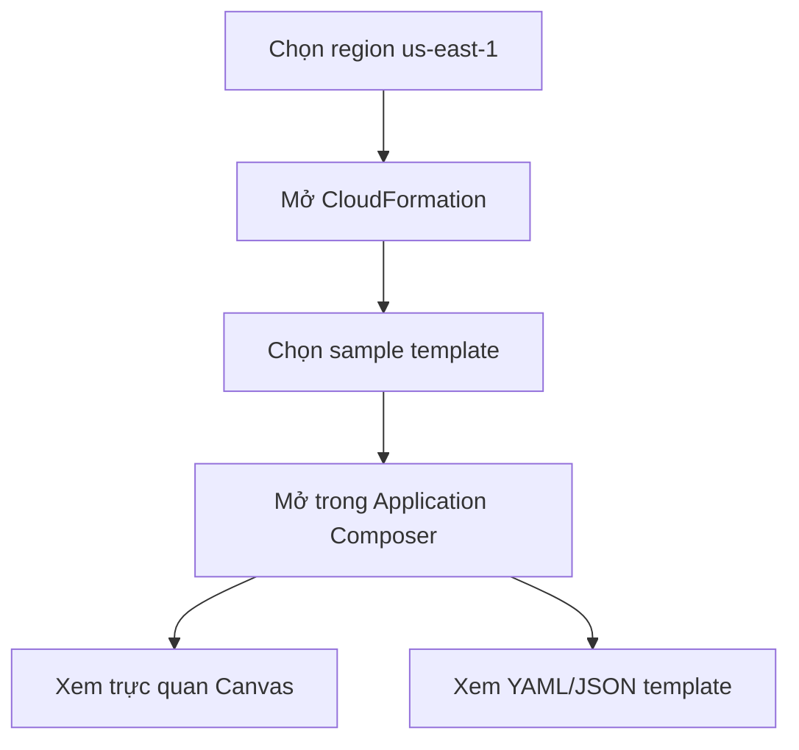

# 195. CloudFormation - Create Stack - Hands On

## 🎯 Giới thiệu
Bài học này thực hành tạo `CloudFormation stack` để triển khai một `EC2 instance` từ `YAML template`.

- Bắt buộc chọn region `us-east-1` để dùng đúng template và `AMI ID` theo region.
- Mục tiêu là hiểu luồng làm việc của `CloudFormation` khi tạo resource từ code thay vì cấu hình thủ công trên console.

## 1. 🗺️ Chọn region và xem mẫu template
- Chọn `US East (Northern Virginia) - us-east-1`.
- Lý do: các template đã được thiết kế cho region này, đặc biệt là `AMI ID` vì `AMI` là region-specific.
- Trong `CloudFormation`, có thể:
  - dùng `existing template`
  - dùng `sample template`
  - hoặc build từ `Application Composer`
- Ở bài này, chọn `sample template`, ví dụ `Multi_AZ_Simple` hoặc `WordPress blog`, rồi mở bằng `Application Composer`.

## 2. 🧩 Template CloudFormation và Application Composer
- `Application Composer` cho phép nhìn ứng dụng theo 2 cách:
  - trực quan trên `Canvas`
  - dưới dạng code
- Có thể chuyển giữa `YAML` và `JSON`.
- Trong bài này ưu tiên `YAML` vì dễ đọc hơn.
- Template sẽ được render thành các component/resource như:
  - `WebServerSecurityGroup`
  - `LaunchConfig`
  - `WebServerGroup`
  - database instance
  - database security group
- Ý nghĩa chính: code CloudFormation tương ứng trực tiếp với các resource AWS.

## 3. ⚙️ Tạo stack từ file YAML
- Không deploy sample template trong bài này để tránh tốn chi phí.
- Dùng file `0-just-ec2.yaml` trong thư mục `CloudFormation`.
- File này có:
  - `Resources` là phần bắt buộc của CloudFormation template
  - resource tên `MyInstance`
  - `Type: AWS::EC2::Instance`
  - `Properties`:
    - `AvailabilityZone: us-east-1a`
    - `ImageId` là AMI đã chỉ định
    - `InstanceType: t2.micro`
- Các tham số này đủ để tạo một `EC2 instance` theo đúng yêu cầu trong template.

## 4. 🚀 Upload template và tạo stack
- Upload file template `0-just-ec2.yaml`.
- Đặt tên stack là `EC2InstanceDemo`.
- Các phần như `tags`, `permissions`, và các setting khác chưa được dùng trong bài này.
- Khi upload file, AWS sẽ lưu template lên `Amazon S3`.
- `CloudFormation` sẽ tham chiếu file template từ `S3`.
- Sau đó nhấn `Submit` để tạo stack.

## 5. 🔍 Kiểm tra kết quả tạo stack
- Trong tab `Events`:
  - ban đầu thấy `stack is being created`
  - `MyInstance` chuyển từ `CREATE_IN_PROGRESS` sang `CREATE_COMPLETE`
- Trong tab `Resources`:
  - thấy resource đã được tạo
  - click vào `Physical ID` để mở trực tiếp `EC2 Console`
- Kết quả kiểm tra:
  - `InstanceType` là `t2.micro`
  - `Availability Zone` là `us-east-1a`
  - `AMI` là `Amazon Linux 2023`
- `Tags` cũng được `CloudFormation` thêm tự động:
  - `stack name`: `EC2InstanceDemo`
  - `logical ID`: `MyInstance`
  - `stack ID`: link tới CloudFormation stack ID
- Các tab khác:
  - `Stack Info`
  - `Events`
  - `Resources`
  - `Outputs` trống
  - `Parameters` trống
  - `Template` là đúng file đã upload

## 📊 Bảng tóm tắt
| Tiêu chí | Mô tả |
|----------|------|
| Region | Phải dùng `us-east-1` để template và `AMI ID` khớp |
| Công cụ | `CloudFormation`, `Application Composer` |
| Template | Dùng `YAML` để dễ đọc |
| File chính | `0-just-ec2.yaml` |
| Resource tạo ra | `AWS::EC2::Instance` với logical ID `MyInstance` |
| Tham số chính | `AvailabilityZone`, `ImageId`, `InstanceType` |
| Kết quả | Stack tạo thành công và `EC2 instance` xuất hiện trong console |
| Metadata tự động | `CloudFormation` gắn `Tags` cho stack, logical ID, stack ID |

## 💡 Mẹo ghi nhớ cho kỳ thi AWS
- `CloudFormation` tạo resource từ `template`, không cần cấu hình thủ công trên console.
- `Resources` là phần bắt buộc của template.
- `YAML` thường dễ đọc hơn `JSON` khi học và ôn thi.
- `Upload template` lên `CloudFormation` sẽ được lưu trong `S3` và stack sẽ tham chiếu tới file đó.
- `Events` là nơi theo dõi tiến trình tạo stack.
- `Resources` cho biết resource nào đã được tạo và có thể mở sang service tương ứng.
- Với `EC2`, nhớ rằng `AMI ID` phụ thuộc `region`, nên chọn đúng `us-east-1` trong bài này.

## ✅ Kết luận
Bài hands-on này cho thấy cách dùng `CloudFormation` để tạo một `EC2 instance` từ `YAML template`, theo dõi tiến trình trong `Events`, và kiểm tra resource thực tế trong `EC2 Console`. Đây là nền tảng để hiểu cách `CloudFormation` triển khai tài nguyên AWS từ code.
