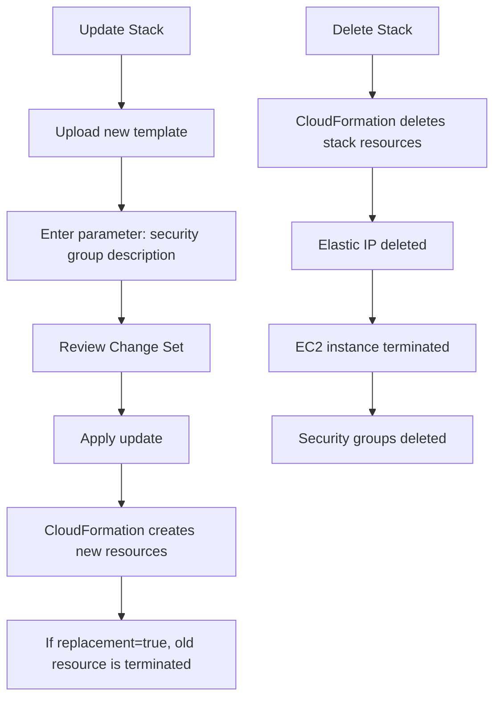

# 196. CloudFormation - Update & Delete Stack - Hands On

## 🎯 Giới thiệu
Bài này minh họa cách **update** và **delete** một **CloudFormation stack** sau khi stack đã được tạo.

- Khi update stack, CloudFormation sẽ **replace current template** bằng một template mới.
- Template mới trong ví dụ là `one EC2 with SG-EIP-YAML`.
- Template này có:
  - `parameter` cho **security group description**
  - **EC2 instance**
  - **Elastic IP**
  - 2 **security groups**
- Khi delete stack, CloudFormation sẽ xóa **toàn bộ resources** thuộc stack theo đúng thứ tự phụ thuộc.

## 1. 🔄 Update Stack với Change Set
Khi bấm **Update** trên stack:

- CloudFormation không chỉnh sửa template cũ trực tiếp.
- Bạn phải **upload template mới**.
- Ở bước nhập parameter, transcript cho thấy giá trị được nhập là:
  - `"This is a cool security group"`

### Change Set preview
CloudFormation hiển thị **Change Set**, tức là danh sách các thay đổi sẽ xảy ra.

Trong ví dụ này có 4 thay đổi:

- **Add** một `Elastic IP`
- **Add** một `SSH security group`
- **Add** một `server security group`
- **Replace** EC2 instance cũ (`replacement true`)

### Ý nghĩa `replacement true`
- `replacement true` nghĩa là resource cũ sẽ bị **terminate**
- Resource mới sẽ được tạo để thay thế
- Nếu là `replacement false`, resource có thể được cập nhật **in place**

## 2. 🧩 Kết quả sau khi Update
Sau khi submit update:

- Stack chuyển sang trạng thái **update in progress**
- CloudFormation tạo:
  - `server security group`
  - `SSH security group`
- Sau đó EC2 instance mới được tạo để thay thế instance cũ
- Tiếp theo là `Elastic IP` được tạo và gắn vào EC2 instance mới

### Quan sát thực tế trong AWS
- Instance cũ bị **shutting down / terminated**
- Instance mới chuyển sang **running**
- `Elastic IP` mới được gắn vào instance mới
- Các `security groups` được attach vào EC2 instance

### Tagging tự động
CloudFormation tự động gắn tags cho resource, bao gồm:

- `logical ID`
- `stack ID`
- `stack name`

### Parameter được sử dụng
- Giá trị parameter `"This is a cool security group"` được dùng để set **description** cho security group
- Đây là ví dụ cho thấy parameter giúp thay đổi cấu hình **at runtime**

## 3. 🗑️ Delete Stack
Để dọn dẹp đúng cách, không nên xóa riêng từng resource.

- Nếu chỉ terminate EC2 instance thủ công:
  - `security groups` vẫn còn
  - `Elastic IP` vẫn còn
- Cách đúng là dùng **Delete stack** trong CloudFormation

### Thứ tự xóa
CloudFormation tự xác định thứ tự xóa resources:

1. `Elastic IP` bị xóa
2. `EC2 instance` bị terminate
3. `security groups` bị xóa

Điểm quan trọng là CloudFormation tự quản lý **dependency order** khi delete.

## 📊 Bảng tóm tắt
| Tiêu chí | Mô tả |
|----------|------|
| Update stack | Upload template mới thay cho template cũ |
| Change Set | Danh sách các thay đổi dự kiến trước khi apply |
| `replacement true` | Resource cũ bị thay thế bằng resource mới |
| `replacement false` | Resource có thể được cập nhật in place |
| Parameter | Dùng để truyền giá trị khi update, ví dụ `security group description` |
| Delete stack | Xóa toàn bộ resources do stack tạo ra |
| Delete order | CloudFormation tự sắp xếp thứ tự xóa theo phụ thuộc |

## 💡 Mẹo ghi nhớ cho kỳ thi AWS
- `Update` trong CloudFormation thường đi kèm **Change Set** để xem trước thay đổi.
- Nếu thấy `replacement true`, hãy hiểu rằng resource cũ sẽ bị thay thế hoàn toàn.
- CloudFormation tự động:
  - tạo resource
  - gắn tags
  - xử lý dependency
  - xóa resource theo đúng thứ tự
- Muốn cleanup đúng, hãy **delete stack**, không xóa lẻ từng resource.

## ✅ Kết luận
Bài học này cho thấy sức mạnh của **CloudFormation** trong việc:

- cập nhật stack bằng template mới
- kiểm tra thay đổi qua **Change Set**
- xử lý `replacement`
- xóa toàn bộ tài nguyên trong stack một cách tự động và đúng thứ tự

CloudFormation giúp triển khai, thay đổi và dọn dẹp infrastructure một cách có kiểm soát, nhất quán và ít thao tác thủ công.
