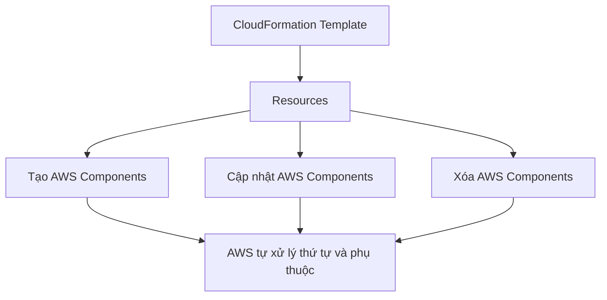

# 198. CloudFormation - Resources

## 🎯 Giới thiệu
- `Resources` là phần **cốt lõi** của CloudFormation template và cũng là **phần bắt buộc duy nhất**.
- Mỗi `Resource` đại diện cho một AWS component sẽ được **tạo, cấu hình, cập nhật hoặc xóa** bởi CloudFormation.
- CloudFormation sẽ tự xử lý thứ tự và thao tác trên các resource khi chúng được khai báo và tham chiếu lẫn nhau.

## 1. Tổng quan về `Resources`
- `Resources` là nơi khai báo các tài nguyên AWS sẽ được tạo trong stack.
- Số lượng resource type rất lớn, hiện có **hơn 700 loại** và vẫn tiếp tục tăng.
- Mỗi resource type có dạng:
  - `service-provider::service-name::data-type-name`
- Ví dụ:
  - `AWS::EC2::Instance`
  - `AWS::Kinesis::...`

## 2. Cách đọc documentation của resource
- Muốn dùng đúng resource, cần tra documentation của CloudFormation.
- Có thể chọn theo service, rồi xem resource type cụ thể.
- Ví dụ `AWS::EC2::Instance` có trang riêng mô tả:
  - `Syntax`
  - `Properties`
  - `Return values`
  - `Examples`
- `Properties` là danh sách các cặp `key-value`.
- Ví dụ:
  - `IamInstanceProfile`:
    - là tên của `IamInstanceProfile`
    - không bắt buộc
    - kiểu `String`
    - nếu thêm vào hoặc cập nhật trên EC2 thì **no interruption**
  - `ImageId`:
    - thay đổi có thể yêu cầu **replacement**
  - `SecurityGroups`:
    - là `Array of String`
    - chứa tên security groups
- Với các resource khác như `Elastic IP`, cũng cần tra đúng documentation để biết cách khai báo và xem ví dụ YAML/JSON.

## 3. Câu hỏi thường gặp và giới hạn
- Có thể tạo **số lượng resource động** không?
  - Có, nhưng phải dùng `CloudFormation Macros` và `Transform`.
  - Nội dung này **không nằm trong phạm vi** bài học này.
- Có phải mọi AWS Service đều được hỗ trợ không?
  - **Gần như có**, nhưng vẫn còn một số trường hợp chưa hỗ trợ.
  - Cách workaround mà exam cần nhớ là dùng `CloudFormation Custom Resources`.

## 📊 Bảng tóm tắt
| Tiêu chí | Mô tả |
|----------|------|
| Vai trò | Phần cốt lõi và bắt buộc duy nhất trong CloudFormation template |
| Chức năng | Đại diện cho AWS components được tạo, cập nhật, xóa |
| Cú pháp resource type | `service-provider::service-name::data-type-name` |
| Cách học đúng | Đọc CloudFormation documentation cho từng resource |
| `Properties` | Danh sách key-value, có thể xem kiểu dữ liệu, bắt buộc hay không, và tác động khi update |
| Update behavior | Có thuộc tính chỉ cần `no interruption`, có thuộc tính cần `replacement` |
| Giới hạn | Không tạo số lượng resource động theo cách thông thường trong scope bài này |
| Workaround khi thiếu support | `CloudFormation Custom Resources` |

## 💡 Mẹo ghi nhớ cho kỳ thi AWS
- Nhớ rằng `Resources` là **phần duy nhất bắt buộc** của CloudFormation template.
- Khi thấy câu hỏi về cách biết một resource có property gì, hãy nghĩ ngay đến **documentation**.
- Phân biệt rõ:
  - `no interruption` = cập nhật không làm gián đoạn resource
  - `replacement` = cập nhật dẫn đến thay thế resource
- Nếu đề bài nói AWS service chưa được hỗ trợ trong CloudFormation, đáp án cần nghĩ tới là **Custom Resources**.
- Nếu cần tạo resource theo số lượng động, nhớ đến **Macros + Transform**, nhưng đây không phải nội dung trọng tâm của bài này.

## ✅ Kết luận
- `Resources` là trung tâm của CloudFormation vì đây là nơi mô tả toàn bộ AWS components trong template.
- Muốn dùng đúng và đủ, phải đọc documentation để hiểu `Syntax`, `Properties`, và hành vi khi update.
- Với giới hạn của CloudFormation, hai ý quan trọng cần nhớ cho kỳ thi là `CloudFormation Macros/Transform` cho resource động và `Custom Resources` cho các trường hợp chưa được hỗ trợ.
