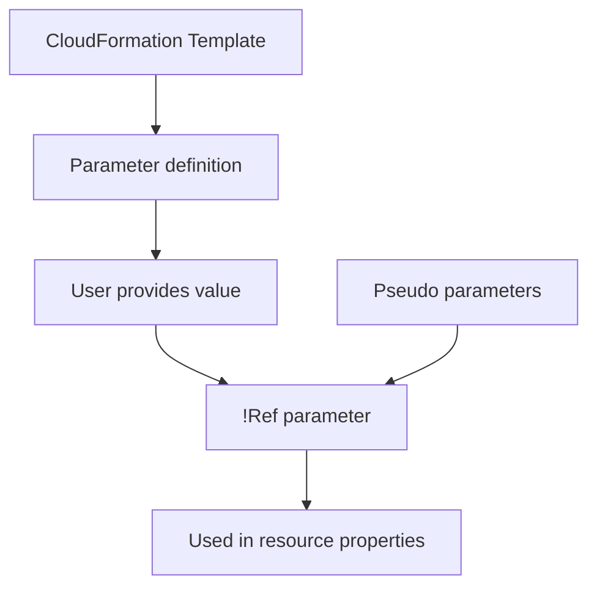

# 199. CloudFormation - Parameters

## 🎯 Giới thiệu
CloudFormation **parameters** là cách để truyền **input** vào template.  
Chúng cho phép:
- Người dùng cung cấp giá trị khi deploy template
- Tái sử dụng template cho nhiều tình huống khác nhau
- Giảm lỗi nhờ **type** và **validation**
- Tránh phải sửa và upload lại template mỗi lần giá trị thay đổi

## 1. Khi nào nên dùng Parameter
Nên dùng parameter khi:
- Giá trị cấu hình của resource **có thể thay đổi trong tương lai**
- Giá trị đó **không thể xác định trước**
- Muốn template **tái sử dụng** trong nhiều team hoặc nhiều môi trường

Ví dụ được nhắc trong bài:
- `SecurityGroupDescription`

## 2. Thuộc tính chính của Parameters
Parameters không chỉ là `String`. Chúng có thể có:
- `Type`
  - `String`
  - `Number`
  - `CommaDelimitedList`
  - `List of numbers`
  - `AWS-Specific Parameter`
  - `SSM Parameter`
- `Description`
- `ConstraintDescription`
- `MinLength`, `MaxLength`
- `MinValue`, `MaxValue`
- `Default`
- `AllowedValues`
- `AllowedPattern` dùng regex
- `NoEcho`

Điểm quan trọng cho kỳ thi:
- Parameters có thể có **constraint** và **validation**
- Nhờ vậy template an toàn và kiểm soát tốt hơn

### Ví dụ quan trọng
- `AllowedValues`
  - Parameter `InstanceType`
  - Chỉ cho chọn: `t2.micro`, `t2.small`, `t2.medium`
  - Có `Default: t2.micro`
  - Tạo dropdown cho người dùng, vừa cho lựa chọn vừa giữ quyền kiểm soát

- `NoEcho`
  - Dùng cho dữ liệu nhạy cảm như `database password`
  - `NoEcho: true` để không hiển thị trong logs và nơi khác

## 3. Cách dùng Parameters và Pseudo Parameters
### `!Ref`
- `!Ref` là cách viết ngắn trong YAML của `Fn::Ref`
- Dùng để tham chiếu:
  - **parameter**
  - hoặc **resource** trong template

Cần nhớ:
- `!Ref SecurityGroupDescription` dùng để lấy giá trị parameter
- `!Ref SSHSecurityGroup`, `!Ref ServiceSecurityGroup`, `!Ref MyInstance` là tham chiếu tới resource
- Vì `!Ref` có thể trỏ tới cả parameter lẫn resource, nên **không nên đặt tên resource trùng với parameter**

### Pseudo parameters
AWS cung cấp các **pseudo parameters** sẵn có trong CloudFormation template, không cần tự tạo và luôn bật mặc định.

Các giá trị quan trọng được nhắc đến:
- `Account ID`
- `Region`
- `Stack ID`
- `Stack Name`
- `Notification ARN`
- `No value`

Ý nghĩa:
- Template có thể tự biết đang chạy ở account nào, region nào
- Không cần người dùng nhập thủ công, ví dụ không cần nói rõ `us-east-1`

## 📊 Bảng tóm tắt
| Tiêu chí | Mô tả |
|----------|------|
| Mục đích | Nhận input từ người dùng vào CloudFormation template |
| Khi dùng | Khi giá trị có thể thay đổi hoặc không xác định trước |
| Type | Không chỉ `String`, còn có `Number`, `CommaDelimitedList`, `SSM Parameter`, `AWS-Specific Parameter` |
| Validation | Có `AllowedValues`, `AllowedPattern`, `Min/Max`, `NoEcho` |
| `AllowedValues` | Giới hạn giá trị được chọn, ví dụ `t2.micro`, `t2.small`, `t2.medium` |
| `NoEcho` | Che giấu giá trị nhạy cảm như password |
| `!Ref` | Tham chiếu parameter hoặc resource trong template |
| Pseudo parameters | Có sẵn, dùng để lấy `Account ID`, `Region`, `Stack Name`, `Stack ID`... |

## 💡 Mẹo ghi nhớ cho kỳ thi AWS
- **Parameter = input** vào template
- Nếu giá trị **có thể đổi** hoặc **chưa biết trước**, hãy nghĩ đến parameter
- Nhớ rằng parameter **không chỉ là string**
- `AllowedValues` giúp giới hạn lựa chọn, rất hay gặp trong đề thi
- `NoEcho` dùng cho dữ liệu bí mật
- `!Ref` có thể trỏ tới **parameter** hoặc **resource**
- Pseudo parameters giúp template tự biết `Region` và `Account ID` mà không cần người dùng nhập

## ✅ Kết luận
CloudFormation parameters là cơ chế quan trọng để làm template **linh hoạt, tái sử dụng và an toàn hơn**.  
Hai ý trọng tâm cần nhớ là:
- Dùng parameter khi giá trị **thay đổi** hoặc **không xác định trước**
- Dùng `!Ref`, `AllowedValues`, `NoEcho`, và pseudo parameters để kiểm soát input hiệu quả
