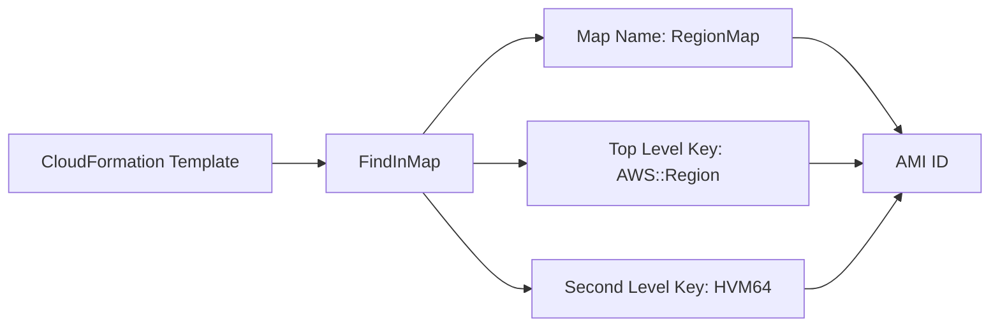

# 200. CloudFormation - Mappings

## 🎯 Giới thiệu
- `Mappings` trong CloudFormation là **fixed variables** trong template.
- Dùng rất hữu ích khi cần phân biệt:
  - `dev` vs `prod`
  - `AWS Region`
  - `AMI types`
  - các giá trị khác đã biết trước và được **hardcoded** trong template
- Ý chính: `Mappings` phù hợp khi **tất cả giá trị có thể xảy ra đều đã biết trước**.

## 1. Mappings là gì?
- Là một dạng cấu hình ánh xạ giá trị cố định trong CloudFormation template.
- Thích hợp cho các trường hợp:
  - giá trị phụ thuộc vào `region`
  - giá trị phụ thuộc vào `environment`
  - giá trị phụ thuộc vào `architecture`
- Ví dụ trong transcript:
  - `us-east-1`, `us-west-1`, `eu-west-1`
  - `HVM64`, `HVMG2`
- Với mỗi tổ hợp, template trả về một `AMI ID` khác nhau.

## 2. Cách truy cập Mapping bằng `FindInMap`
- Một `EC2 instance` có `ImageId` dùng hàm `FindInMap`.
- Cấu trúc cần có:
  - `MapName` ví dụ: `RegionMap`
  - `TopLevelKey` ví dụ: `AWS::Region`
  - `SecondLevelKey` ví dụ: `HVM64`
- `AWS::Region` là `pseudo parameter`, tự động resolve theo region nơi template được launch.

- Flow ý nghĩa:
  - launch template ở `us-east-1` thì `AWS::Region` trở thành `us-east-1`
  - launch ở `us-west-1` thì tự động thành `us-west-1`
  - từ đó lấy đúng `AMI ID` cho đúng `region` và `architecture`

## 3. Khi nào dùng `Mappings`, khi nào dùng `Parameters`?
| Tình huống | Nên dùng |
|----------|----------|
| Đã biết trước toàn bộ giá trị có thể có | `Mappings` |
| Giá trị có thể suy ra từ biến như `region`, `availability zone`, `AWS account`, `environment` | `Mappings` |
| Cần cho user quyết định giá trị tại runtime | `Parameters` |
| Muốn user có mức độ linh hoạt tối đa | `Parameters` |

- `Mappings` giúp kiểm soát template an toàn hơn.
- `Parameters` phù hợp khi giá trị phụ thuộc vào lựa chọn của người dùng lúc chạy.

## 📊 Bảng tóm tắt
| Tiêu chí | Mô tả |
|----------|------|
| Bản chất | Fixed variables trong CloudFormation template |
| Mục đích | Phân biệt `dev/prod`, `region`, `AMI types`, `architecture` |
| Dữ liệu | Các giá trị được `hardcoded` trong template |
| Cách đọc | Dùng `FindInMap` |
| Ví dụ phổ biến | Lấy `AMI ID` theo `AWS::Region` và architecture |
| Khi nên dùng | Khi mọi giá trị có thể xảy ra đã biết trước |
| Khi không nên dùng | Khi cần user chọn giá trị ở runtime |

## 💡 Mẹo ghi nhớ cho kỳ thi AWS
- `Mappings` = **đã biết trước, cố định, tra cứu theo key**.
- `Parameters` = **người dùng quyết định khi chạy template**.
- Gặp bài toán chọn `AMI` theo `region` hoặc `architecture` thì nghĩ ngay đến `Mappings`.
- Nhớ `FindInMap` là cách truy xuất dữ liệu từ `Mappings`.
- `AWS::Region` là `pseudo parameter` thường dùng để map theo region.

## ✅ Kết luận
- `Mappings` trong CloudFormation dùng để lưu các giá trị cố định và tra cứu theo ngữ cảnh như `region` hoặc `environment`.
- `FindInMap` là hàm chính để lấy giá trị từ mapping.
- Trong ôn thi AWS, hãy nhớ: nếu giá trị đã biết trước và có thể suy ra từ biến hệ thống, `Mappings` là lựa chọn phù hợp hơn `Parameters`.
