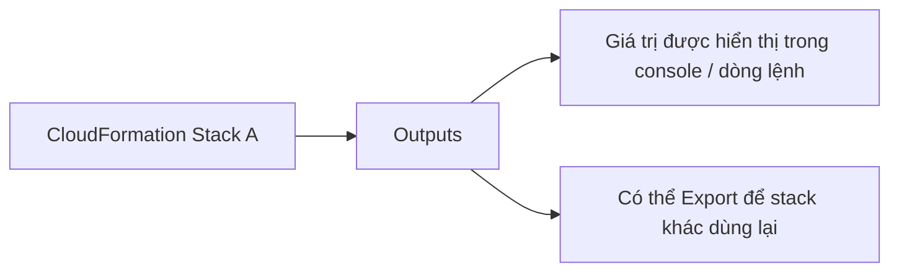
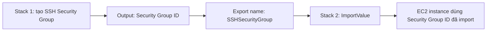

# 201. CloudFormation - Outputs & Exports

## 🎯 Giới thiệu
- `Outputs` trong CloudFormation là phần **tùy chọn**.
- Khi khai báo `Output`, ta có thể:
  - xem giá trị output trong `console` hoặc qua công cụ dòng lệnh,
  - dùng lại giá trị đó ở **stack khác** thông qua `Export` và `ImportValue`.
- Mục tiêu chính là **liên kết nhiều CloudFormation stacks** với nhau, ví dụ:
  - network stack xuất `VPC ID`, `Subnet IDs`,
  - application stack hoặc EC2 stack import lại các giá trị đó.

## 1. Outputs là gì
- `Outputs` dùng để công bố các giá trị quan trọng sau khi stack được tạo.
- Đây là cách tốt để hiển thị những giá trị như:
  - `VPC ID`
  - `Subnet IDs`
  - `Security Group ID`
- Output giúp việc quản lý và chia sẻ thông tin giữa các stack rõ ràng hơn.

## 2. Export và ImportValue
- Một `Output` có thể kèm `export block`.
- `Export` sẽ đặt một **name** cho output để stack khác có thể tham chiếu.
- Tên export phải **duy nhất trong cùng một region**.
- Stack khác dùng `ImportValue` để lấy lại giá trị đã export.
- Ví dụ trong transcript:
  - stack đầu tiên tạo `SSH security group`,
  - export `Security Group ID` với tên `SSHSecurityGroup`,
  - stack thứ hai tạo `EC2 instance` và import lại giá trị đó.

## 3. Lưu ý khi liên kết giữa các stacks
- Khi một stack đã `export` giá trị và stack khác đang `reference` nó:
  - **không thể xóa** stack đầu tiên cho đến khi các stack khác không còn phụ thuộc.
- Đây là cơ chế giúp các stack được liên kết chặt chẽ.
- Cách này rất hữu ích khi tách nhiệm vụ theo nhóm:
  - team hạ tầng quản lý network stack,
  - team ứng dụng dùng lại giá trị từ stack hạ tầng.

## 📊 Bảng tóm tắt
| Tiêu chí | Mô tả |
|----------|------|
| `Outputs` | Phần tùy chọn trong CloudFormation, dùng để công bố giá trị sau khi tạo stack |
| `Export` | Đặt tên cho output để stack khác có thể dùng lại |
| `ImportValue` | Lấy giá trị đã export từ stack khác |
| Tính duy nhất | Tên export phải unique trong cùng một region |
| Ràng buộc | Không thể xóa stack export nếu vẫn còn stack khác tham chiếu |
| Ứng dụng | Liên kết network stack với application stack, chia tách quản lý giữa các team |

## 💡 Mẹo ghi nhớ cho kỳ thi AWS
- `Output` = “xuất ra giá trị quan trọng”.
- `Export` = “đăng ký tên để stack khác gọi lại”.
- `ImportValue` = “nhập giá trị từ stack đã export”.
- Nhớ điểm thi quan trọng:
  - `export name` phải **unique trong region**,
  - stack bị `import` phụ thuộc thì **không xóa được** cho đến khi hết reference.
- Hay gặp trong đề thi khi cần:
  - chia sẻ `VPC ID`, `Subnet IDs`, `Security Group ID` giữa các stacks.

## ✅ Kết luận
- `Outputs` là cơ chế đơn giản nhưng rất hữu ích trong CloudFormation.
- `Export` và `ImportValue` cho phép **reuse giá trị giữa các stacks**.
- Đây là nền tảng quan trọng để thiết kế kiến trúc tách lớp, dễ quản lý và phối hợp giữa nhiều stack.
