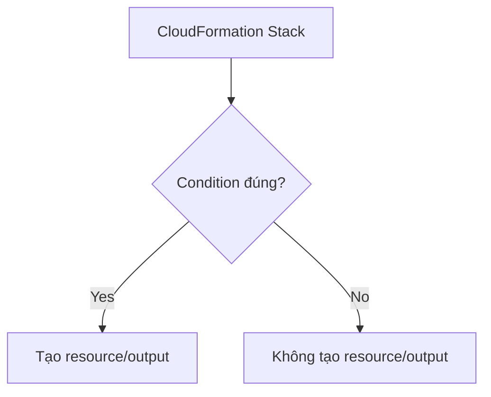

# 202. CloudFormation - Conditions

## 🎯 Giới thiệu
CloudFormation **Conditions** cho phép bạn kiểm soát việc tạo **resource** hoặc **output** dựa trên một điều kiện cụ thể.

- Dùng để tạo/tắt tài nguyên theo ngữ cảnh như:
  - **dev**
  - **test**
  - **prod**
- Cũng có thể phụ thuộc vào:
  - **region**
  - **parameter value**
- Mục tiêu chính trong bài thi: nhận biết rằng **Conditions tồn tại và có thể dùng để quyết định resource/output có được tạo hay không**.

## 1. Conditions là gì
- **Conditions** dùng để điều khiển:
  - tạo **resource**
  - tạo **output**
- Ví dụ trong transcript:
  - môi trường **Dev Stack** có thể có một số tài nguyên
  - môi trường **Prod Stack** có thể có tài nguyên khác
- Transcript nhấn mạnh:
  - có thể có những thứ chỉ tồn tại ở **development**
  - có những thứ chỉ tồn tại ở **production**

## 2. Cách tạo Condition
- Một condition có thể được định nghĩa với tên riêng, ví dụ:
  - `CreateProdResources`
- Condition trong transcript được tạo bằng cách kiểm tra:
  - biến môi trường `Env`
  - nếu `Env == prod` thì condition là **true**
- Các function có thể dùng để tạo condition:
  - `And`
  - `Equals`
  - `If`
  - `Not`
  - `Or`
- Condition có thể:
  - tham chiếu lẫn nhau
  - tham chiếu **parameter values**
  - tham chiếu **mappings**

## 3. Cách áp dụng Condition
- Condition có thể được gắn vào:
  - **resource**
  - **output**
  - và các phần khác tương tự
- Ví dụ trong transcript:
  - resource `MountPoint`
  - loại `EC2 VolumeAttachment`
  - được gắn condition `CreateProdResources`
- Hành vi:
  - nếu condition **true** → `MountPoint` được tạo
  - nếu condition **false** → `MountPoint` không được tạo

## 📊 Bảng tóm tắt
| Tiêu chí | Mô tả |
|----------|------|
| Mục đích | Điều khiển việc tạo resource hoặc output trong CloudFormation |
| Use case phổ biến | Tách tài nguyên theo `dev`, `test`, `prod`, hoặc theo `region`, `parameter value` |
| Cách tạo | Dùng các function như `And`, `Equals`, `If`, `Not`, `Or` |
| Cách dùng | Gắn condition vào resource, output, v.v. |
| Kết quả | `true` thì tạo, `false` thì không tạo |
| Góc nhìn thi AWS | Không cần nhớ cách viết chi tiết, nhưng cần biết Conditions tồn tại và dùng được khi cần |

## 💡 Mẹo ghi nhớ cho kỳ thi AWS
- Nhớ rằng **Conditions** trong CloudFormation là cơ chế để **bật/tắt resource/output** theo điều kiện.
- Hay gặp nhất là dùng theo:
  - **environment**: `dev`, `test`, `prod`
  - **region**
  - **parameter value**
- Nếu thấy câu hỏi kiểu:
  - “chỉ tạo tài nguyên ở production”
  - “không tạo một resource nếu điều kiện không đúng”
  → nghĩ ngay tới **CloudFormation Conditions**.
- Không cần sa đà vào syntax phức tạp; transcript chỉ yêu cầu bạn **biết Conditions tồn tại và áp dụng được**.

## ✅ Kết luận
CloudFormation **Conditions** cho phép tạo hoặc không tạo **resource/output** dựa trên một điều kiện cụ thể. Đây là công cụ hữu ích để tách cấu hình theo môi trường như `dev` và `prod`, và là kiến thức cần nhớ cho kỳ thi AWS.
