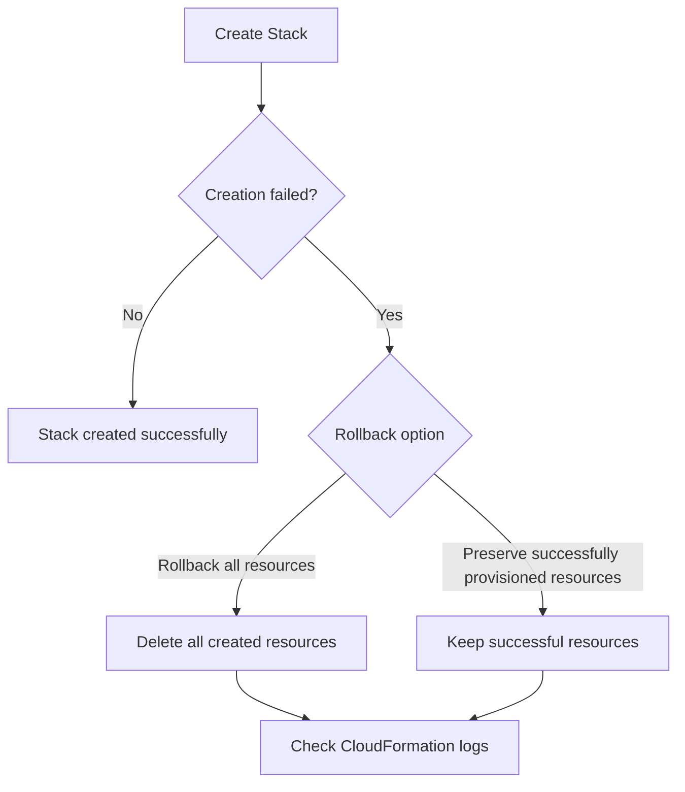

# 204. CloudFormation - Rollbacks

## 🎯 Giới thiệu
CloudFormation rollbacks là chủ đề quan trọng trong kỳ thi AWS. Khi `stack creation` hoặc `stack update` thất bại, CloudFormation có cơ chế tự động quay lui để đưa môi trường về trạng thái an toàn.

## 1. Rollback khi `stack creation` thất bại
- Khi tạo `stack` mà bị lỗi, có 2 lựa chọn:
  - **Default**: `rollback all stack resources`
    - Tất cả resource bị xóa.
    - Có thể xem log của CloudFormation để biết lỗi, nhưng không thể giữ lại resource để kiểm tra.
  - **Non-default**: `preserve successfully provisioned resources`
    - Giữ lại các resource đã tạo thành công.
    - Resource nào lỗi thì bị rollback.
    - Hữu ích khi muốn troubleshoot nguyên nhân lỗi tạo stack.

- Ví dụ trong transcript:
  - File `trigger-failure.yaml` dùng `image ID` của EC2 instance không tồn tại, nên gây failure.
  - Khi chọn `preserve successfully provisioned resources`, một `security group` vẫn được giữ lại dù resource khác fail.
- Sau khi dùng tùy chọn preserve, cần **delete stack** để dọn sạch phần còn sót lại.

## 2. Rollback khi `stack update` thất bại
- Khi update `stack` bị lỗi, mặc định CloudFormation sẽ:
  - Rollback về **last previous known working state**.
  - Xóa mọi resource mới được tạo trong lần update đó.
- Vẫn có thể xem log và error messages để hiểu nguyên nhân.

### Luồng update failure
- Tạo stack bằng template đúng, ví dụ `just-ec2.yaml`.
- Update stack bằng template lỗi, ví dụ `trigger-failure.yaml`.
- Nếu chọn rollback toàn bộ:
  - `SSH security group` và `server security group` sẽ bị xóa sau rollback.
- Nếu chọn `preserve successfully provisioned resources`:
  - Các resource tạo thành công sẽ không bị rollback trong trường hợp update failure.

## 3. `Rollback failure` và `ContinueUpdateRollback`
- Nếu đang rollback mà rollback cũng bị fail, đó là dấu hiệu stack có vấn đề.
- Transcript nêu rằng nguyên nhân thường là:
  - Resource đã bị chỉnh sửa thủ công.
- Cách xử lý:
  - Sửa các resource đó bằng tay.
  - Sau đó chạy `ContinueUpdateRollback` để yêu cầu CloudFormation thử rollback lại.
- Có thể thực hiện qua:
  - Console
  - API
  - CLI bằng `ContinueUpdateRollback API call`

## 📊 Bảng tóm tắt
| Tiêu chí | Mô tả |
|----------|------|
| `Create failure` | Có thể `rollback all stack resources` hoặc `preserve successfully provisioned resources` |
| `Update failure` | Mặc định rollback về trạng thái working trước đó |
| Log | Có thể xem log để biết lý do fail, nhưng không giữ được resource nếu rollback đầy đủ |
| Preserve resources | Giữ lại resource tạo thành công để troubleshoot |
| `Rollback failure` | Thường liên quan đến resource bị thay đổi thủ công |
| `ContinueUpdateRollback` | Dùng để yêu cầu CloudFormation rollback lại sau khi đã sửa lỗi |

## 💡 Mẹo ghi nhớ cho kỳ thi AWS
- Nhớ rằng **create failure** và **update failure** có hành vi rollback khác nhau nhưng đều liên quan đến việc quay về trạng thái an toàn.
- `rollback all stack resources` = dọn sạch toàn bộ.
- `preserve successfully provisioned resources` = giữ resource đã tạo thành công để kiểm tra.
- Nếu rollback bị fail, nghĩ ngay đến `ContinueUpdateRollback`.
- Trong exam, hãy chú ý từ khóa:
  - `last known working state`
  - `preserve successfully provisioned resources`
  - `ContinueUpdateRollback`

## ✅ Kết luận
CloudFormation rollbacks giúp quản lý lỗi khi tạo hoặc cập nhật `stack`. Điểm quan trọng cần nhớ là có thể chọn giữa rollback toàn bộ hoặc giữ lại resource đã tạo thành công, và khi rollback thất bại thì dùng `ContinueUpdateRollback` sau khi đã sửa resource lỗi.
