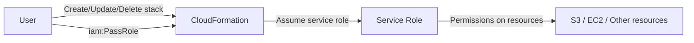

# 205. CloudFormation - Service Role

## 🎯 Giới thiệu
CloudFormation có thể dùng **service role** để thực hiện các thao tác **create / update / delete** stack resources thay cho người dùng.

Ý chính cần nhớ:
- **Service role** là **IAM role** được tạo riêng cho **CloudFormation**.
- Người dùng chỉ cần quyền để **gọi CloudFormation** và quyền **`iam:PassRole`**.
- Nhờ đó có thể áp dụng **least privilege**: người dùng không cần trực tiếp có toàn bộ quyền trên các resource.

## 1. Service Role là gì? 🔐
- Là **IAM role** dành riêng cho **CloudFormation**.
- Cho phép CloudFormation:
  - tạo resource
  - cập nhật resource
  - xóa resource
- CloudFormation làm việc **on your behalf** thay cho user.

## 2. Cách hoạt động trong ví dụ 🧩
- User có quyền thao tác với **CloudFormation**.
- User có thêm quyền **`iam:PassRole`** để truyền role cho dịch vụ AWS.
- CloudFormation nhận **service role** và dùng role đó để thực thi stack operation.
- Ví dụ:
  - service role có quyền **S3 full access**
  - CloudFormation có thể tạo bucket S3 nhờ role này

## 3. Ý nghĩa bảo mật và lưu ý thi cử AWS 📝
- Dùng khi muốn:
  - giữ đúng **least privileged principle**
  - không cấp trực tiếp quá nhiều quyền cho user
- Nếu không chỉ định role:
  - CloudFormation sẽ dùng **personal permissions** của user
- Nếu chỉ định role:
  - mọi stack operations sẽ dùng **IAM role** đó
- Nếu service role chỉ có quyền **S3** nhưng stack lại tạo **EC2 instance**:
  - stack sẽ **fail** vì role không có quyền phù hợp

## 📊 Bảng tóm tắt
| Tiêu chí | Mô tả |
|----------|------|
| Mục đích | Cho CloudFormation dùng quyền thay user |
| Loại tài nguyên | **IAM role** |
| Quyền cần có của user | **`iam:PassRole`** và quyền thao tác với CloudFormation |
| Lợi ích | Áp dụng **least privilege** |
| Phạm vi quyền | Theo quyền của service role được gán |
| Khi không chỉ định role | CloudFormation dùng quyền cá nhân của user |

## 💡 Mẹo ghi nhớ cho kỳ thi AWS
- Nhớ 3 từ khóa: **CloudFormation + service role + `iam:PassRole`**
- Nếu đề bài nói:
  - user không nên có quyền trực tiếp trên resource
  - nhưng vẫn cần tạo/update/delete stack
  - thì đáp án thường là **service role**
- Nếu role thiếu quyền cho resource trong template, stack sẽ **thất bại**
- `iam:PassRole` là quyền để **giao role cho service AWS**, không phải quyền dùng resource trực tiếp

## ✅ Kết luận
**CloudFormation Service Role** là cách để CloudFormation thực thi các thao tác trên stack bằng một **IAM role chuyên biệt**, giúp tăng bảo mật và hỗ trợ **least privilege**. Khi dùng cơ chế này, user cần có **`iam:PassRole`**, còn quyền thực sự trên resource sẽ nằm trong service role.
