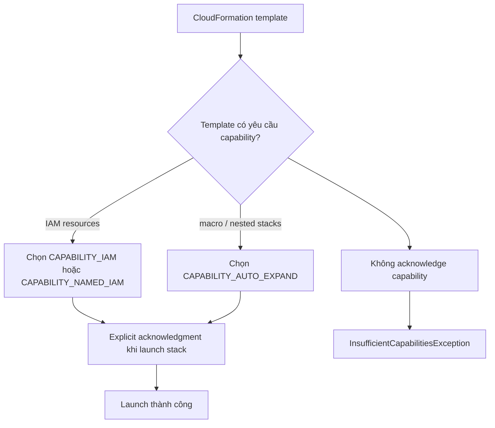

# 206. CloudFormation - Capabilities

## 🎯 Giới thiệu
CloudFormation **capabilities** là các quyền xác nhận bổ sung mà bạn phải cung cấp khi template của mình:

- Tạo hoặc cập nhật **IAM resources** như `IAM user`, `role`, `group`, `policy`
- Sử dụng **macro** hoặc **nested stacks** để thực hiện các **dynamic transformations**

Mục tiêu chính là để bạn **explicitly acknowledge** rằng CloudFormation sẽ thực hiện các hành động này.

## 1. `CAPABILITY_IAM` và `CAPABILITY_NAMED_IAM`
- Dùng khi CloudFormation template sẽ tạo hoặc update **IAM resources**
- Nếu resource có **custom name** thì dùng `CAPABILITY_NAMED_IAM`
- Nếu không có named IAM resource cụ thể thì dùng `CAPABILITY_IAM`

### Ý nghĩa trong exam
- Khi thấy template tạo `IAM role`, `IAM user`, `IAM group`, `IAM policy`, hãy nghĩ ngay đến capability này
- Nếu resource được đặt tên rõ ràng, ví dụ `MyCustomRoleName`, thì cần `CAPABILITY_NAMED_IAM`

## 2. `CAPABILITY_AUTO_EXPAND`
- Dùng khi template có:
  - **macro**
  - **nested stacks**
- Nghĩa là template có thể **thay đổi trước khi được deploy**
- Đây là cách CloudFormation nhận biết bạn chấp nhận việc template được mở rộng hoặc biến đổi động

## 3. `InsufficientCapabilitiesException` và cách xử lý
- Nếu khi launch template bạn gặp **`InsufficientCapabilitiesException`**
- Điều đó có nghĩa là:
  - Template đang yêu cầu capability
  - Nhưng bạn **chưa acknowledge** capability đó
- Cách xử lý:
  - Chỉnh lại template / upload lại
  - Launch stack lại
  - Lần này phải tick box hoặc truyền thêm argument capability trong API call

### Ví dụ trong transcript
- Template `3_capabilities.yaml` tạo một `IAM role`
- Role này có tên `MyCustomRoleName`
- Role dùng managed policy `AmazonEC2FullAccess`
- Vì có **IAM resource** và còn có **custom name**, nên cần acknowledge capability phù hợp trước khi tạo stack

## 📊 Bảng tóm tắt
| Tiêu chí | Mô tả |
|----------|------|
| `CAPABILITY_IAM` | Dùng khi CloudFormation tạo hoặc update IAM resources |
| `CAPABILITY_NAMED_IAM` | Dùng khi IAM resources có **named/custom name** |
| `CAPABILITY_AUTO_EXPAND` | Dùng khi template có **macro** hoặc **nested stacks** |
| `InsufficientCapabilitiesException` | Lỗi khi template cần capability nhưng bạn chưa acknowledge |
| Cách xác nhận | Tick box trong AWS Console hoặc truyền capability trong API call |

## 💡 Mẹo ghi nhớ cho kỳ thi AWS
- **IAM xuất hiện trong template** → nghĩ ngay tới `CAPABILITY_IAM` / `CAPABILITY_NAMED_IAM`
- **Có custom name** → chọn `CAPABILITY_NAMED_IAM`
- **Có macro hoặc nested stacks** → chọn `CAPABILITY_AUTO_EXPAND`
- Gặp lỗi **`InsufficientCapabilitiesException`** → kiểm tra lại capability đã acknowledge chưa
- CloudFormation yêu cầu xác nhận này như một **security measure**

## ✅ Kết luận
CloudFormation capabilities là cơ chế xác nhận bắt buộc khi template tạo **IAM resources** hoặc dùng **macro/nested stacks**.  
Điểm cần nhớ nhất là:
- `CAPABILITY_IAM`
- `CAPABILITY_NAMED_IAM`
- `CAPABILITY_AUTO_EXPAND`
- `InsufficientCapabilitiesException` nghĩa là bạn chưa acknowledge capability cần thiết.
