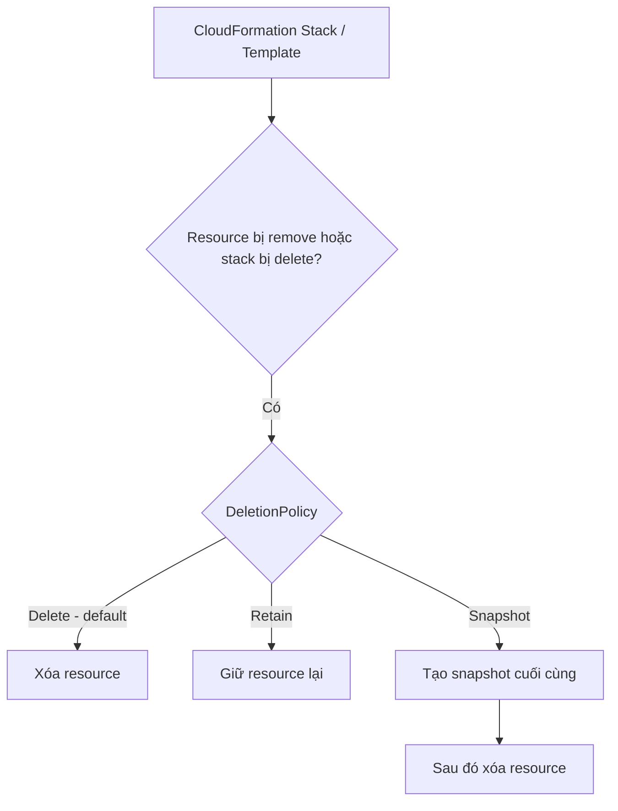

# 207. CloudFormation - Deletion Policy

## 🎯 Giới thiệu
- `DeletionPolicy` là một setting áp dụng cho resources trong CloudFormation template.
- Mục đích của nó là kiểm soát điều gì xảy ra khi:
  - resource bị xóa khỏi CloudFormation template
  - hoặc CloudFormation stack bị delete
- Đây là cách để **preserve** hoặc **backup** resource thay vì luôn xóa mặc định.

## 1. `DeletionPolicy = Delete`
- Đây là **default behavior**.
- Nếu không khai báo gì, CloudFormation sẽ xóa resource khi stack bị delete.
- Ví dụ:
  - `EC2 instance` có `DeletionPolicy: Delete` thì sẽ bị xóa khi stack bị xóa.
- Với `S3 bucket`, có một ngoại lệ quan trọng:
  - `DeletionPolicy: Delete` chỉ hoạt động nếu bucket **empty**
  - nếu bucket không rỗng thì việc delete sẽ fail
- Cách xử lý được nhắc trong transcript:
  - xóa thủ công toàn bộ object trong bucket trước
  - hoặc dùng `custom resource` để dọn bucket trước khi xóa

## 2. `DeletionPolicy = Retain`
- Dùng để **giữ lại resource** khi stack bị xóa.
- Phù hợp khi muốn bảo vệ dữ liệu hoặc muốn resource còn tồn tại độc lập với stack.
- Ví dụ trong transcript:
  - `DynamoDB table` được đặt `DeletionPolicy: Retain`
  - dù xóa CloudFormation template, table vẫn còn
- Áp dụng cho nhiều loại resource.

## 3. `DeletionPolicy = Snapshot`
- Dùng để tạo **một snapshot cuối cùng** trước khi xóa resource.
- Resource được nhắc đến trong transcript có hỗ trợ snapshot:
  - `EBS volumes`
  - `ElastiCache Cluster`
  - `ElastiCache ReplicationGroup`
  - `RDS DBInstance`
  - `DB cluster`
  - `Redshift`
  - `Neptune`
  - `DocumentDB`
  - và có thể còn nhiều loại khác
- Ý nghĩa:
  - resource bị xóa
  - snapshot được tạo trước đó để phục vụ backup/safety

## 4. Ví dụ thực hành trong transcript
- Template `deletionpolicy.yaml` có:
  - một `security group` với `DeletionPolicy: Retain`
  - một `EBS volume` với `DeletionPolicy: Snapshot`
- Kết quả khi xóa stack:
  - `security group` bị **delete skipped** và vẫn còn tồn tại
  - `EBS volume` bị xóa, nhưng **snapshot** được tạo thành công trước đó
- Nếu muốn clean up hoàn toàn:
  - phải xóa snapshot thủ công
  - và nếu muốn, xóa security group thủ công

## 📊 Bảng tóm tắt
| Tiêu chí | Mô tả |
|----------|------|
| `DeletionPolicy` | Setting trong CloudFormation template để kiểm soát hành vi khi resource bị remove hoặc stack bị delete |
| `Delete` | Giá trị mặc định, resource sẽ bị xóa |
| `S3 bucket` với `Delete` | Chỉ xóa được nếu bucket rỗng |
| `Retain` | Giữ lại resource, không xóa cùng stack |
| `Snapshot` | Tạo snapshot cuối cùng rồi mới xóa resource |
| Use case chính | Preserve dữ liệu, backup, tránh mất resource quan trọng |

## 💡 Mẹo ghi nhớ cho kỳ thi AWS
- `Delete` = xóa theo mặc định
- `Retain` = giữ lại resource, rất hay gặp khi muốn giữ dữ liệu
- `Snapshot` = “chụp ảnh” trước khi xóa, liên hệ với `EBS`, `RDS`, `Redshift`, `Neptune`, `DocumentDB`
- Nhớ riêng `S3 bucket`:
  - không rỗng thì `Delete` sẽ fail
- Nếu đề bài hỏi về việc giữ data khi xóa stack, hãy nghĩ ngay đến `Retain` hoặc `Snapshot`

## ✅ Kết luận
- `DeletionPolicy` là cơ chế quan trọng của CloudFormation để kiểm soát vòng đời resource.
- Ba ý chính cần nhớ:
  - `Delete`: xóa resource
  - `Retain`: giữ resource
  - `Snapshot`: tạo snapshot rồi mới xóa
- Trong ôn thi AWS, đây là chủ đề rất dễ xuất hiện khi hỏi về bảo toàn dữ liệu và hành vi khi delete stack.
