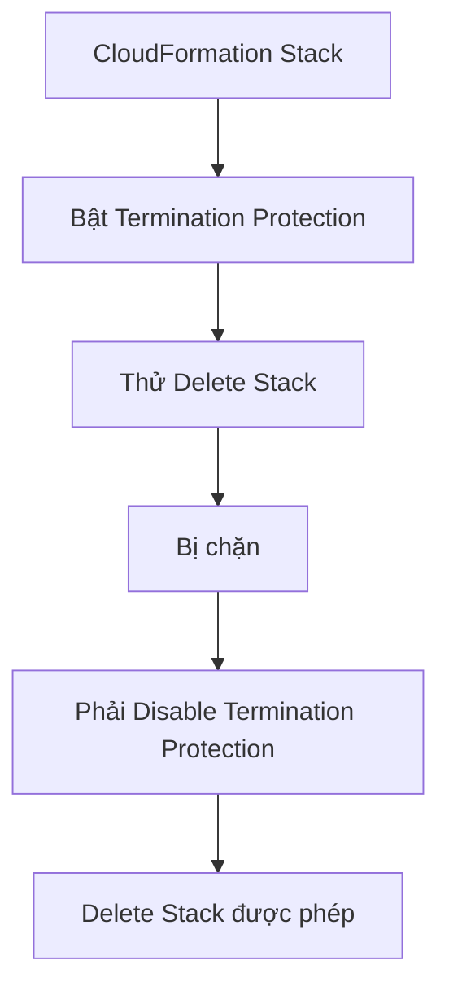

# 209. CloudFormation - Termination Protection

## 🎯 Giới thiệu
Termination Protection trong CloudFormation là cơ chế bảo vệ stack khỏi bị xóa nhầm. Đây là một lớp an toàn để tránh accidental deletes khi thao tác với stack.

## 1. Mục đích của Termination Protection
- Dùng để ngăn việc xóa CloudFormation stack một cách vô tình.
- Khi tính năng này được bật, thao tác delete stack sẽ bị chặn.
- Đây là biện pháp bảo vệ trực tiếp cho stack đang chạy.

## 2. Cách hoạt động
- Có thể bật Termination Protection trong console.
- Sau khi bật, nếu cố gắng xóa stack thì CloudFormation sẽ từ chối.
- Hệ thống sẽ yêu cầu phải tắt Termination Protection trước khi được phép xóa stack.
- Nếu có đủ quyền, bạn có thể chỉnh sửa trạng thái này để tắt bảo vệ rồi mới xóa stack.

## 3. Ý nghĩa khi ôn thi AWS
- Nhớ rằng Termination Protection dùng để bảo vệ stack khỏi bị xóa nhầm.
- Khi tính năng này bật, không thể delete stack ngay.
- Muốn xóa stack thì phải disable trước.
- Câu hỏi thi có thể xoay quanh tình huống “prevent accidental deletes”.

## 📊 Bảng tóm tắt
| Tiêu chí | Mô tả |
|----------|------|
| Tên tính năng | Termination Protection |
| Mục đích | Ngăn xóa nhầm CloudFormation stack |
| Khi bật | Không thể delete stack |
| Điều kiện để xóa | Phải disable Termination Protection trước |
| Ý nghĩa | Safety against accidental deletes |

## 💡 Mẹo ghi nhớ cho kỳ thi AWS
- Gắn với từ khóa: **Termination Protection = chống xóa stack**
- Nhớ logic quan trọng: **Enable -> không delete được, Disable -> mới delete được**
- Nếu đề bài nói về “accidental deletes” của CloudFormation stack, đáp án rất dễ là **Termination Protection**

## ✅ Kết luận
Termination Protection là tính năng bảo vệ CloudFormation stack khỏi bị xóa nhầm. Khi được bật, stack không thể bị delete cho đến khi bạn tắt tính năng này trước. Đây là khái niệm ngắn nhưng rất dễ xuất hiện trong câu hỏi AWS exam.
