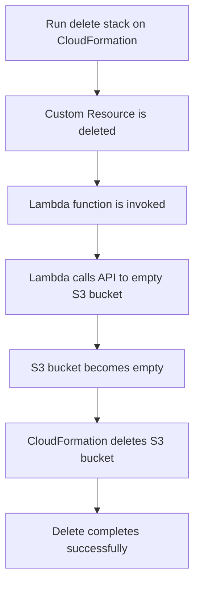

# 210. CloudFormation - Custom Resources

## 🎯 Giới thiệu
- `CloudFormation custom resources` dùng để xử lý:
  - Resource chưa được CloudFormation hỗ trợ.
  - Custom provisioning logic cho resource nằm ngoài CloudFormation.
- Ví dụ trong transcript:
  - Resource on-premises.
  - Third-party resources.
  - Chạy custom scripts trong các phase `create`, `update`, `delete` của stack thông qua `Lambda`.
- Một use case rất quan trọng trong đề thi:
  - Dùng `Lambda` để empty một `S3 bucket` trước khi xóa bucket.

## 1. Khi nào dùng Custom Resources
- Dùng khi CloudFormation **không hỗ trợ sẵn** một resource nào đó.
- Dùng khi cần logic riêng để provision hoặc cleanup resource.
- Có thể áp dụng cho:
  - `on-premises resources`
  - `third-party resources`
  - các hành động custom trong vòng đời stack

## 2. Cách định nghĩa Custom Resource
- Trong template, type của resource sẽ có dạng:
  - `Custom::MyCustomResourceTypeName`
- Custom resource có thể được backend bởi:
  - `Lambda function` là phổ biến nhất
  - `SNS topic`
- Với Lambda custom resource:
  - Trong `properties`, khai báo `service token`
  - `service token` là:
    - `Lambda function ARN`, hoặc
    - `SNS ARN`
  - Các ARN này phải ở **cùng region**
- Có thể truyền `input data parameters` để gửi giá trị đầu vào cho Lambda.

## 3. Use case quan trọng: Xóa `S3 bucket` không rỗng
- CloudFormation **không thể xóa** một `S3 bucket` nếu bucket còn object bên trong.
- Cách xử lý:
  - Dùng `custom resource`
  - Khi custom resource bị delete, `Lambda` sẽ gọi API để xóa toàn bộ objects trong bucket
  - Sau khi bucket đã rỗng, CloudFormation mới tiếp tục xóa `S3 bucket`
- Đây là flow rất hay xuất hiện trong câu hỏi thi

## 📊 Bảng tóm tắt
| Tiêu chí | Mô tả |
|----------|------|
| Mục đích | Tạo logic custom cho resource chưa được CloudFormation hỗ trợ |
| Backend phổ biến | `Lambda function` |
| Backend khác | `SNS topic` |
| Cấu hình chính | `Custom::MyCustomResourceTypeName`, `service token` |
| `service token` | `Lambda ARN` hoặc `SNS ARN` |
| Điều kiện | Các ARN phải cùng `region` |
| Use case nổi bật | Empty `S3 bucket` trước khi delete stack |
| Điểm thi | CloudFormation không xóa được `S3 bucket` không rỗng |

## 💡 Mẹo ghi nhớ cho kỳ thi AWS
- Nhớ rằng `Custom Resources` là cách để mở rộng CloudFormation cho những thứ **chưa hỗ trợ**.
- Nếu đề bài nói:
  - xóa `S3 bucket` nhưng bucket còn object
  - cần logic cleanup trước khi delete
  - cần chạy script trong `create/update/delete`
  
  thì nghĩ ngay đến `CloudFormation Custom Resource` + `Lambda`.
- Keyword cần nhớ:
  - `Custom::...`
  - `service token`
  - `Lambda ARN`
  - `SNS ARN`
  - `same region`
  - `empty S3 bucket before delete`

## ✅ Kết luận
- `CloudFormation custom resources` cho phép thêm logic tùy chỉnh vào lifecycle của stack.
- Cách phổ biến nhất là dùng `Lambda` làm backend.
- Use case kinh điển trong thi AWS là dùng custom resource để `empty S3 bucket` trước khi CloudFormation xóa bucket.
