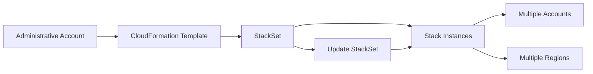

# 211. CloudFormation - StackSets

## 🎯 Giới thiệu
- `CloudFormation StackSets` là cách dùng một `template` để **create, update, hoặc delete stacks** trên **nhiều accounts** và **nhiều regions** trong **một thao tác duy nhất**.
- Ý tưởng chính: thay vì quản lý từng stack riêng lẻ, bạn tạo một `StackSet` từ **administrative account** để triển khai đồng loạt.

## 1. Khái niệm cốt lõi
- `StackSet` = một tập hợp stack instances được triển khai từ cùng một `template`.
- Cho phép quản lý deployment trên:
  - nhiều `AWS accounts`
  - nhiều `regions`
- Khi cập nhật `StackSet`, các `stack instances` trong target accounts và target regions cũng được cập nhật theo.

## 2. Cách hoạt động
- Từ một `administrative account`, bạn lấy một `template` và tạo ra `StackSet`.
- `StackSet` này sẽ deploy stack đến các account và region mục tiêu.
- Khi bạn `update` `StackSet`, mọi stack instance liên quan đều được cập nhật **đồng loạt**.

## 3. Use case và quyền quản trị
- Có thể áp dụng cho các account bạn chọn.
- Một use case rất phổ biến là áp dụng cho **tất cả accounts trong một `AWS Organization`**.
- Chỉ:
  - `administrator account`, hoặc
  - người được chỉ định làm `administrator`
  
  mới có quyền tạo `StackSets`.

## 📊 Bảng tóm tắt
| Tiêu chí | Mô tả |
|----------|------|
| Mục đích | Quản lý `create`, `update`, `delete` stacks trên nhiều account và region |
| Cách triển khai | Tạo `StackSet` từ `template` trong `administrative account` |
| Phạm vi | Nhiều `AWS accounts`, nhiều `regions` |
| Khi cập nhật | Tất cả `stack instances` trong target accounts/regions được cập nhật |
| Use case phổ biến | Triển khai cho toàn bộ accounts trong `AWS Organization` |
| Quyền tạo | Chỉ `administrator account` hoặc người được chỉ định |

## 💡 Mẹo ghi nhớ cho kỳ thi AWS
- `StackSet` = **1 template, nhiều accounts, nhiều regions**.
- Nhớ điểm quan trọng: **update StackSet là update hàng loạt** các stack instances liên quan.
- `AWS Organization` là use case nổi bật.
- Chỉ `administrator` mới được tạo `StackSets` để tránh hỗn loạn và rủi ro bảo mật.

## ✅ Kết luận
- `CloudFormation StackSets` là cơ chế triển khai và quản lý stack trên nhiều account và region từ một `template` duy nhất.
- Điểm cần nhớ cho thi AWS là khả năng **deploy đồng loạt**, **update đồng loạt**, và **quản trị tập trung** từ `administrative account`.
