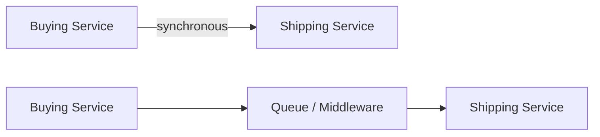

# 213. Introduction to Messaging

## 🎯 Giới thiệu
- Phần này nói về **AWS integration and messaging**.
- Mục tiêu là hiểu cách các application/service **giao tiếp với nhau** thông qua **middleware**.
- Khi deploy nhiều application, chúng sẽ cần:
  - chia sẻ thông tin
  - chia sẻ dữ liệu
  - phối hợp xử lý giữa các service

## 1. Synchronous communication
- Đây là kiểu giao tiếp mà một application **kết nối trực tiếp** tới application khác.
- Ví dụ:
  - `buying service` phát sinh sự kiện mua hàng
  - `shipping service` được gọi trực tiếp để xử lý việc gửi hàng
- Đặc điểm:
  - hai service **directly connected**
  - một service nói với service kia: “có việc này, hãy làm ngay”

## 2. Asynchronous / Event-based communication
- Đây là kiểu giao tiếp **không kết nối trực tiếp** giữa hai application.
- Có một lớp trung gian như **queue** hoặc middleware khác.
- Luồng hoạt động:
  - `buying service` ghi sự kiện “someone bought something” vào queue
  - `shipping service` đọc queue để lấy dữ liệu cần xử lý
- Đặc điểm:
  - application **không trực tiếp nói chuyện** với nhau
  - giao tiếp thông qua middleware
  - mang tính **asynchronous**

## 3. Vì sao cần decouple và scale độc lập
- Giao tiếp synchronous có thể gây vấn đề khi một service bị quá tải.
- Nếu traffic tăng đột biến, một service có thể bị overwhelming và gây **outages**.
- Ví dụ được nêu:
  - hệ thống encode video thường xử lý 10 video
  - nhưng đột nhiên phải encode 1,000 video
  - service có thể bị quá tải
- Giải pháp:
  - **decouple** application
  - để lớp trung gian tự scale
- Các công nghệ được nhắc đến:
  - **SQS** cho **queue model**
  - **SNS** cho **pub/sub model**
  - **Kinesis** cho **real-time streaming** và **big data**
- Điểm quan trọng:
  - service có thể **scale independently**
  - bản thân SQS, SNS, Kinesis cũng **scale rất tốt**

## 📊 Bảng tóm tắt
| Tiêu chí | Mô tả |
|----------|------|
| Synchronous | Application kết nối trực tiếp với nhau |
| Asynchronous | Có middleware/queue ở giữa, không kết nối trực tiếp |
| Vấn đề của synchronous | Có thể bị quá tải khi traffic tăng đột biến |
| Giải pháp | Decouple application để scale độc lập |
| AWS services được nhắc đến | SQS, SNS, Kinesis |
| Ý nghĩa chung | Hỗ trợ orchestration và communication giữa nhiều service |

## 💡 Mẹo ghi nhớ cho kỳ thi AWS
- **Synchronous** = direct connection giữa các service.
- **Asynchronous** = có **queue/middleware** ở giữa.
- Khi gặp tình huống **spike traffic** hoặc **khó dự đoán tải**, nghĩ tới **decouple**.
- Nhớ map nhanh:
  - **SQS** = queue model
  - **SNS** = pub/sub model
  - **Kinesis** = real-time streaming
- Ý chính cần nắm: **services nên scale independently** khi dùng messaging patterns.

## ✅ Kết luận
- Bài học giới thiệu 2 mô hình giao tiếp chính giữa application: **synchronous** và **asynchronous/event-based**.
- Điểm mấu chốt là dùng middleware như **SQS**, **SNS**, hoặc **Kinesis** để **decouple** hệ thống và giúp các service **scale độc lập** khi có tải tăng đột biến.
