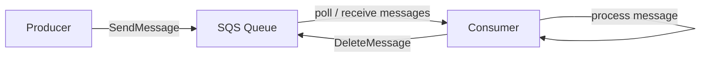
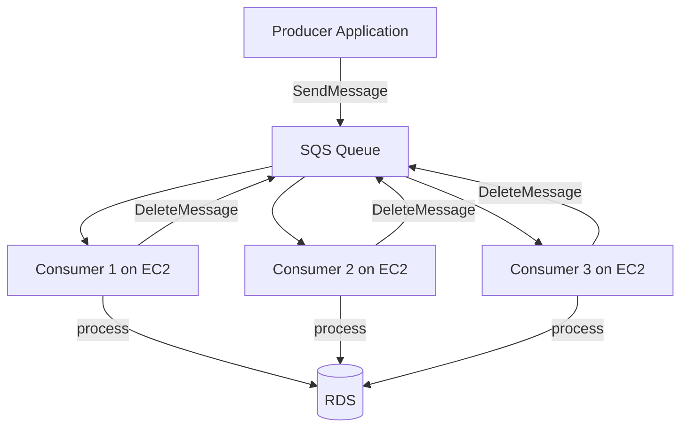

# 214. Amazon SQS - Standard Queues Overview

## 🎯 Giới thiệu
- `Amazon SQS` là một **simple queuing service** dùng để **decouple** giữa các application.
- Trung tâm của SQS là `queue`, nơi chứa `messages`.
- Mô hình cơ bản:
  - `Producer` gửi message vào queue
  - `Consumer` lấy message ra, xử lý, rồi xóa message khỏi queue
- Đây là service rất quan trọng trong đề thi khi gặp các tình huống cần:
  - tách rời các tầng ứng dụng
  - buffer xử lý
  - scale xử lý bất đồng bộ

## 1. Kiến trúc cơ bản của SQS
- `Producer` có thể là 1 hoặc nhiều nguồn gửi message vào `SQS queue`.
- `Message` có thể là bất kỳ nội dung nào, ví dụ:
  - process this order
  - process this video
- `Consumer` là application do bạn tự viết để:
  - pull messages từ queue
  - xử lý nội dung message
  - xóa message sau khi xử lý xong
- SQS đóng vai trò như một **buffer** giữa producer và consumer.

## 2. Đặc tính của Amazon SQS Standard Queue
- `Unlimited throughput`
  - có thể gửi rất nhiều message mỗi giây
  - queue có thể chứa rất nhiều messages
- `Short-lived messages`
  - mặc định message tồn tại trong queue là `4 days`
  - tối đa là `14 days`
  - message phải được đọc và xóa trong thời gian retention
- `Low latency`
  - publish và receive rất nhanh, dưới `10 milliseconds`
- `Message size`
  - nhỏ hơn `1,024 kilobytes` mỗi message
- `At least once delivery`
  - có thể xảy ra message bị deliver `twice`
- `Best effort ordering`
  - thứ tự message có thể không được đảm bảo hoàn toàn
- Vì vậy khi viết application, phải tính đến:
  - duplicate messages
  - out-of-order messages

## 3. Producer, Consumer và scaling
- Producer gửi message bằng `SDK` thông qua API `SendMessage`.
- Message được lưu trong SQS cho đến khi consumer:
  - đọc message
  - xử lý xong
  - gọi `DeleteMessage`
- Consumer có thể chạy trên:
  - `EC2`
  - on-premises servers
  - `Lambda`
- Consumer có thể nhận tối đa `10 messages` mỗi lần poll.
- Có thể có nhiều consumer cùng xử lý song song.
- Nếu message chưa được xử lý kịp, consumer khác có thể nhận lại message đó.
- Khi số lượng message tăng, có thể tăng số consumer theo kiểu `horizontal scaling`.

## 4. Use case và tích hợp thường gặp trong exam
- SQS dùng để **decouple application tiers**.
- Ví dụ video processing:
  - `front end` nhận request
  - thay vì xử lý trực tiếp, front end gửi message vào `SQS`
  - `backend processing application` lấy message và xử lý video
  - kết quả có thể được đưa vào `S3`
- Lợi ích:
  - front end và backend scale độc lập
  - kiến trúc robust và scalable
  - phù hợp khi workload xử lý lâu
- Tích hợp phổ biến với `Auto Scaling Group (ASG)`:
  - consumer chạy trên `EC2` trong ASG
  - scale dựa trên CloudWatch metric `approximate number of messages`
  - có thể tạo alarm khi queue length vượt ngưỡng để tăng capacity
- Đây là pattern rất hay xuất hiện trong đề thi.

## 5. Security trong SQS
- `Encryption in flight`
  - dùng `HTTPS API`
- `At-rest encryption`
  - có thể dùng `KMS keys`
- `Client-side encryption`
  - client tự mã hóa và giải mã
  - không phải tính năng SQS tự làm sẵn
- `Access control`
  - `IAM policies` điều khiển quyền truy cập API của SQS
  - `SQS access policies` tương tự `S3 bucket policies`
  - hữu ích cho:
    - `cross-account access`
    - cho service khác như `SNS` hoặc `S3` ghi vào SQS queue

## 📊 Bảng tóm tắt
| Tiêu chí | Mô tả |
|----------|------|
| Mục đích | Decouple producer và consumer |
| Thành phần | `Producer`, `SQS queue`, `Consumer` |
| Throughput | Unlimited |
| Retention | Mặc định 4 days, tối đa 14 days |
| Latency | Dưới 10 milliseconds |
| Kích thước message | Nhỏ hơn 1,024 KB |
| Delivery | `At least once delivery` |
| Ordering | `Best effort ordering` |
| Gửi message | `SendMessage` qua `SDK` |
| Xử lý message | Consumer poll, process, rồi `DeleteMessage` |
| Scaling | Thêm consumer, dùng `ASG` và CloudWatch metric |
| Security | HTTPS, `KMS`, `IAM policies`, `SQS access policies` |

## 💡 Mẹo ghi nhớ cho kỳ thi AWS
- `SQS = decoupling + buffer`
- `Standard Queue` nhớ 3 ý chính:
  - `unlimited throughput`
  - `at least once delivery`
  - `best effort ordering`
- Khi thấy bài toán:
  - xử lý bất đồng bộ
  - tách front end và backend
  - scale consumer theo số message
  - dùng `ASG` dựa trên queue length
  => hãy nghĩ ngay đến `Amazon SQS`
- Nếu cần security:
  - `HTTPS` cho in-flight
  - `KMS` cho at-rest
  - `IAM policy` và `SQS access policy` cho quyền truy cập

## ✅ Kết luận
- `Amazon SQS Standard Queue` là service queuing dùng để tách rời các application và xử lý message theo mô hình producer-consumer.
- Điểm quan trọng cần nhớ khi ôn thi:
  - throughput rất cao
  - message có thể bị duplicate hoặc out of order
  - consumer phải poll và xóa message sau khi xử lý
  - rất phù hợp với `ASG`, `CloudWatch`, `EC2`, `Lambda`, và kiến trúc xử lý bất đồng bộ
