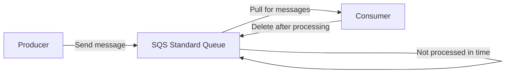

# 215. SQS - Standard Queue Hands On

## 🎯 Giới thiệu
- Bài này thực hành tạo và dùng **Amazon SQS Standard Queue** trong console.
- Mục tiêu chính:
  - Tạo queue
  - Gửi và nhận messages
  - Quan sát cách **producer** và **consumer** làm việc tách rời nhau
  - Xem các thiết lập như encryption, access policy, purge, monitoring

## 1. Tạo Standard Queue
- Trong SQS console, tạo queue mới với loại:
  - **Standard Queue**
  - Tên: `Demo Queue`
- Các cấu hình được nhắc tới:
  - **Visibility timeout**
  - **Delivery delay**
  - **Wait time**
  - **Retention period**: dùng **4 days**
  - **Max message size**: **256 KB** là mức tối đa của SQS
- Trong bài này, các phần cấu hình chi tiết khác sẽ được học ở các lecture sau.

## 2. Encryption và Access Policy
- SQS có nhiều lựa chọn encryption:
  - Có thể tắt encryption
  - Mặc định dùng **Amazon SQS key** với kiểu **SSE-SQS**
  - Có thể dùng **KMS** với customer master key, ví dụ `alias/AWS/SQS`
  - Có thể đặt **data key reuse period** như 5 minutes để giảm số API calls tới KMS
- Bài này giữ nguyên **SSE-SQS**
- **Access policy** của SQS được cấu hình theo kiểu resource policy:
  - Xác định ai có thể **send**
  - Xác định ai có thể **receive**
  - Có thể chỉ queue owner hoặc một danh sách accounts/users/roles
- JSON policy của SQS được so sánh rất giống với **Amazon S3 Bucket policy**

## 3. Gửi, Nhận và Xử lý Messages
- Sau khi tạo queue, có thể vào **Send and receive messages**
- Quy trình thực hành:
  - Gửi message body: `hello world!`
  - Message xuất hiện trong queue và có thể được **pull for messages**
  - Khi mở message details, có thể thấy:
    - **message id**
    - metadata như hash, sender, receive count, size
    - body của message
    - message attributes nếu có tạo
- Điểm quan trọng:
  - Message có thể được nhận lại nếu chưa được xử lý kịp
  - Trong transcript, sau **30 seconds**, message quay lại queue và được receive thêm lần nữa
- Khi đã xử lý xong:
  - Chọn message và **delete**
  - Việc delete là tín hiệu rằng message đã được xử lý thành công
  - Sau khi delete, message không còn được nhận lại

## 4. Các thao tác quản trị hữu ích
- Có thể gửi nhiều messages cùng lúc, và nhận nhiều messages trong một lần pull
- Có thể:
  - **Edit queue** để thay đổi cấu hình
  - **Purge queue** để xóa toàn bộ messages trong queue
    - Hữu ích khi phát triển
    - Không nên dùng trong production
- Mục **Monitoring** cho biết:
  - Số messages trong queue
  - **Approximate age of the oldest message**
  - Chỉ số này có thể hữu ích cho việc scale, ví dụ khi có **auto-scaling group** đọc từ queue
- Các phần khác:
  - **Access policy**
  - **Encryption**
  - **Dead-letter redrive status** nếu có cấu hình **dead-letter queue**

## 📊 Bảng tóm tắt
| Tiêu chí | Mô tả |
|----------|------|
| Loại queue | **SQS Standard Queue** |
| Tên ví dụ | `Demo Queue` |
| Message size tối đa | **256 KB** |
| Retention period | **4 days** trong bài |
| Encryption mặc định | **SSE-SQS** |
| Tùy chọn khác | **KMS** với `alias/AWS/SQS` |
| Access policy | **Resource policy**, giống S3 Bucket policy |
| Xử lý message | Receive rồi **delete** khi hoàn tất |
| Tính chất | Tách rời **producer** và **consumer** |
| Quản trị | Edit queue, **purge queue**, monitoring |
| Redrive | Liên quan **dead-letter queue** |

## 💡 Mẹo ghi nhớ cho kỳ thi AWS
- **SQS Standard Queue**: nhớ đây là queue dùng để tách rời producer và consumer.
- **Delete message** sau khi xử lý xong, nếu không message có thể được nhận lại.
- **SSE-SQS** là encryption mặc định của SQS trong bài.
- **KMS** là lựa chọn thay thế cho server-side encryption.
- **Access policy** của SQS là resource policy, concept giống **S3 Bucket policy**.
- **Purge queue** xóa toàn bộ messages, tiện cho dev nhưng không phù hợp production.
- **Approximate age of the oldest message** là chỉ số quan trọng khi nghĩ đến scaling.

## ✅ Kết luận
- Bài thực hành cho thấy cách tạo **SQS Standard Queue**, gửi và nhận messages, rồi delete khi xử lý xong.
- Ngoài luồng cơ bản, transcript còn nhấn mạnh các phần quan trọng cho ôn thi như **encryption**, **access policy**, **monitoring**, và **dead-letter redrive**.
