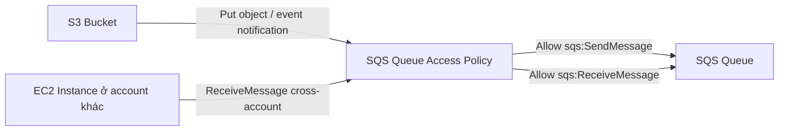
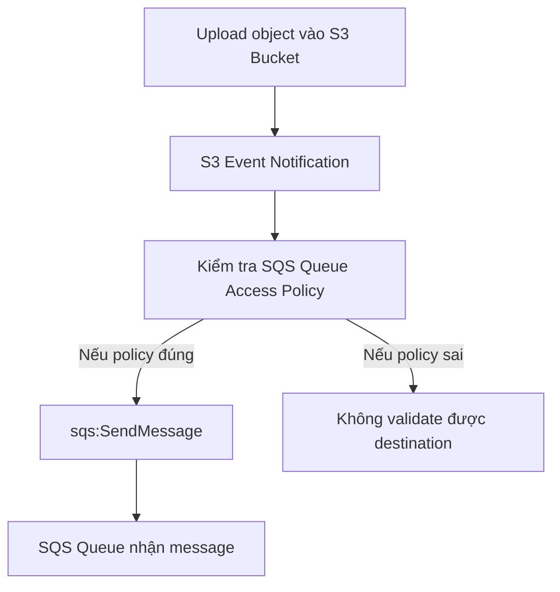

# 216. SQS Queue Access Policy

## 🎯 Giới thiệu
SQS Queue Access Policy là **resource policy** dạng JSON IAM policy được gắn trực tiếp lên **SQS Queue**.

Có 2 use case chính được nhấn mạnh trong transcript:
- ✅ Cho phép **cross-account access** để một account khác có thể truy cập queue
- ✅ Cho phép **S3 Bucket** gửi event notification vào **SQS Queue**

## 1. Cross-account access từ EC2
- Khi một **EC2 Instance** ở account khác cần đọc message từ queue, cần tạo **Queue Access Policy** và attach vào queue ở account sở hữu queue.
- Policy sẽ cho phép **AWS principal** của account bên ngoài thực hiện `sqs:ReceiveMessage` trên queue.
- Ý nghĩa chính:
  - Queue ở account A
  - EC2 ở account B
  - Policy trên queue ở account A cho phép account B đọc message

## 2. S3 Bucket publish event notifications vào SQS Queue
- Khi upload object vào **S3 Bucket**, bucket có thể gửi event notification đến **SQS Queue**.
- Để làm được điều này, queue phải cho phép **S3 Bucket** gọi `sqs:SendMessage`.
- Policy cần có các ý chính:
  - `Action`: `sqs:SendMessage`
  - `Principal`: AWS
  - `Condition`:
    - `ArnLike` với `sourceArn` của bucket
    - `sourceAccount` phải là account owner của S3 bucket

## 3. Hands-on trong transcript
- Tạo queue với tên kiểu `events from S3`
- Giữ cấu hình mặc định ban đầu
- Vào **S3 Bucket Properties** → **Event notifications**
- Tạo notification:
  - Name: `NewObjects`
  - Event type: `All object create events`
  - Destination: **SQS Queue**
- Ban đầu bị lỗi vì destination configuration không validate được
- Sau đó:
  - Vào tài liệu để lấy policy mẫu
  - Chỉnh `Resource` thành ARN của queue
  - Chỉnh `sourceArn` thành tên bucket
  - Chỉnh `sourceAccount` thành account ID hiện tại
- Sau khi sửa policy:
  - Lưu event notification thành công
  - Trong SQS có thể thấy test event đã được gửi từ S3

## 📊 Bảng tóm tắt
| Tiêu chí | Mô tả |
|----------|------|
| Loại policy | Resource policy JSON gắn trực tiếp lên **SQS Queue** |
| Use case 1 | Cho phép **cross-account access** để EC2/account khác đọc message |
| Use case 2 | Cho phép **S3 Bucket** gửi event notification vào queue |
| Action quan trọng | `sqs:ReceiveMessage`, `sqs:SendMessage` |
| Điều kiện hay gặp | `sourceArn`, `sourceAccount`, `ArnLike` |
| Điểm kiểm tra thi | Policy phải được chỉnh đúng thì S3 mới gửi được message vào SQS |
| Dấu hiệu lỗi | Destination configuration không validate được |

## 💡 Mẹo ghi nhớ cho kỳ thi AWS
- **SQS Queue Access Policy = resource policy**
- Nhớ 2 hướng chính:
  - `ReceiveMessage` cho **cross-account EC2**
  - `SendMessage` cho **S3 event notification**
- Nếu thấy câu hỏi về **S3 → SQS**:
  - Nghĩ ngay đến **queue policy**
  - Cần `sourceArn` của bucket và `sourceAccount`
- Nếu thấy câu hỏi về **một account khác đọc queue**:
  - Nghĩ ngay đến `sqs:ReceiveMessage` trong **Queue Access Policy**

## ✅ Kết luận
SQS Queue Access Policy là cơ chế cho phép kiểm soát quyền truy cập trực tiếp vào queue bằng **resource-based policy**. Trong lecture này, trọng tâm là:
- cho phép **cross-account read** từ EC2
- cho phép **S3 Bucket** gửi event vào **SQS Queue**

Điểm mấu chốt để nhớ khi ôn thi: muốn S3 hoặc account khác truy cập SQS thì thường phải sửa **Queue Access Policy** cho đúng.
