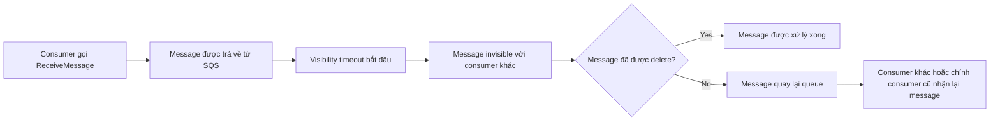

# 217. SQS - Message Visibility Timeout

## 🎯 Giới thiệu
`Message visibility timeout` là thời gian mà một message đã được `ReceiveMessage` bởi một consumer sẽ trở nên **invisible** đối với các consumer khác.

- Khi message được lấy ra từ SQS queue, visibility timeout bắt đầu.
- Mặc định, visibility timeout là **30 seconds**.
- Trong khoảng thời gian này:
  - message chỉ được xử lý bởi consumer đã nhận nó
  - các consumer khác sẽ không thấy message đó
- Nếu message **chưa bị delete** sau khi timeout hết, message sẽ **trở lại queue** và có thể được nhận lại lần nữa.

## 1. Cơ chế hoạt động của Visibility Timeout
- Consumer gọi `ReceiveMessage` để lấy message từ queue.
- Ngay sau đó, message không còn xuất hiện với các consumer khác trong thời gian visibility timeout.
- Nếu consumer khác gọi `ReceiveMessage` trong window này, message sẽ **không được trả về**.
- Khi timeout kết thúc mà message chưa bị delete:
  - message được đưa trở lại queue
  - có thể được nhận lại bởi cùng consumer hoặc consumer khác

## 2. Rủi ro xử lý trùng và cách xử lý
- Nếu message không được xử lý xong trước khi visibility timeout kết thúc, message có thể bị xử lý **twice**.
- Điều này có thể xảy ra:
  - bởi **hai consumer khác nhau**
  - hoặc bởi **cùng một consumer** ở hai lần nhận khác nhau
- Nếu consumer biết cần thêm thời gian xử lý, nó nên gọi `ChangeMessageVisibility`.
- `ChangeMessageVisibility` dùng để:
  - tăng thời gian message vẫn bị ẩn
  - tránh việc message bị consumer khác đọc lại quá sớm

## 3. Cấu hình Visibility Timeout
- Visibility timeout cần được đặt ở mức **reasonable** cho ứng dụng.
- Nếu đặt quá cao:
  - ví dụ hàng giờ
  - nếu consumer crash, message sẽ mất rất lâu mới xuất hiện lại
- Nếu đặt quá thấp:
  - message có thể bị đọc nhiều lần bởi nhiều consumer
  - dẫn đến duplicate processing
- Theo transcript, có thể chỉnh giá trị mặc định từ:
  - **0 seconds** đến **12 hours**
- Tuy nhiên:
  - `0 seconds` là **không khuyến nghị**
  - `30 seconds` là giá trị mặc định và thường ổn trong ví dụ minh họa

## 📊 Bảng tóm tắt
| Tiêu chí | Mô tả |
|----------|------|
| Khái niệm | Thời gian message bị ẩn sau khi được `ReceiveMessage` |
| Mặc định | `30 seconds` |
| Hành vi trong timeout | Message không hiển thị với consumer khác |
| Sau khi timeout | Nếu chưa `delete`, message quay lại queue |
| Rủi ro | Có thể bị xử lý twice / duplicate processing |
| API liên quan | `ChangeMessageVisibility` |
| Cấu hình | Có thể chỉnh default visibility timeout từ `0 seconds` đến `12 hours` |

## 💡 Mẹo ghi nhớ cho kỳ thi AWS
- `ReceiveMessage` không có nghĩa là message đã xong, nó chỉ đang bị **ẩn tạm thời**.
- Nếu **không delete** trước khi timeout hết, message có thể quay lại queue.
- `ChangeMessageVisibility` là key API khi consumer cần thêm thời gian xử lý.
- Tư duy thi:
  - timeout quá dài = chậm phản hồi khi consumer lỗi
  - timeout quá ngắn = dễ duplicate processing

## ✅ Kết luận
`Message visibility timeout` là cơ chế quan trọng của SQS để ngăn nhiều consumer xử lý cùng một message cùng lúc. Hiểu rõ vòng đời của message sau `ReceiveMessage`, cách `ChangeMessageVisibility` hoạt động, và rủi ro duplicate processing là phần rất quan trọng khi ôn thi AWS.
