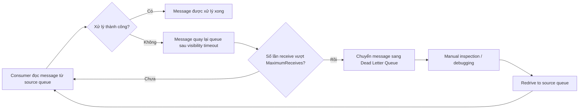

# 218. SQS - Dead Letter Queues

## 🎯 Giới thiệu
Dead Letter Queue (DLQ) trong SQS dùng để xử lý các message bị consumer xử lý thất bại lặp lại nhiều lần trong `visibility timeout`.

Khi consumer đọc message nhưng không xử lý thành công, message sẽ quay lại queue. Nếu vòng lặp này xảy ra liên tục, SQS có thể chuyển message sang DLQ sau khi vượt qua ngưỡng `MaximumReceives`.

## 1. Vấn đề khi message bị fail nhiều lần
- Nếu consumer không xử lý được message trong `visibility timeout`, message sẽ tự quay lại queue.
- Nếu lỗi này lặp lại nhiều lần, message bị đọc đi đọc lại và gây ra vòng lặp thất bại.
- Trường hợp này thường cho thấy:
  - Consumer không hiểu message
  - Message có vấn đề
  - Logic xử lý của consumer bị lỗi

## 2. Cơ chế Dead Letter Queue
- Có thể đặt ngưỡng `MaximumReceives`.
- Khi message bị receive quá nhiều lần mà vẫn không xử lý thành công:
  - SQS sẽ chuyển message sang DLQ.
- Message sẽ bị remove khỏi source queue và được đưa sang queue thứ hai là DLQ.
- DLQ giúp giữ lại message để xử lý sau, thay vì để nó tiếp tục gây lỗi trong source queue.

## 3. Quản lý DLQ và `redrive to source`
- DLQ rất hữu ích cho:
  - Debugging
  - Điều tra nguyên nhân message không được xử lý
  - Manual inspection các message lỗi
- Sau khi kiểm tra:
  - Có thể sửa consumer code
  - Xác định vì sao message không được xử lý
- Sau đó dùng `redrive to source` để đẩy message từ DLQ về lại source queue.
- Khi đó consumer có thể xử lý lại message như bình thường, không cần biết trước rằng message đã từng nằm trong DLQ.

## 📊 Bảng tóm tắt
| Tiêu chí | Mô tả |
|----------|------|
| Mục đích | Giữ lại message xử lý thất bại nhiều lần để debug và xử lý sau |
| Điều kiện chuyển sang DLQ | Vượt ngưỡng `MaximumReceives` |
| Tác dụng chính | Tránh vòng lặp xử lý lỗi lặp đi lặp lại trong source queue |
| Kiểu queue | DLQ của FIFO queue phải là FIFO; DLQ của Standard queue phải là Standard |
| Retention | Nên đặt thời gian lưu dài, ví dụ `14 days` |
| Khả năng khôi phục | Có thể dùng `redrive to source` để đưa message về queue gốc |

## 💡 Mẹo ghi nhớ cho kỳ thi AWS
- `MaximumReceives` là từ khóa quan trọng: vượt ngưỡng thì message đi vào DLQ.
- DLQ dùng để debug và xử lý message lỗi, không phải để bỏ mặc message.
- Nhớ quy tắc loại queue:
  - FIFO DLQ -> FIFO
  - Standard DLQ -> Standard
- Khi có DLQ, nên để retention dài hơn để kịp kiểm tra message trước khi hết hạn.
- `redrive to source` = đưa message từ DLQ quay lại source queue để xử lý lại.

## ✅ Kết luận
Dead Letter Queue trong SQS là cơ chế bảo vệ khi message bị xử lý thất bại nhiều lần. Nó giúp tách message lỗi ra khỏi flow chính, hỗ trợ debug, và cho phép `redrive to source` để xử lý lại sau khi đã khắc phục nguyên nhân.
