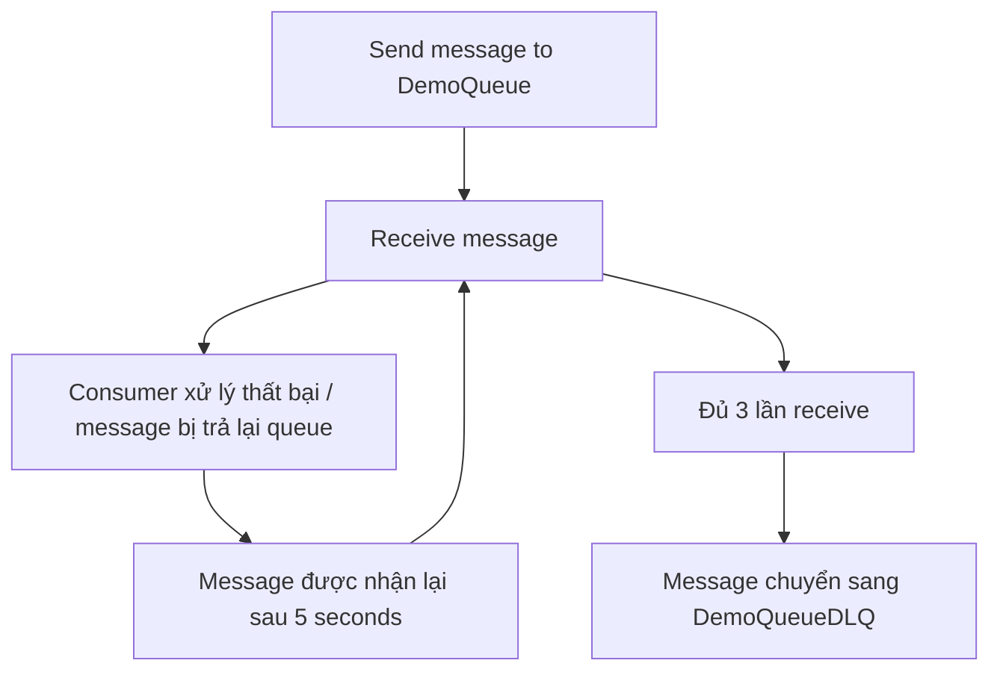

# 219. SQS - Dead Letter Queues - Hands On

## 🎯 Giới thiệu
- Bài này demo cách dùng **SQS Dead Letter Queue (DLQ)** để tách các message lỗi ra khỏi **source queue**.
- Mục tiêu chính:
  - Tạo một **DLQ**
  - Gắn DLQ vào **DemoQueue**
  - Cho message bị xử lý lỗi đi vào DLQ sau số lần nhận tối đa
  - Thực hiện **redrive** message từ DLQ quay lại queue gốc
- Transcript dùng một message dạng **“poison pill”** để minh họa message làm consumer fail.

## 1. Tạo Dead Letter Queue
- Tạo queue mới tên **DemoQueueDLQ**.
- Thiết lập:
  - **Message retention period**: **14 days** để có nhiều thời gian lưu giữ và phân tích message.
  - **Default encryption**: bật sẵn.
- Sau đó tạo queue thành công.

## 2. Cấu hình source queue và cơ chế chuyển sang DLQ
- Mở cấu hình của **DemoQueue**.
- Điều chỉnh **visibility timeout** xuống **5 seconds** để demo diễn ra nhanh hơn.
- Trong phần **Dead-letter queue**:
  - Bật DLQ
  - Chọn **DemoQueueDLQ** làm **dead-letter queue**
- Cấu hình **maximum receive count** là **3**:
  - Message sẽ được nhận tối đa 3 lần
  - Khi bị nhận lần thứ 4 mà vẫn không được xử lý xong, message sẽ bị đưa sang **DLQ**

## 3. Demo message đi vào DLQ và redrive
- Gửi message **“hello world, poison pill”** vào **DemoQueue**.
- Poll message:
  - Message được nhận lần 1
  - Sau **5 seconds**, nhận lần 2
  - Sau thêm **5 seconds**, nhận lần 3
- Vì message luôn bị trả lại queue và không bị xử lý xong, nó sẽ bị chuyển sang **DLQ**.
- Kiểm tra lại **DemoQueue**:
  - Không còn thấy message nữa
- Kiểm tra **DLQ**:
  - Message xuất hiện trong **DemoQueueDLQ**
  - Có thể dùng nó để xác định lý do khiến ứng dụng chính bị crash
- Thực hiện **redrive**:
  - Trong DLQ, chọn **Start DLQ redrive**
  - Chọn đích là **source queue**
  - **Velocity control** dùng **Systemoptimized**
  - Có thể **inspect messages** nếu muốn
  - Chạy **DLQ redrive task**
- Sau khi task hoàn tất:
  - Quay lại **DemoQueue**
  - Poll messages
  - Thấy message xuất hiện lại, chứng tỏ redrive đã thành công

## 📊 Bảng tóm tắt
| Tiêu chí | Mô tả |
|----------|------|
| DLQ | Queue dùng để chứa message không được xử lý thành công sau nhiều lần nhận |
| Source queue | Queue chính nhận message ban đầu, trong demo là **DemoQueue** |
| Message retention | DLQ được đặt **14 days** để giữ message lâu hơn cho việc phân tích |
| Visibility timeout | Đặt **5 seconds** để demo nhanh hơn |
| Maximum receive count | Đặt **3** lần, sau đó message chuyển sang DLQ |
| Poison pill | Message gây lỗi cho consumer, trong demo là **“hello world, poison pill”** |
| Redrive | Đưa message từ DLQ quay lại source queue sau khi sửa consumer |
| Velocity control | Khi redrive, dùng **Systemoptimized** |

## 💡 Mẹo ghi nhớ cho kỳ thi AWS
- **DLQ không tự xử lý lỗi**, nó chỉ là nơi chứa message bị lỗi sau khi vượt quá **maximum receive count**.
- Nếu thấy nhắc đến **poison pill**, hãy liên tưởng ngay đến message gây fail cho consumer và bị đẩy sang **DLQ**.
- Nhớ bộ 3 quan trọng trong demo:
  - **visibility timeout = 5 seconds**
  - **maximum receive count = 3**
  - **DLQ retention = 14 days**
- **Redrive** là thao tác đưa message từ **DLQ** về lại **source queue** sau khi đã sửa lỗi ứng dụng.

## ✅ Kết luận
- **SQS Dead Letter Queue** giúp cô lập các message lỗi để dễ phân tích.
- Khi message bị nhận quá số lần cho phép, nó sẽ chuyển sang **DLQ** thay vì tiếp tục làm hỏng luồng xử lý.
- Nếu đã fix consumer, bạn có thể dùng **DLQ redrive** để đưa message quay lại queue gốc và xử lý lại.
