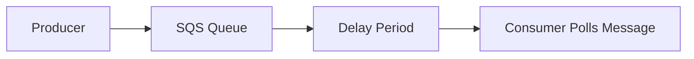

# 220. SQS - Delay Queues

## 🎯 Giới thiệu

`SQS Delay Queues` cho phép trì hoãn message để consumer không nhìn thấy message ngay lập tức sau khi producer gửi vào `SQS queue`.

- Thời gian delay có thể lên đến **15 minutes**.
- Mặc định, delay là **0 seconds**.
- Khi delay là `0 seconds`, message sẽ sẵn sàng để được đọc ngay sau khi được gửi vào queue.

## 1. Cách hoạt động của Delay Queue

📌 Khi một message được gửi vào `SQS queue`, queue có thể giữ message trong một khoảng thời gian trước khi consumer có thể poll và nhận message đó.

Ví dụ trong bài:

- Queue được cấu hình delay mặc định là **30 seconds**.
- Producer gửi message vào queue.
- Sau **30 seconds**, consumer poll queue và có thể nhận message thành công.

## 2. Các mức cấu hình delay

`SQS Delay Queues` hỗ trợ cấu hình delay theo hai cách:

### 📌 Queue level delay

- Thiết lập delay mặc định ở cấp độ queue.
- Tất cả message gửi vào queue sẽ bị trì hoãn theo số giây đã cấu hình.

### 📌 Per-message delay

- Có thể override delay cho từng message khi gửi message.
- Sử dụng parameter `DelaySeconds`.

## 3. Demo trong AWS Console

Trong demo, một queue tên `DelayQueue` được tạo trong `SQS`.

Các bước chính:

- Tạo queue `DelayQueue`.
- Cấu hình `delivery delay` là **10 seconds**.
- Gửi một message vào queue.
- Bắt đầu polling để nhận message.
- Consumer không nhận được message ngay lập tức.
- Sau khoảng **10 seconds**, message xuất hiện và consumer nhận được message.

Điều này cho thấy có một khoảng delay giữa thời điểm message được gửi và thời điểm message thực sự được delivered cho consumer.

## 📊 Bảng tóm tắt

| Tiêu chí | Mô tả |
|----------|------|
| Dịch vụ | `Amazon SQS` |
| Tính năng | `Delay Queues` |
| Mục đích | Trì hoãn message để consumer không thấy message ngay lập tức |
| Delay mặc định | `0 seconds` |
| Delay tối đa | `15 minutes` |
| Cấu hình cấp queue | Áp dụng delay mặc định cho tất cả message |
| Cấu hình từng message | Dùng `DelaySeconds` để override delay |
| Demo | `DelayQueue` với `delivery delay` là `10 seconds` |

## 💡 Mẹo ghi nhớ cho kỳ thi AWS

- `SQS Delay Queues` dùng để trì hoãn việc message được consumer nhìn thấy.
- Delay mặc định là **0 seconds**, nghĩa là message có thể được đọc ngay.
- Delay tối đa là **15 minutes**.
- Có thể cấu hình delay ở **queue level** hoặc theo từng message bằng `DelaySeconds`.

## ✅ Kết luận

`SQS Delay Queues` là tính năng giúp kiểm soát thời điểm message trở nên khả dụng cho consumer. Message có thể bị delay theo cấu hình mặc định của queue hoặc theo từng message bằng `DelaySeconds`. Đây là một tính năng cần biết khi học và ôn thi AWS Certified Developer Associate.
