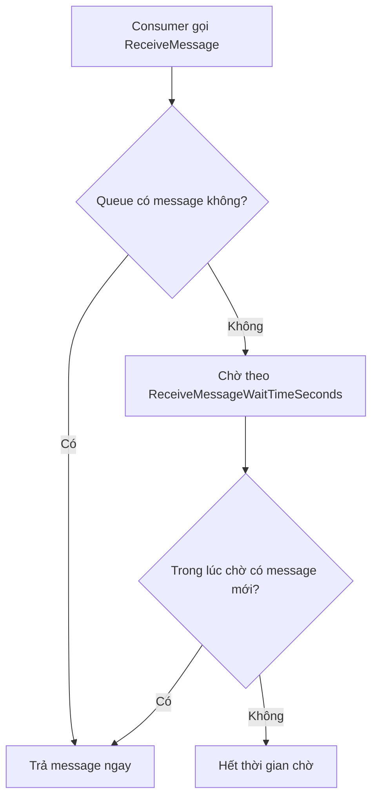
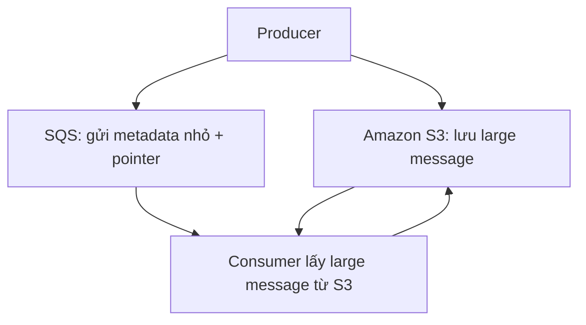

# 221. SQS - Certified Developer concepts

## 🎯 Giới thiệu
Phần này tập trung vào các khái niệm **SQS** ở mức developer, đặc biệt là:
- **Long polling**
- **SQS Extended Client**
- Các **API calls** quan trọng thường gặp trong exam

Mục tiêu là hiểu cách tối ưu hiệu năng, giảm số lần gọi API, và xử lý message lớn hơn giới hạn của SQS.

## 1. Long Polling
**Long polling** là cơ chế cho phép consumer **chờ** message xuất hiện khi queue đang trống, thay vì gọi liên tục.

### Ý chính
- Khi consumer poll vào SQS mà queue rỗng, nó có thể đợi trong một khoảng thời gian.
- Nếu message đến trong lúc đang đợi, consumer sẽ nhận message ngay.
- Lợi ích:
  - Giảm số lần gọi API vào SQS
  - Giảm CPU cycles
  - Giảm latency
- Thời gian wait có thể đặt từ **1 đến 20 seconds**, và **20 seconds** được xem là preferable.
- Có thể bật long polling ở:
  - **Queue level**
  - **API call level** thông qua `ReceiveMessageWaitTimeSeconds`

### Mermaid - Long polling flow

### Ghi nhớ cho exam
- Nếu đề bài nói consumer gọi quá nhiều lần vào SQS, tốn tiền, tốn CPU, tăng latency -> nghĩ đến **Long polling**.
- **Short polling** tương ứng với wait time = **0**.
- Trong demo, khi queue được cấu hình wait time và consumer chạy long polling, message được nhận ngay khi được gửi vào queue.

## 2. SQS Extended Client
SQS có giới hạn kích thước message tối đa là **1,024 KB**. Khi cần gửi message lớn hơn, có thể dùng **SQS Extended Client**.

### Ý chính
- Đây là một **Java library**.
- Ý tưởng có thể áp dụng tương tự trong ngôn ngữ khác.
- Cách hoạt động:
  - Dữ liệu lớn được lưu trong **Amazon S3**
  - SQS chỉ chứa một **small metadata message**
  - Metadata này có **pointer** tới object lớn trong S3
- Consumer đọc message từ SQS, sau đó dùng pointer để lấy dữ liệu thật từ S3.

### Use case
- Ví dụ xử lý **video files**
  - Upload video lên **S3**
  - Gửi message nhỏ vào **SQS** trỏ tới file đó

### Mermaid - Extended Client flow

## 3. Các API Calls Quan Trọng
Các API calls sau cần nhớ vì dễ xuất hiện trong exam:

| API | Mục đích |
|---|---|
| `CreateQueue` | Tạo queue |
| `DeleteQueue` | Xóa queue và toàn bộ messages trong queue |
| `PurgeQueue` | Xóa toàn bộ messages trong queue |
| `SendMessage` | Gửi message vào queue |
| `ReceiveMessage` | Poll message từ queue |
| `DeleteMessage` | Xóa message sau khi consumer xử lý xong |
| `ChangeMessageVisibility` | Thay đổi message timeout nếu cần thêm thời gian xử lý |

### Parameters cần nhớ
- `MessageRetentionPeriod`: thời gian giữ message trong queue trước khi bị discard
- `DelaySeconds`: gửi message có delay
- `MaxNumberOfMessages`:
  - Mặc định là **1**
  - Có thể nhận tối đa **10 messages** trong một lần gọi
- `ReceiveMessageWaitTimeSeconds`:
  - Thời gian consumer chờ response
  - Tương đương bật **long polling**
- Batch API calls có thể dùng cho:
  - `SendMessage`
  - `DeleteMessage`
  - `ChangeMessageVisibility`
- Mục tiêu của batch API:
  - Giảm số lần gọi API
  - Giảm chi phí

## 📊 Bảng tóm tắt
| Tiêu chí | Mô tả |
|----------|------|
| Long polling | Consumer chờ message khi queue rỗng, giảm API calls và latency |
| Cấu hình long polling | Queue level hoặc `ReceiveMessageWaitTimeSeconds` |
| Thời gian chờ | Từ 1 đến 20 seconds, 20 seconds được ưu tiên |
| SQS Extended Client | Dùng khi message quá lớn so với giới hạn SQS |
| Lưu dữ liệu lớn | Đặt trong **S3**, SQS chỉ giữ metadata + pointer |
| Giới hạn message | **1,024 KB** |
| `ReceiveMessage` | Poll message từ queue |
| `DeleteMessage` | Xóa message sau xử lý |
| `ChangeMessageVisibility` | Tăng/điều chỉnh thời gian xử lý message |
| Batch API | Giúp giảm số lần gọi API và giảm cost |

## 💡 Mẹo ghi nhớ cho kỳ thi AWS
- **Queue trống + consumer chờ** = **Long polling**
- **Message quá lớn** = **S3 + SQS Extended Client**
- **Nhận nhiều message hơn 1** = chỉnh `MaxNumberOfMessages` tối đa **10**
- **Muốn giảm cost và API calls** = dùng **long polling** và **batch API**
- **`DeleteQueue` khác `PurgeQueue`**:
  - `DeleteQueue`: xóa queue luôn
  - `PurgeQueue`: chỉ xóa messages trong queue
- **`ReceiveMessageWaitTimeSeconds`** là dấu hiệu của **long polling**

## ✅ Kết luận
Các ý chính của bài này xoay quanh việc tối ưu SQS cho developer:
- **Long polling** giúp giảm API calls, giảm cost, giảm latency
- **SQS Extended Client** giúp xử lý message lớn bằng cách dùng **S3**
- Nhớ các **API calls** và parameters như `MaxNumberOfMessages`, `ReceiveMessageWaitTimeSeconds`, `ChangeMessageVisibility` vì rất hay xuất hiện trong đề thi AWS
