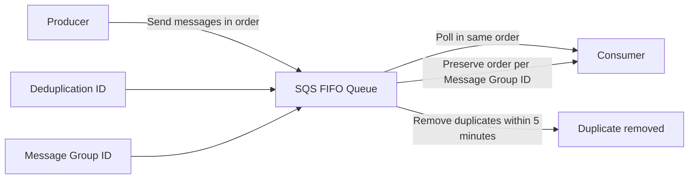

# 222. SQS - FIFO Queues

## 🎯 Giới thiệu
Amazon SQS FIFO queues là loại queue bảo đảm thứ tự message theo kiểu **first in, first out**.

- Nếu producer gửi message theo thứ tự `1, 2, 3, 4` thì consumer đọc từ **SQS FIFO queue** cũng sẽ nhận đúng thứ tự đó.
- Đây là điểm khác với **regular SQS queue**, nơi message có thể bị nhận **out of order**.
- FIFO queue có thêm cơ chế **exactly-once send** để loại bỏ duplicate ở level của queue.

## 1. Đặc điểm chính của FIFO Queue 🧩
- **FIFO = first in, first out**.
- Message được đọc theo đúng thứ tự đã gửi.
- Thứ tự được đảm bảo ở mức **message group ID**.
- Producer phải gửi kèm **Message Group ID** mỗi lần gửi message.

## 2. Throughput và giới hạn ⚡
Do có ordering guarantee, FIFO queue có giới hạn throughput:

- Khoảng **300 messages/second** nếu **không batching**
- Khoảng **3,000 messages/second** nếu **có batching**

## 3. Exactly-once send và deduplication 🛡️
FIFO queue hỗ trợ loại bỏ duplicate ngay tại queue level:

- Mỗi message cần có **deduplication ID**
- Nếu cùng ID xuất hiện trong vòng **5 minutes**, message duplicate sẽ bị loại
- Có thêm setting **content-based deduplication**
- Đây là cách hữu ích để tránh duplicate trong một cửa sổ 5 phút ngắn

## 4. Tạo và dùng FIFO Queue trong console 🛠️
- Khi tạo queue FIFO, tên queue **phải kết thúc bằng `.fifo`**
- Nếu không có `.fifo`, bạn sẽ không tạo được FIFO queue
- Configuration khá giống queue thường, nhưng có thêm:
  - **content-based deduplication**
- Access policy, encryption, và các phần khác được giữ như bình thường

## 📊 Bảng tóm tắt
| Tiêu chí | Mô tả |
|----------|------|
| Tên queue | Phải kết thúc bằng `.fifo` |
| Ordering | Đảm bảo message được đọc đúng thứ tự |
| So với regular SQS | Regular SQS có thể nhận message out of order |
| Throughput | ~300 msg/s không batching, ~3,000 msg/s có batching |
| Deduplication | Dùng **deduplication ID** để loại duplicate trong 5 phút |
| Grouping | Ordering guarantee áp dụng theo **Message Group ID** |
| Tùy chọn thêm | **content-based deduplication** |

## 💡 Mẹo ghi nhớ cho kỳ thi AWS
- **FIFO = Order First**: ưu tiên nhớ rằng FIFO bảo toàn thứ tự message.
- **`.fifo` là bắt buộc** khi tạo queue loại này.
- Nhớ 2 ID quan trọng:
  - **Message Group ID** = nhóm để giữ thứ tự
  - **Deduplication ID** = chống duplicate trong 5 phút
- FIFO có **throughput thấp hơn** so với queue thường vì phải giữ ordering.

## ✅ Kết luận
SQS FIFO queues phù hợp khi bạn cần:

- **Đúng thứ tự message**
- **Loại bỏ duplicate**
- **Xử lý theo Message Group ID**
- Chấp nhận **throughput thấp hơn** so với regular SQS queue

Đây là phần rất dễ ra thi vì thường hỏi về **ordering guarantee**, **deduplication ID**, và điều kiện tên queue **`.fifo`**.
