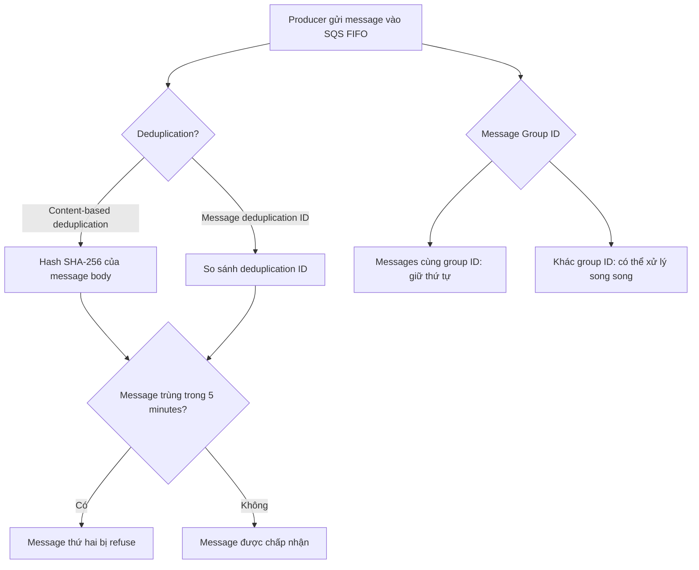

# 223. SQS - FIFO Queues Advanced

## 🎯 Giới thiệu
Trong bài này, nội dung tập trung vào các khái niệm nâng cao của **SQS FIFO Queue**:
- **Deduplication** trong vòng **5 minutes**
- **Content-based deduplication** và **Message deduplication ID**
- **Message Group ID** để đảm bảo thứ tự theo nhóm và cho phép xử lý song song

## 1. 🧩 Deduplication trong SQS FIFO
- **Deduplication interval** là **5 minutes**.
- Nếu gửi cùng một message hai lần trong khoảng thời gian này, **message thứ hai sẽ bị refused**.
- Có 2 cách deduplication:
  - **Content-based deduplication**
    - SQS dùng **SHA-256** của **message body** để tạo hash.
    - Nếu nội dung giống nhau, hash giống nhau, message trùng sẽ bị loại.
  - **Message deduplication ID**
    - Người gửi tự cung cấp **deduplication ID**.
    - Nếu cùng ID xuất hiện lần nữa, message sẽ bị bỏ qua.

## 2. 📦 Message Group ID và thứ tự message
- **Message Group ID** là tham số **bắt buộc** khi gửi message vào **FIFO queue**.
- Các message có cùng **message group ID**:
  - Được xử lý theo **đúng thứ tự**
  - Thuộc về **một consumer** cho nhóm đó
- Nếu dùng **nhiều group ID khác nhau**:
  - Có thể **parallel processing**
  - Mỗi group có consumer riêng
  - **Ordering across groups is not guaranteed**
- Ý tưởng ứng dụng:
  - Nếu chỉ cần giữ thứ tự cho một phần dữ liệu, hãy dùng **different Message Group ID**
  - Ví dụ theo **customer ID** hoặc **user ID** để mỗi user có thứ tự riêng

## 3. 🧪 Quan sát từ demo trong transcript
- Khi bật **content-based deduplication**:
  - Gửi cùng một message nhiều lần thì số message available vẫn chỉ là **1**
  - Gửi message khác nội dung thì sẽ có thêm message mới
- Khi dùng **deduplication ID** tự chỉ định:
  - Nếu dùng lại cùng một ID, SQS FIFO chỉ giữ **1 message**
- Khi đổi **Message Group ID**:
  - Các message của từng group vẫn giữ thứ tự riêng
  - Nhiều group có thể được xử lý đồng thời

## 📊 Bảng tóm tắt
| Tiêu chí | Mô tả |
|----------|------|
| Deduplication window | **5 minutes** |
| Content-based deduplication | Dựa trên **SHA-256 hash** của message body |
| Manual deduplication | Dùng **Message deduplication ID** |
| Trùng message | Message thứ hai sẽ bị **refuse** |
| Message Group ID | Bắt buộc với **FIFO queue** |
| Ordering | Đảm bảo thứ tự **trong cùng group** |
| Parallel processing | Có thể xử lý song song khi dùng **nhiều group ID** |
| Ordering across groups | **Không được guarantee** |

## 💡 Mẹo ghi nhớ cho kỳ thi AWS
- Nhớ 3 ý chính của **SQS FIFO**:
  - **Deduplication**
  - **Ordering**
  - **Message Group ID**
- Ghi nhớ:
  - **5 minutes** là cửa sổ deduplication
  - **Content-based deduplication** dùng **SHA-256**
  - **Same Message Group ID** = giữ thứ tự, nhưng giới hạn song song trong nhóm đó
- Nếu đề bài nói:
  - Cần tránh message trùng trong thời gian ngắn → nghĩ đến **deduplication**
  - Cần giữ thứ tự theo từng user/customer → nghĩ đến **Message Group ID**
  - Cần xử lý song song nhưng vẫn giữ thứ tự theo nhóm → dùng **nhiều Message Group ID**

## ✅ Kết luận
**SQS FIFO Queue** trong transcript được mở rộng với 2 cơ chế quan trọng:
- **Deduplication** để tránh message trùng trong **5 minutes**
- **Message Group ID** để giữ thứ tự trong từng nhóm và cho phép **parallel processing** giữa các nhóm

Đây là các điểm rất dễ xuất hiện trong câu hỏi AWS vì chúng liên quan trực tiếp đến **ordering**, **uniqueness**, và **scaling** của **FIFO queue**.
