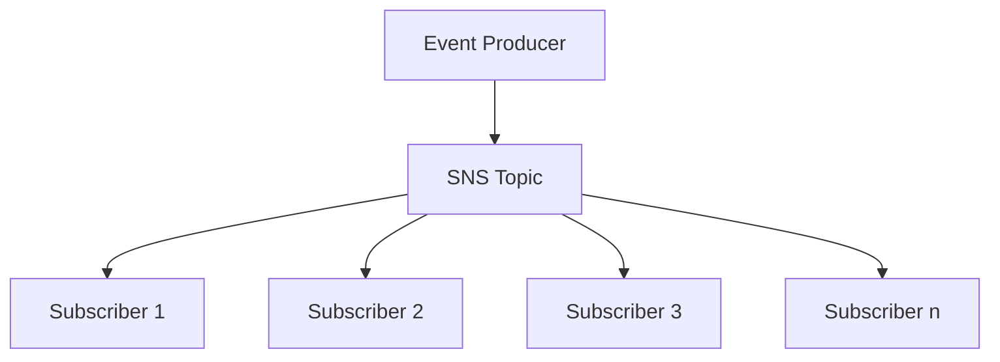

# 224. Amazon SNS

## 🎯 Giới thiệu
Amazon SNS (Simple Notification Service) là dịch vụ **Pub/Sub (Publish-subscribe)** giúp một producer gửi **một message** đến **một SNS topic**, rồi topic này phân phối message đó cho **nhiều subscribers** khác nhau.

- Phù hợp khi một hệ thống cần gửi cùng một thông báo đến nhiều nơi.
- Tránh phải tích hợp trực tiếp từng service nhận riêng lẻ.
- Các subscribers có thể nhận **tất cả message** từ topic, trừ khi dùng **message filtering**.

## 1. 🧩 Mô hình Pub/Sub trong SNS
Trong transcript, ví dụ là một **buying service** gửi thông báo đến nhiều đích:

- email notification
- fraud service
- shipping service
- SQS Queue

Nếu làm theo kiểu direct integration, mỗi lần thêm receiver mới sẽ phải tạo thêm integration mới, rất cồng kềnh.

Với SNS:

- **Event producer** chỉ publish message vào **một SNS topic**.
- **Event receivers / subscriptions** sẽ lắng nghe topic.
- Mỗi subscriber nhận message từ topic để xử lý theo nhu cầu riêng.

## 2. 📩 Cách publish và các loại subscriber
Để gửi message vào SNS, transcript nêu các cách chính:

- Dùng **topic.publish SDK** để publish vào **SNS topic**
- Tạo topic
- Tạo một hoặc nhiều subscriptions
- Publish message vào topic, các subscribers sẽ tự nhận

SNS có thể gửi đến nhiều loại đích:

- **Email**
- **SMS**
- **Mobile notifications**
- **HTTP / HTTP(S) endpoints**
- Tích hợp AWS services:
  - **SQS**
  - **Lambda**
  - **Kinesis Data Firehose**

Ngoài ra, SNS cũng nhận notification từ nhiều AWS services, ví dụ:

- **CloudWatch Alarms**
- **Auto Scaling Group notifications**
- **CloudFormation state changes**
- **Budgets**
- **S3 buckets**
- **DMS**
- **Lambda**
- **DynamoDB**
- **RDS events**

### Direct publish cho mobile apps
Transcript cũng nhắc đến **direct publish** cho mobile apps:

- Cần tạo **platform application**
- Tạo **platform endpoint**
- Publish vào **platform endpoint**
- Có thể làm việc với:
  - **Google GCM**
  - **Apple APNS**
  - **Amazon ADM**

## 3. 🔐 Bảo mật và Access Control
Về security, SNS được mô tả tương tự **SQS**:

- **In-flight encryption** by default
- **At-rest encryption** using **KMS keys**
- **Client-side encryption** nếu client tự mã hóa message trước khi gửi

Về access control:

- **IAM policies** là trung tâm vì mọi **SNS APIs** đều được điều khiển bởi IAM policies
- Có thể dùng **SNS access policies**
- Các policy này tương tự **S3 bucket policies**
- Rất hữu ích cho:
  - **cross-account access** đến SNS topics
  - cho phép service khác như **S3 events** ghi vào SNS topic

## 📊 Bảng tóm tắt
| Tiêu chí | Mô tả |
|----------|------|
| Mô hình | **Pub/Sub**: producer publish vào **SNS topic**, nhiều subscribers nhận message |
| Subscriber | Có thể là email, SMS, mobile notification, HTTP(S), **SQS**, **Lambda**, **Kinesis Data Firehose** |
| Tích hợp AWS | Nhận notification từ **CloudWatch**, **Auto Scaling**, **CloudFormation**, **S3**, **DynamoDB**, **RDS**, ... |
| Mobile publish | Dùng **platform application** và **platform endpoint** cho **GCM**, **APNS**, **Amazon ADM** |
| Bảo mật | **In-flight encryption**, **at-rest encryption with KMS**, **client-side encryption** |
| Access control | **IAM policies** và **SNS access policies** |

## 💡 Mẹo ghi nhớ cho kỳ thi AWS
- Nhớ SNS = **Pub/Sub**, dùng khi **một message cần gửi đến nhiều receiver**.
- **SNS topic** là điểm trung tâm, còn **subscriptions** là nơi nhận message.
- SNS không chỉ gửi ra ngoài, mà còn nhận notification từ nhiều AWS services như **S3**, **CloudWatch**, **Auto Scaling**, **Lambda**, **DynamoDB**.
- Nếu thấy câu hỏi về **fan-out** hoặc một message đến nhiều consumer, hãy nghĩ đến **SNS**.
- Về security, hãy nhớ 3 ý:
  - **default in-flight encryption**
  - **at-rest encryption with KMS**
  - **IAM policies** kiểm soát API

## ✅ Kết luận
Amazon SNS là dịch vụ **publish-subscribe** giúp tách producer khỏi nhiều subscribers, giảm sự phức tạp của direct integration. Trong AWS exam, hãy nhớ SNS cho **notification fan-out**, hỗ trợ nhiều loại subscriber, tích hợp rộng với AWS services, và được bảo vệ bởi **IAM policies** cùng các cơ chế mã hóa.
