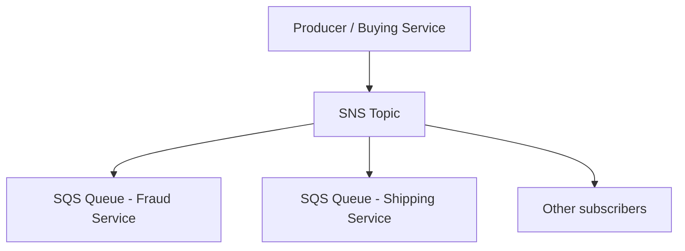

# 225. Amazon SNS and SQS - Fan Out Pattern

## 🎯 Giới thiệu
Bài này nói về **SNS + SQS fan-out pattern**: thay vì gửi message riêng lẻ đến nhiều SQS queue, ta gửi **một lần vào SNS topic**, rồi nhiều **SQS queues** sẽ subscribe topic đó và nhận cùng một message.

Mục tiêu của pattern này:
- ✅ Giảm rủi ro lỗi khi ứng dụng crash giữa chừng
- ✅ Tránh delivery failure khi phải gửi nhiều lần
- ✅ Dễ mở rộng thêm queue mới về sau
- ✅ Đảm bảo mô hình **fully decoupled**
- ✅ Tận dụng **SQS data persistence**, **delayed processing**, và **retries**

## 1. SNS + SQS Fan-out Pattern
- Producer chỉ **push 1 lần vào SNS topic**
- Nhiều **SQS queues** subscribe vào SNS topic
- Mỗi queue là một **subscriber** và nhận cùng message
- Có thể thêm queue mới theo thời gian mà không cần sửa cách gửi message ban đầu

### Ví dụ trong transcript
- **Buying service** gửi message vào SNS topic
- **Fraud service** đọc từ một SQS queue riêng
- **Shipping service** đọc từ một SQS queue riêng

### Lưu ý quan trọng
- Cần đảm bảo **SQS queue access policy** cho phép **SNS topic** ghi vào queue
- Pattern này có thể hỗ trợ **cross-region delivery** nếu security cho phép

## 2. Các ứng dụng của Fan-out
### 2.1 S3 events vào nhiều queue
- `S3` có giới hạn: với cùng một tổ hợp **event type** và **prefix**, chỉ có thể có **một S3 event rule**
- Nếu muốn gửi cùng một S3 event notification đến **nhiều SQS queues**, dùng **fan-out pattern**
- Luồng:
  - S3 object created event
  - Đẩy vào SNS topic
  - SNS topic fan-out đến nhiều SQS queues

Ngoài SQS, SNS còn có thể subscribe:
- Email
- Lambda functions
- Các application khác

### 2.2 SNS → Kinesis Data Firehose → S3
- SNS có tích hợp trực tiếp với **Kinesis Data Firehose (KDF)**
- Buying service gửi data vào SNS topic
- KDF nhận dữ liệu
- Từ KDF, dữ liệu được đẩy vào:
  - `Amazon S3`
  - hoặc các **supported KDF destinations** khác

## 3. SNS FIFO và Message Filtering
### 3.1 SNS FIFO fan-out
- SNS có **FIFO capability**
- FIFO = **first in first out**
- Đảm bảo **ordering** của message trong topic
- Hỗ trợ:
  - **message group ID**
  - **deduplication ID**
  - **content-based deduplication**
- Subscribers có thể là:
  - **SQS standard queue**
  - **SQS FIFO queue**
- Riêng luồng fan-out FIFO trong transcript nhấn mạnh subscriber hiện tại là **SQS FIFO queue** để giữ thứ tự

### Ý nghĩa thi cử
Dùng khi cần đồng thời:
- fan-out
- ordering
- deduplication

### 3.2 Message filtering trên SNS
- **Message filtering** là một **JSON policy**
- Policy này dùng để lọc message ở mức **SNS subscription**
- Mặc định:
  - subscription **không có filter policy** sẽ nhận **mọi message**
- Nếu có filter policy:
  - chỉ message khớp điều kiện mới được deliver

### Ví dụ trong transcript
- Transaction có các field như:
  - order number
  - product
  - quantity
  - state
- Tạo queue chỉ cho:
  - `State = Placed`
- Tạo queue khác cho:
  - `State = Canceled`
- Có thể dùng cùng filter policy cho:
  - `email subscription`
- Có thể tạo:
  - queue cho `declined orders`
  - queue không có filter policy để nhận tất cả message

## 📊 Bảng tóm tắt
| Tiêu chí | Mô tả |
|----------|------|
| Mục tiêu | Gửi 1 message đến nhiều destinations qua SNS |
| Thành phần chính | `SNS Topic`, `SQS Queues` |
| Điểm mạnh | Decoupled, giảm lỗi, dễ mở rộng, không mất data |
| Lợi ích của SQS | Data persistence, delayed processing, retries |
| Yêu cầu quyền | SQS queue access policy phải cho phép SNS ghi vào queue |
| Cross-region | Có thể nếu security cho phép |
| Dùng cho S3 events | Có thể fan-out S3 event đến nhiều queue/subscriber |
| KDF integration | SNS có thể đẩy sang `Kinesis Data Firehose` rồi tới `S3` |
| SNS FIFO | Có ordering, deduplication, message group ID |
| Message filtering | Dùng JSON policy để lọc message theo subscription |

## 💡 Mẹo ghi nhớ cho kỳ thi AWS
- `SNS = broadcast`, `SQS = buffer/queue`
- Nếu cần **1-to-many**, nghĩ ngay đến **fan-out pattern**
- Nếu cần **ordering + deduplication + fan-out**, nhớ đến **SNS FIFO + SQS FIFO**
- Nếu chỉ một số subscriber cần message, dùng **SNS message filtering**
- Với `S3 events`, nếu muốn gửi đến nhiều nơi, fan-out là cách giải quyết
- Câu hỏi thi thường kiểm tra:
  - quyền giữa SNS và SQS
  - FIFO vs standard
  - filtering theo subscription
  - luồng S3 → SNS → multiple targets

## ✅ Kết luận
**SNS + SQS fan-out pattern** cho phép một producer gửi message một lần vào `SNS topic`, sau đó phân phối đến nhiều `SQS queues` hoặc subscriber khác. Pattern này hỗ trợ kiến trúc **decoupled**, dễ mở rộng, có thể áp dụng cho `S3 events`, `Kinesis Data Firehose`, `SNS FIFO`, và `message filtering` để kiểm soát chính xác message nào đi đến đâu.
