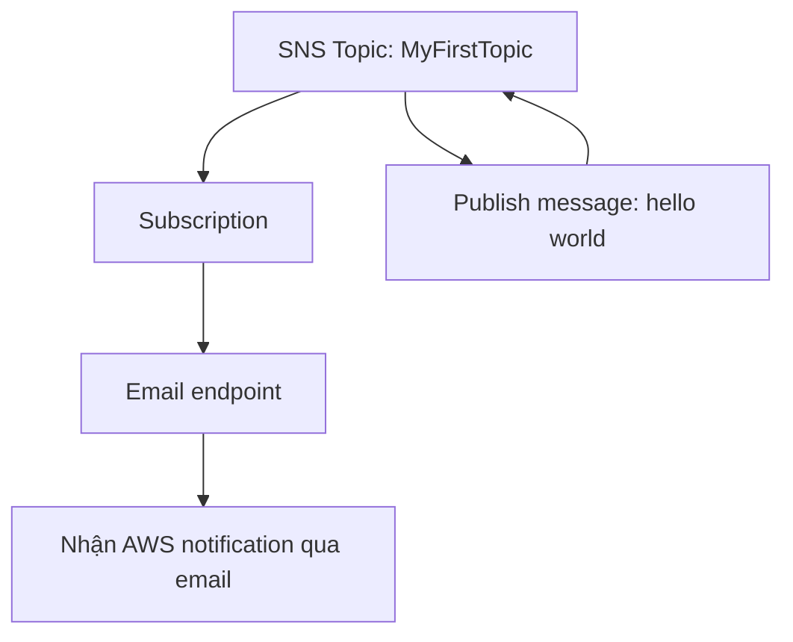

# 226. SNS Hands On

## 🎯 Giới thiệu
Bài hands-on này thực hành với **Amazon SNS (Simple Notification Service)** bằng cách:
- Tạo **topic**
- Tạo và xác nhận **subscription**
- **Publish** message để kiểm tra luồng hoạt động
- Xóa **subscription** và **topic** sau khi hoàn tất

SNS được dùng để gửi thông báo từ **topic** đến nhiều loại subscriber khác nhau như **SQS, Lambda, HTTPS, SMS, email, mobile application endpoints**.

## 1. Tạo SNS Topic
- Vào **Simple Notification Service** và tạo topic đầu tiên tên là `MyFirstTopic`.
- Có 2 loại topic:
  - **Standard topic**
    - **best-effort message ordering**
    - **at least once message delivery**
    - **highest throughput**
    - hỗ trợ subscriber: **SQS, Lambda, HTTPS, SMS, email, mobile application endpoints**
  - **FIFO topic**
    - **strictly preserved message ordering**
    - **exactly once message delivery**
    - throughput tối đa **300 publishes per second**
    - chỉ **SQS queue** được subscribe
    - tên topic phải kết thúc bằng **`.fifo`**

- Trong bài này dùng **standard topic**.
- Có thể bật:
  - **Encryption**
  - **Access policy**
- **Access policy** dùng để xác định **ai / cái gì** được phép ghi vào SNS topic.
- Ví dụ trong transcript: có thể cho **S3 bucket** ghi events vào SNS topic, rồi SNS tiếp tục gửi dữ liệu sang **SQS**.

## 2. Tạo Subscription và xác nhận
- Sau khi tạo topic, ban đầu sẽ có **zero subscriptions**.
- Tạo subscription mới và chọn **protocol**.
- Các protocol được nhắc đến:
  - **Kinesis Data Firehose**
  - **SQS**
  - **Lambda**
  - **Email**
  - **Email-JSON**
  - **HTTP**
  - **HTTPS**
  - **SMS**

- Trong hands-on này dùng **Email**.
- Nhập **endpoint** là địa chỉ email để nhận thông báo.
- Có thể thêm **subscription filter policy**:
  - Đây là tùy chọn
  - Dùng để lọc message gửi đến subscription
  - Hữu ích khi một topic có nhiều subscriber chỉ cần một phần message
- Sau khi tạo, subscription ở trạng thái **pending confirmation**.
- Mở email xác nhận và bấm **Confirm subscription** để hoàn tất.
- Khi refresh, subscription sẽ chuyển sang trạng thái **confirmed**.

## 3. Publish Message và kiểm tra kết quả
- Sau khi subscription đã confirmed, thực hiện **publish message** vào topic.
- Gửi thử message đơn giản như **`hello world`**.
- Kết quả:
  - Message được publish vào `MyFirstTopic`
  - Email nhận được AWS notification từ SNS với nội dung **hello world**
- Điều này xác nhận SNS hoạt động đúng theo mô hình **topic -> subscription -> endpoint**.

## 📊 Bảng tóm tắt
| Tiêu chí | Mô tả |
|----------|------|
| Dịch vụ | **SNS (Simple Notification Service)** |
| Topic type | **Standard** hoặc **FIFO** |
| Standard topic | Ordering best-effort, delivery at least once, throughput cao |
| FIFO topic | Ordering chặt chẽ, exactly once, tối đa 300 publishes/sec |
| Subscriber trong bài | **Email** |
| Protocols cần nhớ | **SQS, Lambda, Email, Email-JSON, HTTP, HTTPS, SMS, Kinesis Data Firehose** |
| Access policy | Quy định ai / cái gì được phép write vào SNS topic |
| Subscription filter policy | Lọc message trước khi gửi đến subscriber |
| Kiểm tra hoạt động | Publish `hello world` và nhận email xác nhận |
| Dọn dẹp | Xóa **subscription** rồi xóa **topic** |

## 💡 Mẹo ghi nhớ cho kỳ thi AWS
- **Standard SNS**: nhớ 3 ý chính là **best-effort ordering**, **at least once delivery**, **highest throughput**.
- **FIFO SNS**: nhớ 3 ý chính là **strict ordering**, **exactly once delivery**, **only SQS can subscribe**.
- **`.fifo`** là dấu hiệu bắt buộc cho tên FIFO topic.
- **Access policy** của SNS giống ý nghĩa với **S3 bucket policy** và **SQS access queue policy**: đều kiểm soát quyền ghi/hoạt động.
- **Subscription filter policy** chỉ là tùy chọn, dùng khi muốn subscriber nhận **một phần message** thay vì tất cả.
- Trong hands-on, luồng cần nhớ là: **Create topic -> Create subscription -> Confirm subscription -> Publish message -> Verify email**.

## ✅ Kết luận
Bài học này cho thấy cách dùng **SNS** rất trực quan:
- Tạo **topic**
- Gắn **subscription**
- Xác nhận subscription qua email
- **Publish** message và kiểm tra kết quả nhận được

Đây là nền tảng quan trọng để ôn thi AWS, đặc biệt khi cần nhớ sự khác nhau giữa **Standard** và **FIFO topic**, cũng như cách **SNS fanout** hoạt động qua các subscription.
